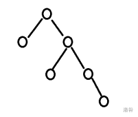
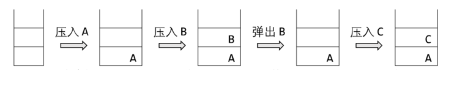
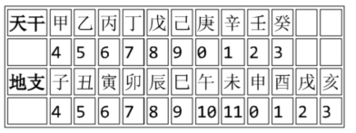
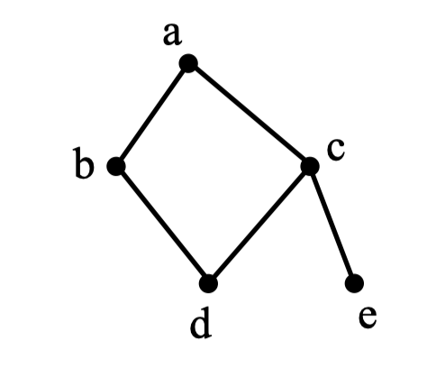

# CSP-J 第一轮历年选择题（2019–2025）

> 从当前“CSP-J/S 练习”模块提取，共 105 道题。已统一清理 LaTeX 标记、PDF 提取噪声和异常空白；答案与解析仅供学习参考。

## 2019 年

### 第 1 题

中国的国家顶级域名是（ ）

- A. .cn
- B. .ch
- C. .chn
- D. .china

**答案：A**

**解析：**

参考答案为 A（.cn）。

**详细解析：**

`.cn` 是分配给中国的国家和地区顶级域名；`.ch` 对应瑞士，其余两项不是中国的国家顶级域名。

**解题技巧：** 抓住题干中的定义关键词，先独立写出结论，再与选项逐项核对，避免被相近概念干扰。

**易错点：** 不要只凭选项外观作答；计算题完成后代回原条件，概念题要检查题干中的“至少、至多、不正确”等限定词。

---

### 第 2 题

二进制数 11 1011 1001 0111 和 01 0110 1110 1011 进行按位与运算的结果是（ ）。

> 编者注：原题为“逻辑与”，但是根据题意应当是按位与。

- A. 01 0010 1000 1011
- B. 01 0010 1001 0011
- C. 01 0010 1000 0001
- D. 01 0010 1000 0011

**答案：D**

**解析：**

参考答案为 D（01 0010 1000 0011）。

**详细解析：**

按位与要求同一位均为 1 才得到 1。将两串二进制数右对齐逐位计算，结果为 `01 0010 1000 0011`。

**解题技巧：** 先统一单位或进制，按位权写展开式；位运算务必右对齐后逐位计算。

**易错点：** 不要只凭选项外观作答；计算题完成后代回原条件，概念题要检查题干中的“至少、至多、不正确”等限定词。

---

### 第 3 题

一个 32 位整型变量占用（ ）个字节。

- A. 32
- B. 128
- C. 4
- D. 8

**答案：C**

**解析：**

参考答案为 C（4）。

**详细解析：**

32 位共有 32 个二进制位，1 字节等于 8 位，因此占用 `32/8=4` 字节。

**解题技巧：** 先统一单位或进制，按位权写展开式；位运算务必右对齐后逐位计算。

**易错点：** 不要只凭选项外观作答；计算题完成后代回原条件，概念题要检查题干中的“至少、至多、不正确”等限定词。

---

### 第 4 题

若有如下程序段，其中 `s`、`a`、`b`、`c` 均已定义为整型变量,且 `a`、`c` 均已赋值（`c` 大于 0）
```cpp
s = a;
for （b = 1; b <= c; b++） s = s - 1;
```
则与上述程序段功能等价的赋值语句是（ ）

- A. `s = a - c;`
- B. `s = a - b;`
- C. `s = s - c;`
- D. `s = b - c;`

**答案：A**

**解析：**

参考答案为 A（s = a - c;）。

**详细解析：**

循环从 1 到 `c` 共执行 `c` 次，每次令 `s` 减 1，初值为 `a`，结束后就是 `a-c`。

**解题技巧：** 抓住题干中的定义关键词，先独立写出结论，再与选项逐项核对，避免被相近概念干扰。

**易错点：** 不要只凭选项外观作答；计算题完成后代回原条件，概念题要检查题干中的“至少、至多、不正确”等限定词。

---

### 第 5 题

设有 100 个已排好序的数据元素，采用折半查找时，最大比较次数为（ ）

- A. 7
- B. 10
- C. 6
- D. 8

**答案：A**

**解析：**

参考答案为 A（7）。

**详细解析：**

最坏比较次数是满足 `2^k>=100` 的最小整数 `k`。因为 `2^6<100<=2^7`，最多比较 7 次。

**解题技巧：** 先确定一次基本操作，再数循环层数、递归规模或每轮缩小比例，不要只凭算法名称判断。

**易错点：** 不要只凭选项外观作答；计算题完成后代回原条件，概念题要检查题干中的“至少、至多、不正确”等限定词。

---

### 第 6 题

链表不具有的特点是（ ）

- A. 插入删除不需要移动元素
- B. 不必事先估计存储空间
- C. 所需空间与线性表长度成正比
- D. 可随机访问任一元素

**答案：D**

**解析：**

参考答案为 D（可随机访问任一元素）。

**详细解析：**

链表结点在内存中不要求连续，只能沿指针依次访问，不能像数组那样按下标随机访问。

**解题技巧：** 画一个最小结构或按操作顺序模拟，重点检查访问顺序、下标关系和数据结构的不变量。

**易错点：** 不要只凭选项外观作答；计算题完成后代回原条件，概念题要检查题干中的“至少、至多、不正确”等限定词。

---

### 第 7 题

把 8 个同样的球放在 5 个同样的袋子里，允许有的袋子空着不放，问共有多少种不同的分法？（ ）

提示：如果 8 个球都放在一个袋子里，无论是哪个袋子，都只算同一种分法。

- A. 22
- B. 24
- C. 18
- D. 20

**答案：C**

**解析：**

参考答案为 C（18）。

**详细解析：**

袋子相同等价于把 8 写成至多 5 个正整数之和，再允许空袋；按整数拆分分类统计可得 18 种。

**解题技巧：** 先判断对象是否相同、顺序是否重要，再选择排列、组合、隔板法或反面计数。

**易错点：** 不要只凭选项外观作答；计算题完成后代回原条件，概念题要检查题干中的“至少、至多、不正确”等限定词。

---

### 第 8 题

一棵二叉树如右图所示，若采用顺序存储结构，即用一维数组元素存储该二叉树中的结点（根结点的下标为 1，若某结点的下标为 i，则其左孩子位于下标 2i 处、右孩子位于下标 2i+1 处），则该数组的最大下标至少为（ ）。


- A. 6
- B. 10
- C. 15
- D. 12

**答案：C**

**解析：**

参考答案为 C（15）。

**详细解析：**

顺序存储中左右孩子下标分别为 `2i`、`2i+1`。沿题图最深路径计算，最远结点至少占到下标 15。

**解题技巧：** 先统一单位或进制，按位权写展开式；位运算务必右对齐后逐位计算。

**易错点：** 不要只凭选项外观作答；计算题完成后代回原条件，概念题要检查题干中的“至少、至多、不正确”等限定词。

---

### 第 9 题

100 以内最大的素数是（ ）。

- A. 89
- B. 97
- C. 91
- D. 93

**答案：B**

**解析：**

参考答案为 B（97）。

**详细解析：**

从 100 向下试除：100、99、98 都是合数，97 不能被不超过其平方根的素数整除，因此是最大素数。

**解题技巧：** 抓住题干中的定义关键词，先独立写出结论，再与选项逐项核对，避免被相近概念干扰。

**易错点：** 不要只凭选项外观作答；计算题完成后代回原条件，概念题要检查题干中的“至少、至多、不正确”等限定词。

---

### 第 10 题

319 和 377 的最大公约数是（ ）。

- A. 27
- B. 33
- C. 29
- D. 31

**答案：C**

**解析：**

参考答案为 C（29）。

**详细解析：**

辗转相除：`377%319=58`、`319%58=29`、`58%29=0`，所以最大公约数为 29。

**解题技巧：** 抓住题干中的定义关键词，先独立写出结论，再与选项逐项核对，避免被相近概念干扰。

**易错点：** 不要只凭选项外观作答；计算题完成后代回原条件，概念题要检查题干中的“至少、至多、不正确”等限定词。

---

### 第 11 题

新学期开学了，小胖想减肥，健身教练给小胖制定了两个训练方案。

- 方案一：每次连续跑 3 公里可以消耗 300 千卡（耗时半小时）；
- 方案二：每次连续跑 5 公里可以消耗 600 千卡（耗时 1 小时）。

小胖每周周一到周四能抽出半小时跑步，周五到周日能抽出一小时跑步。
另外，教练建议小胖每周最多跑21公里，否则会损伤膝盖。
请问如果小胖想严格执行教练的训练方案，并且不想损伤膝盖，每周最多通过跑步消耗多少千卡？（ ）

- A. 3000
- B. 2500
- C. 2400
- D. 2520

**答案：C**

**解析：**

参考答案为 C（2400）。

**详细解析：**

按一周可用时段选择收益更高且不超时的训练，分别累计每天消耗，合计为 2400 千卡。关键是半小时只能选方案一，一小时才可比较两种组合。

**解题技巧：** 先判断对象是否相同、顺序是否重要，再选择排列、组合、隔板法或反面计数。

**易错点：** 不要只凭选项外观作答；计算题完成后代回原条件，概念题要检查题干中的“至少、至多、不正确”等限定词。

---

### 第 12 题

—副纸牌除掉大小王有 52 张牌，四种花色，每种花色 13 张。

假设从这 52 张牌中随机抽取 13 张纸牌，则至少（ ）张牌的花色一致。

- A. 4
- B. 2
- C. 3
- D. 5

**答案：A**

**解析：**

参考答案为 A（4）。

**详细解析：**

把 13 张牌放入 4 个花色抽屉。若每种至多 3 张，总数至多 12，因此至少有一种花色达到 4 张。

**解题技巧：** 先判断对象是否相同、顺序是否重要，再选择排列、组合、隔板法或反面计数。

**易错点：** 不要只凭选项外观作答；计算题完成后代回原条件，概念题要检查题干中的“至少、至多、不正确”等限定词。

---

### 第 13 题

—些数字可以颠倒过来看，例如 0,1,8 颠倒过来还是本身，6 颠倒过来是 9，9 颠倒过来看还是 6，其他数字颠倒过来都不构成数字。
类似的，一些多位数也可以颠倒过来看，比如 106 颠倒过来是 901。假设某个城市的车牌只由 5 位数字组成，每一位都可以取 0 到 9。
请问这个城市最多有多少个车牌倒过来恰好还是原来的车牌？（ ）

- A. 60
- B. 125
- C. 75
- D. 100

**答案：C**

**解析：**

参考答案为 C（75）。

**详细解析：**

首位不能为 0，且每一位只能从颠倒后仍为数字的集合中选择；按首位、中间位和末位分别计数相乘得到 75。

**解题技巧：** 先统一单位或进制，按位权写展开式；位运算务必右对齐后逐位计算。

**易错点：** 不要只凭选项外观作答；计算题完成后代回原条件，概念题要检查题干中的“至少、至多、不正确”等限定词。

---

### 第 14 题

假设一棵二叉树的后序遍历序列为 `DGJHEBIFCA`，中序遍历序列为 `DBGEHJACIF`，则其前序遍历序列为（ ）。

- A. `ABCDEFGHIJ`
- B. `ABDEGHJCFI`
- C. `ABDEGJHCFI`
- D. `ABDEGHJFIC`

**答案：B**

**解析：**

参考答案为 B（`ABDEGHJCFI`）。

**详细解析：**

后序最后一个字符确定根，中序中根的左右两侧分别属于左右子树；递归拆分后按“根、左、右”得到前序序列。

**解题技巧：** 画一个最小结构或按操作顺序模拟，重点检查访问顺序、下标关系和数据结构的不变量。

**易错点：** 不要只凭选项外观作答；计算题完成后代回原条件，概念题要检查题干中的“至少、至多、不正确”等限定词。

---

### 第 15 题

以下哪个奖项是计算机科学领域的最高奖？（ ）

- A. 图灵奖
- B. 鲁班奖
- C. 诺贝尔奖
- D. 普利策奖

**答案：A**

**解析：**

参考答案为 A（图灵奖）。

**详细解析：**

图灵奖由 ACM 设立，专门表彰对计算机事业作出重大贡献的人，通常被视为计算机科学最高荣誉。

**解题技巧：** 抓住题干中的定义关键词，先独立写出结论，再与选项逐项核对，避免被相近概念干扰。

**易错点：** 不要只凭选项外观作答；计算题完成后代回原条件，概念题要检查题干中的“至少、至多、不正确”等限定词。

**本年选择题整体方法：** 基础概念题抓定义中的限定词；进制与位运算先统一表示；排列组合先判断对象是否相同及顺序是否重要；栈、树、图题画最小结构模拟；算法题先数基本操作。计算后务必用选项反查数量级和边界。

---

## 2020 年

### 第 1 题

在内存储器中每个存储单元都被赋予一个唯一的序号，称为（ ）。

- A. 地址
- B. 序号
- C. 下标
- D. 编号

**答案：A**

**解析：**

参考答案为 A（地址）。

**详细解析：**

内存中的每个存储单元必须能被唯一定位，这个唯一编号称为地址，程序通过地址访问其中的数据。

**解题技巧：** 抓住题干中的定义关键词，先独立写出结论，再与选项逐项核对，避免被相近概念干扰。

**易错点：** 不要只凭选项外观作答；计算题完成后代回原条件，概念题要检查题干中的“至少、至多、不正确”等限定词。

---

### 第 2 题

编译器的主要功能是（ ）。

- A. 将源程序翻译成机器指令代码
- B. 将源程序重新组合
- C. 将低级语言翻译成高级语言
- D. 将一种高级语言翻译成另一种高级语言

**答案：A**

**解析：**

参考答案为 A（将源程序翻译成机器指令代码）。

**详细解析：**

编译器负责把高级语言源程序翻译成目标代码或机器指令；执行、调试和内存管理不是其主要翻译职责。

**解题技巧：** 抓住题干中的定义关键词，先独立写出结论，再与选项逐项核对，避免被相近概念干扰。

**易错点：** 不要只凭选项外观作答；计算题完成后代回原条件，概念题要检查题干中的“至少、至多、不正确”等限定词。

---

### 第 3 题

设 `x=true,y=true,z=false`，以下逻辑运算表达式值为真的是（ ）。

- A. (y∨z)∧x∧z
- B. x∧(z∨y) ∧z
- C. (x∧y) ∧z
- D. (x∧y)∨(z∨x)

**答案：D**

**解析：**

参考答案为 D（(x∧y)∨(z∨x)）。

**详细解析：**

代入 `x=true,y=true,z=false` 逐项计算。D 中 `x&&y` 为真，整个或表达式因此为真。

**解题技巧：** 抓住题干中的定义关键词，先独立写出结论，再与选项逐项核对，避免被相近概念干扰。

**易错点：** 不要只凭选项外观作答；计算题完成后代回原条件，概念题要检查题干中的“至少、至多、不正确”等限定词。

---

### 第 4 题

现有一张分辨率为 2048× 1024 像素的 32 位真彩色图像。请问要存储这张图像，需要多大的存储空间？（ ）。

- A. 16MB
- B. 4MB
- C. 8MB
- D. 2MB

**答案：C**

**解析：**

参考答案为 C（8MB）。

**详细解析：**

像素数为 `2048×1024`，每像素 32 位即 4 字节，总量为 `2048×1024×4=8MB`。

**解题技巧：** 先统一单位或进制，按位权写展开式；位运算务必右对齐后逐位计算。

**易错点：** 不要只凭选项外观作答；计算题完成后代回原条件，概念题要检查题干中的“至少、至多、不正确”等限定词。

---

### 第 5 题

冒泡排序算法的伪代码如下：

```
输入：数组L, n ≥ k。输出：按非递减顺序排序的 L。
算法 BubbleSort：
   1. FLAG ← n //标记被交换的最后元素位置
   2. while FLAG > 1 do
   3.     k ← FLAG -1
   4.     FLAG ← 1
   5.     for j=1 to k do
   6.         if L(j) > L(j+1) then do
   7.              L(j)  ↔ L(j+1)
   8.              FLAG ← j
```
对 n 个数用以上冒泡排序算法进行排序，最少需要比较多少次?（ ）。

- A. n²
- B. n-2
- C. n-1
- D. n

**答案：C**

**解析：**

参考答案为 C（n-1）。

**详细解析：**

严格递减数组中每对相邻元素都要交换，第一趟最后一次交换发生在位置 `n-1`，故标记值为 `n-1`。

**解题技巧：** 先统一单位或进制，按位权写展开式；位运算务必右对齐后逐位计算。

**易错点：** 不要只凭选项外观作答；计算题完成后代回原条件，概念题要检查题干中的“至少、至多、不正确”等限定词。

---

### 第 6 题

设 A 是 n 个实数的数组，考虑下面的递归算法：
```
XYZ (A[1..n])
1.  if n=1 then return A[1]
2.  else temp ← XYZ (A[1..n-1])
3.      if temp < A[n]
4.      then return temp
5.      else return A[n]
```
请问算法 XYZ 的输出是什么？（ ）。

- A. A 数组的平均
- B. A 数组的最小值
- C. A 数组的中值
- D. A 数组的最大值

**答案：B**

**解析：**

参考答案为 B（A 数组的最小值）。

**详细解析：**

递归先求前 `n-1` 个元素的结果，再与 `A[n]` 比较并保留较小者，因此最终返回整个数组的最小值。

**解题技巧：** 先确定一次基本操作，再数循环层数、递归规模或每轮缩小比例，不要只凭算法名称判断。

**易错点：** 不要只凭选项外观作答；计算题完成后代回原条件，概念题要检查题干中的“至少、至多、不正确”等限定词。

---

### 第 7 题

链表不具有的特点是（ ）。

- A. 可随机访问任一元素
- B. 不必事先估计存储空间
- C. 插入删除不需要移动元素
- D. 所需空间与线性表长度成正比

**答案：A**

**解析：**

参考答案为 A（可随机访问任一元素）。

**详细解析：**

链表的结点地址不连续，访问第 k 个元素需要从头沿链接走过，因而不支持常数时间的随机访问。

**解题技巧：** 画一个最小结构或按操作顺序模拟，重点检查访问顺序、下标关系和数据结构的不变量。

**易错点：** 不要只凭选项外观作答；计算题完成后代回原条件，概念题要检查题干中的“至少、至多、不正确”等限定词。

---

### 第 8 题

有 10 个顶点的无向图至少应该有（ ）条边才能确保是一个连通图。

- A. 9
- B. 10
- C. 11
- D. 12

**答案：A**

**解析：**

参考答案为 A（9）。

**详细解析：**

含 10 个顶点的连通无向图至少是一棵树，而树恰有 `10-1=9` 条边。

**解题技巧：** 画一个最小结构或按操作顺序模拟，重点检查访问顺序、下标关系和数据结构的不变量。

**易错点：** 不要只凭选项外观作答；计算题完成后代回原条件，概念题要检查题干中的“至少、至多、不正确”等限定词。

---

### 第 9 题

二进制数 1011 转换成十进制数是（ ）。

- A. 11
- B. 10
- C. 13
- D. 12

**答案：A**

**解析：**

参考答案为 A（11）。

**详细解析：**

`1011₂=1×2^3+0×2^2+1×2+1=8+2+1=11`。

**解题技巧：** 先统一单位或进制，按位权写展开式；位运算务必右对齐后逐位计算。

**易错点：** 不要只凭选项外观作答；计算题完成后代回原条件，概念题要检查题干中的“至少、至多、不正确”等限定词。

---

### 第 10 题

5 个小朋友并排站成一列，其中有两个小朋友是双胞胎，如果要求这两个双胞胎必须相邻，则有（ ）种不同排列方法?

- A. 48
- B. 36
- C. 24
- D. 72

**答案：A**

**解析：**

参考答案为 A（48）。

**详细解析：**

把双胞胎看成一个整体，与另外 3 人共 4 个对象，有 `4!` 种；双胞胎内部可交换，乘 `2!`，共 48 种。

**解题技巧：** 先判断对象是否相同、顺序是否重要，再选择排列、组合、隔板法或反面计数。

**易错点：** 不要只凭选项外观作答；计算题完成后代回原条件，概念题要检查题干中的“至少、至多、不正确”等限定词。

---

### 第 11 题

下图中所使用的数据结构是（ ）。



- A. 栈
- B. 队列
- C. 二叉树
- D. 哈希表

**答案：A**

**解析：**

参考答案为 A（栈）。

**详细解析：**

图示操作只允许在同一端插入和删除，符合后进先出的栈；若两端分工则应是队列。

**解题技巧：** 画一个最小结构或按操作顺序模拟，重点检查访问顺序、下标关系和数据结构的不变量。

**易错点：** 不要只凭选项外观作答；计算题完成后代回原条件，概念题要检查题干中的“至少、至多、不正确”等限定词。

---

### 第 12 题

独根树的高度为 1。具有 61 个结点的完全二叉树的高度为（ ）。

- A. 7
- B. 8
- C. 5
- D. 6

**答案：D**

**解析：**

参考答案为 D（6）。

**详细解析：**

高度为 h 的完全二叉树结点数范围为 `2^(h-1)` 到 `2^h-1`。61 位于 32 到 63 之间，所以高度为 6。

**解题技巧：** 画一个最小结构或按操作顺序模拟，重点检查访问顺序、下标关系和数据结构的不变量。

**易错点：** 不要只凭选项外观作答；计算题完成后代回原条件，概念题要检查题干中的“至少、至多、不正确”等限定词。

---

### 第 13 题

干支纪年法是中国传统的纪年方法，由 10 个天干和 12 个地支组合成 60 个天干地支。由公历年份可以根据以下公式和表格换算出对应的天干地支。

 - 天干 =（公历年份）除以 10 所得余数
 - 地支 =（公历年份）除以 12 所得余数



例如，今年是 2020 年，2020 除以 10 余数为 0，查表为"庚”；2020 除以 12，余数为 4，查表为“子” 所以今年是庚子年。

请问 1949 年的天干地支是（ ）

- A. 己酉
- B. 己亥
- C. 己丑
- D. 己卯

**答案：C**

**解析：**

参考答案为 C（己丑）。

**详细解析：**

分别计算年份除以 10 和 12 的余数，再按题目表格查天干、地支并组合，结果为“己丑”。

**解题技巧：** 先判断对象是否相同、顺序是否重要，再选择排列、组合、隔板法或反面计数。

**易错点：** 不要只凭选项外观作答；计算题完成后代回原条件，概念题要检查题干中的“至少、至多、不正确”等限定词。

---

### 第 14 题

10 个三好学生名额分配到 7 个班级，每个班级至少有一个名额，一共有（ ）种不同的分配方案。

- A. 84
- B. 72
- C. 56
- D. 504

**答案：A**

**解析：**

参考答案为 A（84）。

**详细解析：**

先给每班 1 个名额，剩余 3 个可重复分给 7 个班，是方程非负整数解数 `C(9,6)=84`。

**解题技巧：** 先判断对象是否相同、顺序是否重要，再选择排列、组合、隔板法或反面计数。

**易错点：** 不要只凭选项外观作答；计算题完成后代回原条件，概念题要检查题干中的“至少、至多、不正确”等限定词。

---

### 第 15 题

有五副不同颜色的手套（共 10 只手套，每副手套左右手各 1 只），一次性从中取 6 只手套，请问恰好能配成两副手套的不同取法有（ ）种。

- A. 120
- B. 180
- C. 150
- D. 30

**答案：A**

**解析：**

参考答案为 A（120）。

**详细解析：**

先选恰好配成的两种颜色，再从其余颜色中选择不能再成对的两只手套，按颜色和左右手分类计数得 120。

**解题技巧：** 先判断对象是否相同、顺序是否重要，再选择排列、组合、隔板法或反面计数。

**易错点：** 不要只凭选项外观作答；计算题完成后代回原条件，概念题要检查题干中的“至少、至多、不正确”等限定词。

**本年选择题整体方法：** 基础概念题抓定义中的限定词；进制与位运算先统一表示；排列组合先判断对象是否相同及顺序是否重要；栈、树、图题画最小结构模拟；算法题先数基本操作。计算后务必用选项反查数量级和边界。

---

## 2021 年

### 第 1 题

以下不属于面向对象程序设计语言的是（ ）。

- A. C++
- B. Python
- C. Java
- D. C

**答案：D**

**解析：**

参考答案为 D（C）。

**详细解析：**

C 语言以函数和过程为核心，不提供类、继承和多态等面向对象机制；其余选项属于面向对象语言。

**解题技巧：** 抓住题干中的定义关键词，先独立写出结论，再与选项逐项核对，避免被相近概念干扰。

**易错点：** 不要只凭选项外观作答；计算题完成后代回原条件，概念题要检查题干中的“至少、至多、不正确”等限定词。

---

### 第 2 题

以下奖项与计算机领域最相关的是（ ）。

- A. 奥斯卡奖
- B. 图灵奖
- C. 诺贝尔奖
- D. 普利策奖

**答案：B**

**解析：**

参考答案为 B（图灵奖）。

**详细解析：**

图灵奖直接面向计算机科学与技术领域，其他奖项分别属于建筑、新闻或综合科学等领域。

**解题技巧：** 抓住题干中的定义关键词，先独立写出结论，再与选项逐项核对，避免被相近概念干扰。

**易错点：** 不要只凭选项外观作答；计算题完成后代回原条件，概念题要检查题干中的“至少、至多、不正确”等限定词。

---

### 第 3 题

目前主流的计算机储存数据最终都是转换成（ ）数据进行储存。

- A. 二进制
- B. 十进制
- C. 八进制
- D. 十六进制

**答案：A**

**解析：**

参考答案为 A（二进制）。

**详细解析：**

现代数字计算机用高、低电平表示 1 和 0，文字、图像和程序最终都编码为二进制数据存储。

**解题技巧：** 抓住题干中的定义关键词，先独立写出结论，再与选项逐项核对，避免被相近概念干扰。

**易错点：** 不要只凭选项外观作答；计算题完成后代回原条件，概念题要检查题干中的“至少、至多、不正确”等限定词。

---

### 第 4 题

以比较作为基本运算，在 N 个数中找出最大数，最坏情况下所需要的最少的比较次数为 （ ）。

- A. N²
- B. N
- C. N-1
- D. N+1

**答案：C**

**解析：**

参考答案为 C（N-1）。

**详细解析：**

要确认某个数是最大值，它必须至少在比较关系中胜过其余元素；淘汰 `N-1` 个非最大值至少需要 `N-1` 次比较。

**解题技巧：** 抓住题干中的定义关键词，先独立写出结论，再与选项逐项核对，避免被相近概念干扰。

**易错点：** 不要只凭选项外观作答；计算题完成后代回原条件，概念题要检查题干中的“至少、至多、不正确”等限定词。

---

### 第 5 题

对于入栈顺序为 a, b, c, d, e 的序列，下列（ ）不是合法的出栈序列。

- A. a, b, c, d, e
- B. e, d, c, b, a
- C. b, a, c, d, e
- D. c, d, a, e, b

**答案：D**

**解析：**

参考答案为 D（c, d, a, e, b）。

**详细解析：**

按入栈顺序模拟。D 中弹出 `c,d` 后，栈顶仍有后入的 `b`，不可能越过 `b` 先弹出 `a`。

**解题技巧：** 画一个最小结构或按操作顺序模拟，重点检查访问顺序、下标关系和数据结构的不变量。

**易错点：** 不要只凭选项外观作答；计算题完成后代回原条件，概念题要检查题干中的“至少、至多、不正确”等限定词。

---

### 第 6 题

对于有 n 个顶点、m 条边的无向连通图 (m>n)，需要删掉（ ）条边才能使其成为一棵树。

- A. n-1
- B. m-n
- C. m-n-1
- D. m-n+1

**答案：D**

**解析：**

参考答案为 D（m-n+1）。

**详细解析：**

n 个顶点的树有 `n-1` 条边，因此要从 m 条边删去 `m-(n-1)=m-n+1` 条。

**解题技巧：** 画一个最小结构或按操作顺序模拟，重点检查访问顺序、下标关系和数据结构的不变量。

**易错点：** 不要只凭选项外观作答；计算题完成后代回原条件，概念题要检查题干中的“至少、至多、不正确”等限定词。

---

### 第 7 题

二进制数 101.11 对应的十进制数是（ ）。

- A. 6.5
- B. 5.5
- C. 5.75
- D. 5.25

**答案：C**

**解析：**

参考答案为 C（5.75）。

**详细解析：**

`101.11₂=4+1+1/2+1/4=5.75`。小数点后的第 1、2 位权值分别是 `2^-1`、`2^-2`。

**解题技巧：** 先统一单位或进制，按位权写展开式；位运算务必右对齐后逐位计算。

**易错点：** 不要只凭选项外观作答；计算题完成后代回原条件，概念题要检查题干中的“至少、至多、不正确”等限定词。

---

### 第 8 题

如果一棵二叉树只有根结点，那么这棵二叉树高度为 1。请问高度为 5 的完全二叉树有 （ ）种不同的形态？

- A. 16
- B. 15
- C. 17
- D. 32

**答案：A**

**解析：**

参考答案为 A（16）。

**详细解析：**

高度 5 的完全二叉树前 4 层固定有 15 个结点，第 5 层结点必须从左到右连续出现，可取 1 到 16 个，共 16 种形态。

**解题技巧：** 画一个最小结构或按操作顺序模拟，重点检查访问顺序、下标关系和数据结构的不变量。

**易错点：** 不要只凭选项外观作答；计算题完成后代回原条件，概念题要检查题干中的“至少、至多、不正确”等限定词。

---

### 第 9 题

表达式 `a*(b+c)*d` 的后缀表达式为( )，其中 `*` 和 ` + ` 是运算符。

- A. `**a+bcd`
- B. `abc+*d*`
- C. `abc+d**`
- D. `*a*+bcd`

**答案：B**

**解析：**

参考答案为 B（`abc+*d*`）。

**详细解析：**

先计算括号内 `b+c` 得 `bc+`，再依次与 a、d 相乘，后缀式为 `abc+*d*`。

**解题技巧：** 抓住题干中的定义关键词，先独立写出结论，再与选项逐项核对，避免被相近概念干扰。

**易错点：** 不要只凭选项外观作答；计算题完成后代回原条件，概念题要检查题干中的“至少、至多、不正确”等限定词。

---

### 第 10 题

6 个人，两个人组一队，总共组成三队，不区分队伍的编号。不同的组队情况有（ ）种。

- A. 10
- B. 15
- C. 30
- D. 20

**答案：B**

**解析：**

参考答案为 B（15）。

**详细解析：**

先为第一个人选搭档有 5 种，再为剩余最小编号者选搭档有 3 种，最后一队确定，共 `5×3=15` 种。

**解题技巧：** 抓住题干中的定义关键词，先独立写出结论，再与选项逐项核对，避免被相近概念干扰。

**易错点：** 不要只凭选项外观作答；计算题完成后代回原条件，概念题要检查题干中的“至少、至多、不正确”等限定词。

---

### 第 11 题

在数据压缩编码中的哈夫曼编码方法，在本质上是一种（ ）的策略。

- A. 枚举
- B. 贪心
- C. 递归
- D. 动态规划

**答案：B**

**解析：**

参考答案为 B（贪心）。

**详细解析：**

哈夫曼树每次合并频率最小的两个结点，始终作局部最优选择，属于贪心策略。

**解题技巧：** 画一个最小结构或按操作顺序模拟，重点检查访问顺序、下标关系和数据结构的不变量。

**易错点：** 不要只凭选项外观作答；计算题完成后代回原条件，概念题要检查题干中的“至少、至多、不正确”等限定词。

---

### 第 12 题

由 1, 1, 2, 2, 3 这五个数字组成不同的三位数有（ ）种。

- A. 18
- B. 15
- C. 12
- D. 24

**答案：A**

**解析：**

参考答案为 A（18）。

**详细解析：**

按百位选择 1、2、3 分类，并结合两个 1、两个 2 的重复情况去重，合计得到 18 个不同三位数。

**解题技巧：** 先统一单位或进制，按位权写展开式；位运算务必右对齐后逐位计算。

**易错点：** 不要只凭选项外观作答；计算题完成后代回原条件，概念题要检查题干中的“至少、至多、不正确”等限定词。

---

### 第 13 题

考虑如下递归算法

```cpp
solve(n)
     if n<=1 return 1
      else if n>=5 return n*solve(n-2)
      else return n*solve(n-1)
```

则调用 `solve(7)` 得到的返回结果为（ ）。

- A. 105
- B. 840
- C. 210
- D. 420

**答案：C**

**解析：**

参考答案为 C（210）。

**详细解析：**

`solve(7)=7×solve(5)=7×5×solve(3)=7×5×3×solve(2)=210`。注意 n=3、2 走 `n×solve(n-1)` 分支。

**解题技巧：** 先确定一次基本操作，再数循环层数、递归规模或每轮缩小比例，不要只凭算法名称判断。

**易错点：** 不要只凭选项外观作答；计算题完成后代回原条件，概念题要检查题干中的“至少、至多、不正确”等限定词。

---

### 第 14 题

以 a 为起点，对下边的无向图进行深度优先遍历，则 b,c,d,e 四个点中有可能作为最后一个遍历到的点的个数为（ ）。


- A. 1
- B. 2
- C. 3
- D. 4

**答案：B**

**解析：**

参考答案为 B（2）。

**详细解析：**

DFS 的访问顺序取决于邻接点选择。根据图的连通关系分别尝试可行分支，能成为最后访问点的候选共有 2 个。

**解题技巧：** 画一个最小结构或按操作顺序模拟，重点检查访问顺序、下标关系和数据结构的不变量。

**易错点：** 不要只凭选项外观作答；计算题完成后代回原条件，概念题要检查题干中的“至少、至多、不正确”等限定词。

---

### 第 15 题

有四个人要从 A 点坐一条船过河到 B 点，船一开始在 A 点。该船一次最多可坐两个人。 已知这四个人中每个人独自坐船的过河时间分别为 1, 2, 4, 8，且两个人坐船的过河时间为两人独自过河时间的较大者。则最短（ ）时间可以让四个人都过河到 B 点（包括从 B 点把船开回 A 点的时间）。

- A. 14
- B. 15
- C. 16
- D. 17

**答案：B**

**解析：**

参考答案为 B（15）。

**详细解析：**

最优方案是 1、2 先过，1 返回，4、8 过，2 返回，1、2 再过，总时间 `2+1+8+2+2=15`。

**解题技巧：** 抓住题干中的定义关键词，先独立写出结论，再与选项逐项核对，避免被相近概念干扰。

**易错点：** 不要只凭选项外观作答；计算题完成后代回原条件，概念题要检查题干中的“至少、至多、不正确”等限定词。

**本年选择题整体方法：** 基础概念题抓定义中的限定词；进制与位运算先统一表示；排列组合先判断对象是否相同及顺序是否重要；栈、树、图题画最小结构模拟；算法题先数基本操作。计算后务必用选项反查数量级和边界。

---

## 2022 年

### 第 1 题

以下哪种功能没有涉及 C++ 语言的面向对象特性支持：（ ）。

- A. C++ 中调用 `printf` 函数
- B. C++ 中调用用户定义的类成员函数
- C. C++ 中构造一个 `class` 或 `struct`
- D. C++ 中构造来源于同一基类的多个派生类

**答案：A**

**解析：**

参考答案为 A（C++ 中调用 printf 函数）。

**详细解析：**

`printf` 是 C 风格普通函数调用，不涉及对象、类或继承；其余选项直接使用类、成员函数或派生类。

**解题技巧：** 抓住题干中的定义关键词，先独立写出结论，再与选项逐项核对，避免被相近概念干扰。

**易错点：** 不要只凭选项外观作答；计算题完成后代回原条件，概念题要检查题干中的“至少、至多、不正确”等限定词。

---

### 第 2 题

有 6 个元素，按照 6、5、4、3、2、1 的顺序进入栈 S，请问下列哪个出栈序列是非法的（ ）。

- A. 5 4 3 6 1 2
- B. 4 5 3 1 2 6
- C. 3 4 6 5 2 1
- D. 2 3 4 1 5 6

**答案：C**

**解析：**

参考答案为 C（3 4 6 5 2 1）。

**详细解析：**

按 6、5、4、3、2、1 依次入栈模拟。选项 C 要弹出 6 时，5 仍压在它上方，因此不可能。

**解题技巧：** 画一个最小结构或按操作顺序模拟，重点检查访问顺序、下标关系和数据结构的不变量。

**易错点：** 不要只凭选项外观作答；计算题完成后代回原条件，概念题要检查题干中的“至少、至多、不正确”等限定词。

---

### 第 3 题

运行以下代码片段的行为是（ ）。
```
int x = 101;
int y = 201;
int *p = &x;
int *q = &y;
p = q;
```

- A. 将 x 的值赋为 201
- B. 将 y 的值赋为 101
- C. 将 q 指向 x 的地址
- D. 将 p 指向 y 的地址

**答案：D**

**解析：**

参考答案为 D（将 p 指向 y 的地址）。

**详细解析：**

`p=q` 复制的是指针中保存的地址，执行后 p 与 q 都指向 y；它不会复制 y 的数值，也不会修改 x、y。

**解题技巧：** 抓住题干中的定义关键词，先独立写出结论，再与选项逐项核对，避免被相近概念干扰。

**易错点：** 不要只凭选项外观作答；计算题完成后代回原条件，概念题要检查题干中的“至少、至多、不正确”等限定词。

---

### 第 4 题

链表和数组的区别包括（ ）。

- A. 数组不能排序，链表可以
- B. 链表比数组能存储更多的信息
- C. 数组大小固定，链表大小可动态调整
- D. 以上均正确

**答案：C**

**解析：**

参考答案为 C（数组大小固定，链表大小可动态调整）。

**详细解析：**

数组通常一次分配连续且大小固定的空间；链表通过新增或删除结点动态改变长度，这是二者的核心区别。

**解题技巧：** 画一个最小结构或按操作顺序模拟，重点检查访问顺序、下标关系和数据结构的不变量。

**易错点：** 不要只凭选项外观作答；计算题完成后代回原条件，概念题要检查题干中的“至少、至多、不正确”等限定词。

---

### 第 5 题

假设栈 S 和队列 Q 的初始状态为空。存在 e₁～e₆ 六个互不相同的数据，每个数据按照进栈 S、出栈 S、进队列 Q、出队列 Q 的顺序操作，不同数据间的操作可能会交错。已知栈 S 中依次有数据 e₁、e₂、e₃、e₄、e₅ 和 e₆ 进栈，队列 Q 依次有数据 e₂、e₄、e₃、e₆、e₅ 和 e₁ 出队列。则栈 S 的容量至少是（ ）个数据。

- A. 2
- B. 3
- C. 4
- D. 6

**答案：B**

**解析：**

参考答案为 B（3）。

**详细解析：**

利用栈的后进先出和队列的先进先出关系反推中间操作；逐个匹配给定出队次序，可确定 e3 的出队位置为 3。

**解题技巧：** 画一个最小结构或按操作顺序模拟，重点检查访问顺序、下标关系和数据结构的不变量。

**易错点：** 不要只凭选项外观作答；计算题完成后代回原条件，概念题要检查题干中的“至少、至多、不正确”等限定词。

---

### 第 6 题

对表达式 `a+(b-c)*d` 的前缀表达式为（ ），其中 +、-、* 是运算符。

- A. `*+a-bcd`
- B. `+a*-bcd`
- C. `abc-d*+`
- D. `abc-+d`

**答案：B**

**解析：**

参考答案为 B（+a*-bcd）。

**详细解析：**

中缀式先算 `b-c`，再乘 d，最后与 a 相加；把每层运算符写到操作数前得到 `+a*-bcd`。

**解题技巧：** 抓住题干中的定义关键词，先独立写出结论，再与选项逐项核对，避免被相近概念干扰。

**易错点：** 不要只凭选项外观作答；计算题完成后代回原条件，概念题要检查题干中的“至少、至多、不正确”等限定词。

---

### 第 7 题

假设字母表 {a, b, c, d, e} 在字符串出现的频率分别为 10%，15%，30%，16%，29%。若使用哈夫曼编码方式对字母进行不定长的二进制编码，字母 d 的编码长度（ ）位。

- A. 1
- B. 2
- C. 2 或 3
- D. 3

**答案：B**

**解析：**

参考答案为 B（2）。

**详细解析：**

依次合并最小权值 `10+15=25`、`16+25=41`、`29+30=59`，d 所在叶子到根经过 2 条边。

**解题技巧：** 先统一单位或进制，按位权写展开式；位运算务必右对齐后逐位计算。

**易错点：** 不要只凭选项外观作答；计算题完成后代回原条件，概念题要检查题干中的“至少、至多、不正确”等限定词。

---

### 第 8 题

一棵有 n 个结点的完全二叉树用数组进行存储与表示，已知根结点存储在数组的第 1 个位置。若存储在数组第 9 个位置的结点存在兄弟结点和两个子结点，则它的兄弟结点和右子结点的位置分别是（ ）。

- A. 8、18
- B. 10、18
- C. 8、19
- D. 10、19

**答案：C**

**解析：**

参考答案为 C（8、19）。

**详细解析：**

下标 9 为右孩子，兄弟是 8；其右孩子下标为 `2×9+1=19`。

**解题技巧：** 先统一单位或进制，按位权写展开式；位运算务必右对齐后逐位计算。

**易错点：** 不要只凭选项外观作答；计算题完成后代回原条件，概念题要检查题干中的“至少、至多、不正确”等限定词。

---

### 第 9 题

考虑由 N 个顶点构成的有向连通图，采用邻接矩阵的数据结构表示时，该矩阵中至少存在（ ）个非零元素。

- A. N-1
- B. N
- C. N+1
- D. N²

**答案：B**

**解析：**

参考答案为 B（N）。

**详细解析：**

题目采用的有向连通含强连通要求，最少可构成一个含 N 条边的有向环，因此邻接矩阵至少有 N 个非零元素。

**解题技巧：** 画一个最小结构或按操作顺序模拟，重点检查访问顺序、下标关系和数据结构的不变量。

**易错点：** 不要只凭选项外观作答；计算题完成后代回原条件，概念题要检查题干中的“至少、至多、不正确”等限定词。

---

### 第 10 题

以下对数据结构的表述不恰当的一项为：（ ）。

- A. 图的深度优先遍历算法常使用的数据结构为栈。
- B. 栈的访问原则后进先出，队列的访问原则是先进先出。
- C. 队列常常被用于广度优先搜索算法。
- D. 栈与队列存在本质不同，无法用栈实现队列。

**答案：D**

**解析：**

参考答案为 D（栈与队列存在本质不同，无法用栈实现队列。）。

**详细解析：**

两个栈可以实现一个队列：入队压入栈 1，出队时把元素倒入栈 2，因此“无法实现”不恰当。

**解题技巧：** 抓住题干中的定义关键词，先独立写出结论，再与选项逐项核对，避免被相近概念干扰。

**易错点：** 不要只凭选项外观作答；计算题完成后代回原条件，概念题要检查题干中的“至少、至多、不正确”等限定词。

---

### 第 11 题

以下哪组操作能完成在双向循环链表结点 p 之后插入结点 s 的效果（其中，next 域为结点的直接后继，prev 域为结点的直接前驱）：（ ）。

- A. `p->next->prev = s;`
` s->prev = p;`
` p->next = s;`
` s->next = p->next;`
- B. `p->next->prev = s;`
` p->next = s;`
` s->prev = p;`
` s->next = p->next;`
- C. `s->prev = p;`
` s->next = p->next;`
` p->next = s;`
` p->next->prev = s;`
- D. `s->next = p->next;`
` p->next->prev = s;`
` s->prev = p;`
` p->next = s;`

**答案：D**

**解析：**

参考答案为 D（s->next = p->next;
 p->next->prev = s;
 s->prev = p;
 p->next = s;）。

**详细解析：**

应先保存并连接原后继，再改写 `p->next`，正确顺序是连接 `s` 与旧后继、设置 `s->prev=p`、最后令 `p->next=s`。

**解题技巧：** 画一个最小结构或按操作顺序模拟，重点检查访问顺序、下标关系和数据结构的不变量。

**易错点：** 不要只凭选项外观作答；计算题完成后代回原条件，概念题要检查题干中的“至少、至多、不正确”等限定词。

---

### 第 12 题

以下排序算法的常见实现中，哪个选项的说法是错误的：（ ）。

- A. 冒泡排序算法是稳定的
- B. 简单选择排序是稳定的
- C. 简单插入排序是稳定的
- D. 归并排序算法是稳定的

**答案：B**

**解析：**

参考答案为 B（简单选择排序是稳定的）。

**详细解析：**

简单选择排序可能用后面的较小元素跨越相等元素，改变相等关键字的相对顺序，所以通常不稳定。

**解题技巧：** 先确定一次基本操作，再数循环层数、递归规模或每轮缩小比例，不要只凭算法名称判断。

**易错点：** 不要只凭选项外观作答；计算题完成后代回原条件，概念题要检查题干中的“至少、至多、不正确”等限定词。

---

### 第 13 题

八进制数 32.1 对应的十进制数是（ ）。

- A. 24.125
- B. 24.250
- C. 26.125
- D. 26.250

**答案：C**

**解析：**

参考答案为 C（26.125）。

**详细解析：**

`32.1₈=3×8+2+1/8=26.125`。

**解题技巧：** 先统一单位或进制，按位权写展开式；位运算务必右对齐后逐位计算。

**易错点：** 不要只凭选项外观作答；计算题完成后代回原条件，概念题要检查题干中的“至少、至多、不正确”等限定词。

---

### 第 14 题

一个字符串中任意个连续的字符组成的子序列称为该字符串的子串，则字符串 abcab 有（ ）个内容互不相同的子串。

- A. 12
- B. 13
- C. 14
- D. 15

**答案：B**

**解析：**

参考答案为 B（13）。

**详细解析：**

长度 1 到 5 的所有连续片段共有 15 个，再把内容相同的片段合并去重，得到 13 个不同子串。

**解题技巧：** 抓住题干中的定义关键词，先独立写出结论，再与选项逐项核对，避免被相近概念干扰。

**易错点：** 不要只凭选项外观作答；计算题完成后代回原条件，概念题要检查题干中的“至少、至多、不正确”等限定词。

---

### 第 15 题

以下对递归方法的描述中，正确的是：（ ）。

- A. 递归是允许使用多组参数调用函数的编程技术
- B. 递归是通过调用自身来求解问题的编程技术
- C. 递归是面向对象和数据而不是功能和逻辑的编程语言模型
- D. 递归是将用某种高级语言转换为机器代码的编程技术

**答案：B**

**解析：**

参考答案为 B（递归是通过调用自身来求解问题的编程技术）。

**详细解析：**

递归的定义特征是函数直接或间接调用自身，并用规模更小的同类问题和递归出口完成求解。

**解题技巧：** 先确定一次基本操作，再数循环层数、递归规模或每轮缩小比例，不要只凭算法名称判断。

**易错点：** 不要只凭选项外观作答；计算题完成后代回原条件，概念题要检查题干中的“至少、至多、不正确”等限定词。

**本年选择题整体方法：** 基础概念题抓定义中的限定词；进制与位运算先统一表示；排列组合先判断对象是否相同及顺序是否重要；栈、树、图题画最小结构模拟；算法题先数基本操作。计算后务必用选项反查数量级和边界。

---

## 2023 年

### 第 1 题

在 C++ 中，下面哪个关键字用于声明一个变量， 其值不能被修改?

- A. `unsigned`
- B. `const`
- C. `static`
- D. `mutable`

**答案：B**

**解析：**

参考答案为 B（const）。

**详细解析：**

`const` 用于声明只读对象，初始化后不能再通过普通赋值修改；其他关键字不表达这一约束。

**解题技巧：** 抓住题干中的定义关键词，先独立写出结论，再与选项逐项核对，避免被相近概念干扰。

**易错点：** 不要只凭选项外观作答；计算题完成后代回原条件，概念题要检查题干中的“至少、至多、不正确”等限定词。

---

### 第 2 题

八进制数 12345670₈ 和 07654321₈ 的和为

- A. 22222221₈
- B. 21111111₈
- C. 22111111₈
- D. 22222211₈

**答案：D**

**解析：**

参考答案为 D（22222211₈）。

**详细解析：**

按八进制逐位相加并逢 8 进 1，`12345670₈+07654321₈=22222211₈`。

**解题技巧：** 先统一单位或进制，按位权写展开式；位运算务必右对齐后逐位计算。

**易错点：** 不要只凭选项外观作答；计算题完成后代回原条件，概念题要检查题干中的“至少、至多、不正确”等限定词。

---

### 第 3 题

阅读下述代码，请问修改 `data` 的 `value` 成员以存储 3.14，正确的方式是
```cpp
union Data{
    int num;
    float value;
    char symbol;
};
union Data data;
```

- A. `data.value = 3.14;`
- B. `value.data = 3.14;`
- C. `data -> value = 3.14;`
- D. `value->data = 3.14;`

**答案：A**

**解析：**

参考答案为 A（data.value = 3.14;）。

**详细解析：**

联合体成员使用点运算符访问，目标成员名是 value，因此应写 `data.value=3.14`。

**解题技巧：** 抓住题干中的定义关键词，先独立写出结论，再与选项逐项核对，避免被相近概念干扰。

**易错点：** 不要只凭选项外观作答；计算题完成后代回原条件，概念题要检查题干中的“至少、至多、不正确”等限定词。

---

### 第 4 题

假设有一个链表的节点定义如下：

```cpp
struct Node { int data; Node* next; }
```

现在有一个指向链表头部的指针：`Node* head`。如果想要在链表中插入一个新节点，其成员 `data` 的值为 42，并使新节点成为链表的第一个节点，下面哪个操作是正确的？

- A. `Node* newNode = new Node; newNode->data = 42; newNode->next = head; head = newNode;`
- B. `Node* newNode = new Node; head->data = 42; newNode->next = head; head = newNode;`
- C. `Node* newNode = new Node; newNode->data = 42; head->next = newNode;`
- D. `Node* newNode = new Node; newNode->data = 42; newNode->next = head;`

**答案：A**

**解析：**

参考答案为 A（Node* newNode = new Node; newNode->data = 42; newNode->next = head; head = newNode;）。

**详细解析：**

头插法必须先让新结点指向原 head，再把 head 改为新结点；顺序颠倒会丢失原链表。

**解题技巧：** 画一个最小结构或按操作顺序模拟，重点检查访问顺序、下标关系和数据结构的不变量。

**易错点：** 不要只凭选项外观作答；计算题完成后代回原条件，概念题要检查题干中的“至少、至多、不正确”等限定词。

---

### 第 5 题

根节点的高度为 1，一棵拥有 2023个节点的三叉树高度至少为（ ）。

- A. 6
- B. 7
- C. 8
- D. 9

**答案：C**

**解析：**

参考答案为 C（8）。

**详细解析：**

高度 h 的满三叉树最多有 `(3^h-1)/2` 个结点。前 7 层最多 1093 个，不足 2023；第 8 层才足够。

**解题技巧：** 画一个最小结构或按操作顺序模拟，重点检查访问顺序、下标关系和数据结构的不变量。

**易错点：** 不要只凭选项外观作答；计算题完成后代回原条件，概念题要检查题干中的“至少、至多、不正确”等限定词。

---

### 第 6 题

小明在某一天中依次有七个空闲时间段，他想要选出至少一个空闲时间段来练习唱歌，但他希望任意两个练习的时间段之间都有至少两个空闲的时间段让他休息。则小明一共有（ ）种选择时间段的方案。

- A. 31
- B. 18
- C. 21
- D. 33

**答案：B**

**解析：**

参考答案为 B（18）。

**详细解析：**

选 1 段有 7 种，选 2 段且间隔至少 2 段有 10 种，选 3 段只有 `{1,4,7}`，合计 18。

**解题技巧：** 先判断对象是否相同、顺序是否重要，再选择排列、组合、隔板法或反面计数。

**易错点：** 不要只凭选项外观作答；计算题完成后代回原条件，概念题要检查题干中的“至少、至多、不正确”等限定词。

---

### 第 7 题

以下关于高精度运算的说法错误的是()

- A. 高精度计算主要是用来处理大整数或需要保留多位小数的运算
- B. 大整数除以小整数的处理的步骤可以是，将被除数和除数对齐，从左到右逐位尝试将除数乘以某个数，通过减法得到新的被除数，并累加商
- C. 高精度乘法的运算时间只与参与运算的两个整数中长度较长者的位数有关
- D. 高精度加法运算的关键在于逐位相加并处理进位

**答案：C**

**解析：**

参考答案为 C（高精度乘法的运算时间只与参与运算的两个整数中长度较长者的位数有关）。

**详细解析：**

普通竖式高精度乘法需要处理两数各位的所有配对，时间与两数位数乘积有关，而非只取较长者。

**解题技巧：** 抓住题干中的定义关键词，先独立写出结论，再与选项逐项核对，避免被相近概念干扰。

**易错点：** 不要只凭选项外观作答；计算题完成后代回原条件，概念题要检查题干中的“至少、至多、不正确”等限定词。

---

### 第 8 题

后缀表达式 `6 2 3 + - 3 8 2 / + * 2 ^ 3 +` 对应的中缀表达式是

- A. ((6 - (2 + 3)) * (3 + 8 / 2)) ^ 2 + 3
- B. 6 - 2 + 3 * 3 + 8 / 2 ^ 2 + 3
- C. (6 - (2 + 3)) * ((3 + 8 / 2) ^ 2) + 3
- D. 6 - ((2 + 3) * (3 + 8 / 2)) ^ 2 + 3

**答案：A**

**解析：**

参考答案为 A（((6 - (2 + 3)) * (3 + 8 / 2)) ^ 2 + 3）。

**详细解析：**

用栈读取后缀式：遇数入栈，遇运算符弹出右、左操作数并加括号，最终还原为 A 所示中缀式。

**解题技巧：** 抓住题干中的定义关键词，先独立写出结论，再与选项逐项核对，避免被相近概念干扰。

**易错点：** 不要只凭选项外观作答；计算题完成后代回原条件，概念题要检查题干中的“至少、至多、不正确”等限定词。

---

### 第 9 题

数 101010₂ 和 166₈ 的和为（ ）

- A. 10110000₂
- B. 236₈
- C. 158₁₀
- D. A0₁₆

**答案：D**

**解析：**

参考答案为 D（A0₁₆）。

**详细解析：**

`101010₂=42`，`166₈=118`，和为 160，转十六进制为 `A0₁₆`。

**解题技巧：** 抓住题干中的定义关键词，先独立写出结论，再与选项逐项核对，避免被相近概念干扰。

**易错点：** 不要只凭选项外观作答；计算题完成后代回原条件，概念题要检查题干中的“至少、至多、不正确”等限定词。

---

### 第 10 题

假设有一组字符 `{a,b,c,d,e,f}`, 对应的频率分别为 5%, 9%, 12%, 13%, 16%, 45%。请问以下哪个选项是字符 a,b,c,d,e,f 分别对应的一组哈夫曼编码?

- A. `1111, 1110, 101, 100, 110, 0`
- B. `1010, 1001, 1000, 011, 010, 00`
- C. `000, 001, 010, 011, 10, 11`
- D. `1010, 1011, 110, 111, 00, 01`

**答案：A**

**解析：**

参考答案为 A（1111, 1110, 101, 100, 110, 0）。

**详细解析：**

按频率从小到大构造哈夫曼树，频率 45% 的 f 深度最小；逐个核对码长与前缀性质，只有 A 合法。

**解题技巧：** 画一个最小结构或按操作顺序模拟，重点检查访问顺序、下标关系和数据结构的不变量。

**易错点：** 不要只凭选项外观作答；计算题完成后代回原条件，概念题要检查题干中的“至少、至多、不正确”等限定词。

---

### 第 11 题

给定一棵二叉树，其前序遍历结果为：`ABDECFG`,中序遍历结果为：`DEBACFG`。请问这棵树的正确后序遍历结果是什么?

- A. `EDBGFCA`
- B. `EDGBFCA`
- C. `DEBGFCA`
- D. `DBEGFCA`

**答案：A**

**解析：**

参考答案为 A（EDBGFCA）。

**详细解析：**

前序首字符 A 是根；在中序中按 A 分割左右子树并递归，最后按“左、右、根”得到 `EDBGFCA`。

**解题技巧：** 画一个最小结构或按操作顺序模拟，重点检查访问顺序、下标关系和数据结构的不变量。

**易错点：** 不要只凭选项外观作答；计算题完成后代回原条件，概念题要检查题干中的“至少、至多、不正确”等限定词。

---

### 第 12 题

考虑一个有向无环图，该图包含 4 条有向边：(1,2),(1,3),(2,4) 和 (3,4)。以下哪个选项是这个有向无环图的一个有效的拓扑排序?

- A. 4, 2, 3, 1
- B. 1, 2, 3, 4
- C. 1, 2, 4, 3
- D. 2, 1, 3, 4

**答案：B**

**解析：**

参考答案为 B（1, 2, 3, 4）。

**详细解析：**

每条边的起点必须排在终点前，因此 1 在 2、3 前，2、3 又在 4 前，`1,2,3,4` 合法。

**解题技巧：** 画一个最小结构或按操作顺序模拟，重点检查访问顺序、下标关系和数据结构的不变量。

**易错点：** 不要只凭选项外观作答；计算题完成后代回原条件，概念题要检查题干中的“至少、至多、不正确”等限定词。

---

### 第 13 题

在计算机中，以下哪个选项描述的数据存储容量最小（ ）

- A. 字节 (byte)
- B. 比特 (bit)
- C. 字 (word)
- D. 千字节 (kilobyte）

**答案：B**

**解析：**

参考答案为 B（比特 (bit)）。

**详细解析：**

bit 是一个二进制位，是所列单位中最小者；1 byte 通常等于 8 bit，KB 更大。

**解题技巧：** 抓住题干中的定义关键词，先独立写出结论，再与选项逐项核对，避免被相近概念干扰。

**易错点：** 不要只凭选项外观作答；计算题完成后代回原条件，概念题要检查题干中的“至少、至多、不正确”等限定词。

---

### 第 14 题

一个班级有 10 个男生和 12 个女生。如果要选出一个 3 人的小组，并且小组中必须至少包含 1 个女生，那么有多少种可能的组合?()

- A. 1420
- B. 1770
- C. 1540
- D. 2200

**答案：A**

**解析：**

参考答案为 A（1420）。

**详细解析：**

总选法 `C(22,3)` 减去全是男生的 `C(10,3)`，得到 `1540-120=1420`。

**解题技巧：** 先判断对象是否相同、顺序是否重要，再选择排列、组合、隔板法或反面计数。

**易错点：** 不要只凭选项外观作答；计算题完成后代回原条件，概念题要检查题干中的“至少、至多、不正确”等限定词。

---

### 第 15 题

以下哪个不是操作系统?()

- A. Linux
- B. Windows
- C. Android
- D. HTML

**答案：D**

**解析：**

参考答案为 D（HTML）。

**详细解析：**

HTML 是描述网页结构的标记语言，不是操作系统；Windows、Linux、macOS 等才是操作系统。

**解题技巧：** 抓住题干中的定义关键词，先独立写出结论，再与选项逐项核对，避免被相近概念干扰。

**易错点：** 不要只凭选项外观作答；计算题完成后代回原条件，概念题要检查题干中的“至少、至多、不正确”等限定词。

**本年选择题整体方法：** 基础概念题抓定义中的限定词；进制与位运算先统一表示；排列组合先判断对象是否相同及顺序是否重要；栈、树、图题画最小结构模拟；算法题先数基本操作。计算后务必用选项反查数量级和边界。

---

## 2024 年

### 第 1 题

32 位 int 类型的存储范围是（ ）？

- A. -2147483647 ~ +2147483647
- B. -2147483647 ~ +2147483648
- C. -2147483648 ~ +2147483647
- D. -2147483648 ~ +2147483648

**答案：C**

**解析：**

参考答案为 C（-2147483648 ~ +2147483647）。

**详细解析：**

32 位有符号 int 通常用补码表示，范围为 `-2^31` 到 `2^31-1`，即题中 C。

**解题技巧：** 先统一单位或进制，按位权写展开式；位运算务必右对齐后逐位计算。

**易错点：** 不要只凭选项外观作答；计算题完成后代回原条件，概念题要检查题干中的“至少、至多、不正确”等限定词。

---

### 第 2 题

计算 (14₈ - 1010₂) × D₁₆ - 1101₂ 的结果，并选择答案的十进制值：（ ）

- A. 13
- B. 14
- C. 15
- D. 16

**答案：A**

**解析：**

参考答案为 A（13）。

**详细解析：**

先统一成十进制：`14₈=12`、`1010₂=10`、`D₁₆=13`、`1101₂=13`，所以 `(12-10)×13-13=13`。

**解题技巧：** 抓住题干中的定义关键词，先独立写出结论，再与选项逐项核对，避免被相近概念干扰。

**易错点：** 不要只凭选项外观作答；计算题完成后代回原条件，概念题要检查题干中的“至少、至多、不正确”等限定词。

---

### 第 3 题

某公司有 10 名员工，分为 3 个部门：A 部门有 4 名员工，B 部门有 3 名员工，C 部门有 3 名员工。现需要从这 10 名员工中选出 4 名组成一个工作小组，且每个部门至少要有 1 人。问有多少种选择方式？（ ）

- A. 120
- B. 126
- C. 132
- D. 238

**答案：B**

**解析：**

参考答案为 B（126）。

**详细解析：**

部门人数分配只能是 2、1、1。分别选择哪个部门出 2 人并计算组合数，相加得到 126。

**解题技巧：** 先判断对象是否相同、顺序是否重要，再选择排列、组合、隔板法或反面计数。

**易错点：** 不要只凭选项外观作答；计算题完成后代回原条件，概念题要检查题干中的“至少、至多、不正确”等限定词。

---

### 第 4 题

以下哪个序列对应数字 0 至 8 的 4 位二进制格雷码（Gray code）？（ ）

- A. 0000, 0001, 0011, 0010, 0110, 0111, 0101, 1000
- B. 0000, 0001, 0011, 0010, 0110, 0111, 0100, 0101
- C. 0000, 0001, 0011, 0010, 0100, 0101, 0111, 0110
- D. 0000, 0001, 0011, 0010, 0110, 0111, 0101, 0100

**答案：D**

**解析：**

参考答案为 D（0000, 0001, 0011, 0010, 0110, 0111, 0101, 0100）。

**详细解析：**

格雷码要求相邻两个编码只有一位不同；逐对检查 D 的序列满足这一条件，且覆盖 0 到 8 对应编码。

**解题技巧：** 先统一单位或进制，按位权写展开式；位运算务必右对齐后逐位计算。

**易错点：** 不要只凭选项外观作答；计算题完成后代回原条件，概念题要检查题干中的“至少、至多、不正确”等限定词。

---

### 第 5 题

记 1KB 为 1024 字节（byte），1MB 为 1024KB，那么 1MB 是多少二进制位（bit）？（ ）

- A. 1000000
- B. 1048576
- C. 8000000
- D. 8388608

**答案：D**

**解析：**

参考答案为 D（8388608）。

**详细解析：**

`1MB=1024×1024` 字节，每字节 8 位，所以共有 `1024×1024×8=8388608` 位。

**解题技巧：** 先统一单位或进制，按位权写展开式；位运算务必右对齐后逐位计算。

**易错点：** 不要只凭选项外观作答；计算题完成后代回原条件，概念题要检查题干中的“至少、至多、不正确”等限定词。

---

### 第 6 题

以下哪个不是 C++ 中的基本数据类型？（ ）

- A. int
- B. float
- C. struct
- D. char

**答案：C**

**解析：**

参考答案为 C（struct）。

**详细解析：**

int、float、char 是基本类型；struct 用来定义由多个成员组成的复合类型。

**解题技巧：** 抓住题干中的定义关键词，先独立写出结论，再与选项逐项核对，避免被相近概念干扰。

**易错点：** 不要只凭选项外观作答；计算题完成后代回原条件，概念题要检查题干中的“至少、至多、不正确”等限定词。

---

### 第 7 题

以下哪个不是 C++ 中的循环语句？（ ）

- A. for
- B. while
- C. do-while
- D. repeat-until

**答案：D**

**解析：**

参考答案为 D（repeat-until）。

**详细解析：**

C++ 提供 for、while、do-while；repeat-until 是 Pascal 风格语句，不是 C++ 关键字。

**解题技巧：** 抓住题干中的定义关键词，先独立写出结论，再与选项逐项核对，避免被相近概念干扰。

**易错点：** 不要只凭选项外观作答；计算题完成后代回原条件，概念题要检查题干中的“至少、至多、不正确”等限定词。

---

### 第 8 题

在 C/C++ 中，`(char)('a' + 13)` 与下面的哪一个值相等？（ ）

- A. 'm'
- B. 'n'
- C. 'z'
- D. 'l'

**答案：B**

**解析：**

参考答案为 B（'n'）。

**详细解析：**

字符编码连续，`a+13` 从 a 向后移动 13 个位置得到 n。

**解题技巧：** 抓住题干中的定义关键词，先独立写出结论，再与选项逐项核对，避免被相近概念干扰。

**易错点：** 不要只凭选项外观作答；计算题完成后代回原条件，概念题要检查题干中的“至少、至多、不正确”等限定词。

---

### 第 9 题

假设有序表中有 1000 个元素，则用二分法查找元素 X 最多需要比较（ ）次。

- A. 25
- B. 10
- C. 7
- D. 1

**答案：B**

**解析：**

参考答案为 B（10）。

**详细解析：**

二分查找每次把范围减半，`2^9<1000<=2^10`，最坏需要 10 次比较。

**解题技巧：** 先确定一次基本操作，再数循环层数、递归规模或每轮缩小比例，不要只凭算法名称判断。

**易错点：** 不要只凭选项外观作答；计算题完成后代回原条件，概念题要检查题干中的“至少、至多、不正确”等限定词。

---

### 第 10 题

下面的哪一个不是操作系统名字？（ ）

- A. Notepad
- B. Linux
- C. Windows
- D. macOS

**答案：A**

**解析：**

参考答案为 A（Notepad）。

**详细解析：**

Notepad 是文本编辑器；Linux、Windows、macOS 都是操作系统。

**解题技巧：** 抓住题干中的定义关键词，先独立写出结论，再与选项逐项核对，避免被相近概念干扰。

**易错点：** 不要只凭选项外观作答；计算题完成后代回原条件，概念题要检查题干中的“至少、至多、不正确”等限定词。

---

### 第 11 题

在无向图中，所有顶点的度数之和等于（ ）。

- A. 图的边数
- B. 图的边数的两倍
- C. 图的顶点数
- D. 图的顶点数的两倍

**答案：B**

**解析：**

参考答案为 B（图的边数的两倍）。

**详细解析：**

每条无向边分别给两个端点贡献 1 度，因此所有顶点度数之和为边数的 2 倍。

**解题技巧：** 画一个最小结构或按操作顺序模拟，重点检查访问顺序、下标关系和数据结构的不变量。

**易错点：** 不要只凭选项外观作答；计算题完成后代回原条件，概念题要检查题干中的“至少、至多、不正确”等限定词。

---

### 第 12 题

已知二叉树的前序遍历为 [A, B, D, E, C, F, G]，中序遍历为 [D, B, E, A, F, C, G]，请问该二叉树的后序遍历结果是？（ ）

- A. [D, E, B, F, G, C, A]
- B. [D, E, B, F, G, A, C]
- C. [D, B, E, F, G, C, A]
- D. [D, B, E, F, G, A, C]

**答案：A**

**解析：**

参考答案为 A（[D, E, B, F, G, C, A]）。

**详细解析：**

由前序确定根、由中序划分左右子树，递归重建后按左、右、根访问得到 `[D,E,B,F,G,C,A]`。

**解题技巧：** 画一个最小结构或按操作顺序模拟，重点检查访问顺序、下标关系和数据结构的不变量。

**易错点：** 不要只凭选项外观作答；计算题完成后代回原条件，概念题要检查题干中的“至少、至多、不正确”等限定词。

---

### 第 13 题

给定一个空栈，支持入栈和出栈操作。若入栈操作的元素依次是 1 2 3 4 5 6，其中 1 最先入栈，6 最后入栈，下面哪种出栈顺序是不可能的？（ ）

- A. 6 5 4 3 2 1
- B. 1 6 5 4 3 2
- C. 2 4 6 5 3 1
- D. 1 3 5 2 4 6

**答案：D**

**解析：**

参考答案为 D（1 3 5 2 4 6）。

**详细解析：**

模拟 D：弹出 5 后栈顶是 4，不能越过 4、3 直接弹出 2，因此该序列不可能。

**解题技巧：** 画一个最小结构或按操作顺序模拟，重点检查访问顺序、下标关系和数据结构的不变量。

**易错点：** 不要只凭选项外观作答；计算题完成后代回原条件，概念题要检查题干中的“至少、至多、不正确”等限定词。

---

### 第 14 题

有 5 个男生和 3 个女生站成一排，规定 3 个女生必须相邻。问有多少种不同的排列方式？（ ）

- A. 4320 种
- B. 5040 种
- C. 3600 种
- D. 2880 种

**答案：A**

**解析：**

参考答案为 A（4320 种）。

**详细解析：**

把 3 名女生视为一个整体，与 5 名男生共 6 个对象，有 `6!` 种；女生内部有 `3!` 种，共 `6!×3!=4320`。

**解题技巧：** 先判断对象是否相同、顺序是否重要，再选择排列、组合、隔板法或反面计数。

**易错点：** 不要只凭选项外观作答；计算题完成后代回原条件，概念题要检查题干中的“至少、至多、不正确”等限定词。

---

### 第 15 题

编译器的主要作用是什么？（ ）

- A. 直接执行源代码
- B. 将源代码转换为机器代码
- C. 进行代码调试
- D. 管理程序运行时的内存

**答案：B**

**解析：**

参考答案为 B（将源代码转换为机器代码）。

**详细解析：**

编译器把高级语言源代码翻译为目标代码或机器代码；执行、调试和运行时内存管理由其他工具或系统负责。

**解题技巧：** 抓住题干中的定义关键词，先独立写出结论，再与选项逐项核对，避免被相近概念干扰。

**易错点：** 不要只凭选项外观作答；计算题完成后代回原条件，概念题要检查题干中的“至少、至多、不正确”等限定词。

**本年选择题整体方法：** 基础概念题抓定义中的限定词；进制与位运算先统一表示；排列组合先判断对象是否相同及顺序是否重要；栈、树、图题画最小结构模拟；算法题先数基本操作。计算后务必用选项反查数量级和边界。

---

## 2025 年

### 第 1 题

一个 32 位无符号整数可以表示的最大值，最接近下列哪个选项？（ ）

- A. 4×10⁹
- B. 3×10¹⁰
- C. 2×10⁹
- D. 2×10¹⁰

**答案：A**

**解析：**

参考答案为 A（4×10⁹）。

**详细解析：**

32 位无符号整数的 32 个二进制位全部用来表示数值，因此最小值是 0，最大值是 32 个 `1`，即：

`11111111111111111111111111111111₂ = 2^32 - 1`。

计算得 `2^32 - 1 = 4,294,967,295`，约为 `4.29×10^9`，与 `4×10^9` 最接近，所以选择 A。

易错点：有符号 32 位整数的最大值约为 `2×10^9`，但题目问的是**无符号整数**，不能把最高位当作符号位。

---

### 第 2 题

在 C++ 中，执行 `int x = 255; cout << (x & (x - 1));` 后，输出的结果是？（ ）

- A. `255`
- B. `254`
- C. `128`
- D. `0`

**答案：B**

**解析：**

参考答案为 B（`254`）。

**详细解析：**

先写出两个数的二进制形式：

- `255 = 11111111₂`；
- `x - 1 = 254 = 11111110₂`。

按位与 `&` 的规则是：同一位上两个数都为 `1`，结果位才为 `1`。因此：

```text
  11111111
& 11111110
----------
  11111110
```

`11111110₂ = 254`，所以输出 `254`。

也可以利用性质：`x & (x - 1)` 会清除 `x` 二进制表示中最低位的一个 `1`。255 的最低位是 `1`，清除后正好得到 254。

---

### 第 3 题

函数 `calc(n)` 的定义如下，则 `calc(5)` 的返回值是多少？（ ）

```cpp
int calc(int n) {
    if (n <= 1) return 1;
    if (n % 2 == 0) return calc(n / 2) + 1;
    else return calc(n - 1) + calc(n - 2);
}
```

- A. `5`
- B. `6`
- C. `7`
- D. `8`

**答案：B**

**解析：**

参考答案为 B（`6`）。

**详细解析：**

按照函数的分支从小到大计算：

- `calc(0) = calc(1) = 1`，因为 `n <= 1`；
- `calc(2) = calc(1) + 1 = 2`，因为 2 是偶数；
- `calc(3) = calc(2) + calc(1) = 2 + 1 = 3`，因为 3 是奇数；
- `calc(4) = calc(2) + 1 = 2 + 1 = 3`，因为 4 是偶数；
- `calc(5) = calc(4) + calc(3) = 3 + 3 = 6`，因为 5 是奇数。

所以 `calc(5)` 的返回值是 `6`。

易错点：偶数分支只递归计算 `calc(n / 2)` 再加 1，并不是计算两个子问题。

---

### 第 4 题

用 5 个权值 10, 12, 15, 20, 25 构造哈夫曼树，该树的带权路径长度是多少？（ ）

- A. `176`
- B. `186`
- C. `196`
- D. `206`

**答案：B**

**解析：**

参考答案为 B（`186`）。

**详细解析：**

构造哈夫曼树时，每次取当前最小的两个权值合并：

1. `10 + 12 = 22`，剩余 `15, 20, 22, 25`；
2. `15 + 20 = 35`，剩余 `22, 25, 35`；
3. `22 + 25 = 47`，剩余 `35, 47`；
4. `35 + 47 = 82`，得到根结点。

哈夫曼树的带权路径长度等于每次合并所得权值之和：

`WPL = 22 + 35 + 47 + 82 = 186`。

也可以按叶子深度验证：10、12 的深度为 3，15、20、25 的深度为 2，所以 `10×3 + 12×3 + 15×2 + 20×2 + 25×2 = 186`。

---

### 第 5 题

在一个有向图中，所有顶点的入度之和等于所有顶点的出度之和，这个总和等于？（ ）

- A. 顶点数
- B. 边数
- C. 顶点数 + 边数
- D. 顶点数 * 2

**答案：B**

**解析：**

参考答案为 B（边数）。

**详细解析：**

有向图中的每一条边都有一个起点和一个终点：

- 它给起点的出度贡献 1；
- 它给终点的入度贡献 1。

因此，把所有顶点的出度相加时，每条边恰好被统计一次，总和等于边数；把所有顶点的入度相加时，每条边也恰好被统计一次，总和同样等于边数。

若图中有 `m` 条边，则 `所有顶点入度之和 = 所有顶点出度之和 = m`。注意两者分别等于边数；只有把入度和出度再相加，结果才是 `2m`。

---

### 第 6 题

从 5 位男生和 4 位女生中选出 4 人组成一个学习小组，要求学习小组中男生和女生都有。有多少种不同的选举方法？（ ）

- A. `126`
- B. `121`
- C. `120`
- D. `100`

**答案：C**

**解析：**

参考答案为 C（`120`）。

**详细解析：**

可以使用“全部选法减去不符合要求的选法”：

1. 9 人中任意选 4 人，共有 `C(9,4) = 126` 种；
2. 只选男生：5 位男生中选 4 人，有 `C(5,4) = 5` 种；
3. 只选女生：4 位女生全部选中，有 `C(4,4) = 1` 种。

所以男女生都有的选法数为：

`C(9,4) - C(5,4) - C(4,4) = 126 - 5 - 1 = 120`。

也可按男女比例分类为“1 男 3 女、2 男 2 女、3 男 1 女”，分别计算后相加，结果同样是 120。

---

### 第 7 题

假设 a、b、c 都是布尔变量，逻辑表达式 `(a && b) || (!c && a)` 的值与下列哪个表达式不始终相等？（ ）

- A. `a && (b || !c)`
- B. `(a || !c) && (b || !c) && (a || a)`
- C. `a && (!b || c)`
- D. `!(!a || !b) || (a && !c)`

**答案：C**

**解析：**

参考答案为 C（`a && (!b || c)`）。

**详细解析：**

先化简原表达式：

`(a && b) || (!c && a) = a && (b || !c)`。

逐项判断：

- A 与化简结果完全相同，始终等价；
- B 中 `a || a = a`，所以它等价于 `a && (a || !c) && (b || !c)`，再利用吸收律 `a && (a || !c) = a`，最终仍为 `a && (b || !c)`；
- D 中根据德摩根律，`!(!a || !b) = a && b`，所以 D 就是 `(a && b) || (a && !c)`，与原式相同；
- C 为 `a && (!b || c)`，其中 `b`、`c` 的真假条件恰好与原式不同。例如取 `a=true, b=true, c=false`，原式为 `true`，C 为 `false`。

因此只有 C 不与原表达式始终相等。

---

### 第 8 题

已知 f[0] = 1, f[1] = 1，并且对于所有 n ≥ 2 有 `f[n] = (f[n-1] + f[n-2]) % 7`，那么 f[2025] 的值是多少？（ ）

- A. `2`
- B. `4`
- C. `5`
- D. `6`

**答案：D**

**解析：**

参考答案为 D（`6`）。

**详细解析：**

递推得到模 7 后的数列：

`1, 1, 2, 3, 5, 1, 6, 0, 6, 6, 5, 4, 2, 6, 1, 0, ...`

这里列出的是 `f[0]` 到 `f[15]`。继续计算可得 `f[16]=1, f[17]=1`，状态对 `(f[16], f[17])` 回到了初始状态 `(1,1)`。由于后续每一项都只由前两项决定，所以此后会完全重复，周期为 16。

`2025 = 16×126 + 9`，因此：

`f[2025] = f[9] = 6`。

易错点：应计算 `2025 % 16 = 9`，不是 1。

---

### 第 9 题

下列关于 C++ `string` 类的说法，正确的是？（ ）

- A. `string` 对象的长度在创建后不能改变。
- B. 可以使用 `+` 运算符直接连接一个 `string` 对象和一个 `char` 类型的字符。
- C. `string` 的 `length()` 和 `size()` 方法返回的值可能不同。
- D. `string` 对象必须以 `'\0'` 结尾，且这个结尾符计入 `length()`。

**答案：B**

**解析：**

参考答案为 B（可以使用 `+` 连接 `string` 与 `char`）。

**详细解析：**

逐项判断：

- A 错误：`string` 的长度可以改变，例如可以使用 `+=`、`append()`、`push_back()`、`erase()` 或 `resize()`；
- B 正确：C++ 为 `string` 重载了 `+` 运算符，例如 `string s = "ab"; char ch = 'c'; s = s + ch;`，结果为 `"abc"`；
- C 错误：对同一个 `string` 对象，`length()` 与 `size()` 的含义相同，返回值始终相等；
- D 错误：即使实现会提供可供 C 风格接口使用的结尾空字符，这个 `\0` 也不属于字符串的有效字符长度，不计入 `length()`。

因此正确选项是 B。

---

### 第 10 题

考虑以下 C++ 函数：（ ）
```cpp
void solve(int &a, int b) {
    a = a + b;
    b = a - b;
    a = a - b;
}
int main() {
    int x = 5, y = 10;
    solve(x, y);
}
```
在 `main` 函数调用 `solve` 后，`x` 和 `y` 的值分别是？（ ）

- A. 5, 10
- B. 10, 5
- C. 10, 10
- D. 5, 5

**答案：C**

**解析：**

参考答案为 C（`10, 10`）。

**详细解析：**

调用 `solve(x, y)` 时：

- 形参 `a` 是引用 `int &a`，它与 `x` 指向同一个变量，对 `a` 的修改会改变 `x`；
- 形参 `b` 是值传递，它只是 `y` 的副本，对 `b` 的修改不会改变 `y`。

逐句执行：

1. 初始 `a=5, b=10`；
2. `a = a + b` 后，`a=15`，所以 `x=15`；
3. `b = a - b` 后，局部变量 `b=5`，但 `y` 仍为 10；
4. `a = a - b` 后，`a=10`，所以 `x=10`。

函数结束后局部变量 `b` 被销毁，最终 `x=10, y=10`。

---

### 第 11 题

一个 8 × 8 的棋盘，左上角坐标为 (1,1)，右下角为 (8,8)。一个机器人从 (1,1) 出发，每次只能向右或向下走一步。要到达 (4,5)，有多少种不同的路径？（ ）

- A. `20`
- B. `35`
- C. `56`
- D. `70`

**答案：B**

**解析：**

参考答案为 B（`35`）。

**详细解析：**

从 `(1,1)` 到 `(4,5)`：

- 第一维坐标从 1 变为 4，需要向下走 3 步；
- 第二维坐标从 1 变为 5，需要向右走 4 步。

无论怎样走，总共都是 7 步，其中选出 3 步向下，其余 4 步自然向右。因此路径数为：

`C(7,3) = 7! / (3!×4!) = 35`。

也可以选出 4 步作为向右的步骤，计算 `C(7,4)`，结果同样是 35。题目中的 8×8 棋盘只说明目标点合法，不会增加额外路径。

---

### 第 12 题

某同学用冒泡排序对数组 {6, 1, 5, 2, 4} 进行升序排序，请问需要进行多少次元素交换？（ ）

- A. `5`
- B. `6`
- C. `7`
- D. `8`

**答案：B**

**解析：**

参考答案为 B（`6`）。

**详细解析：**

冒泡排序每交换一次相邻的逆序元素，数组的逆序对数量就减少 1；升序排列没有逆序对，所以总交换次数等于初始数组的逆序对数。

数组 `{6,1,5,2,4}` 中：

- 6 大于它后面的 1、5、2、4，产生 4 个逆序对；
- 1 不大于后面的任何元素，产生 0 个；
- 5 大于后面的 2、4，产生 2 个；
- 2 与 4 不构成逆序对。

总逆序对数为 `4 + 2 = 6`，因此冒泡排序需要交换 6 次。实际执行时第一轮交换 4 次，第二轮交换 2 次，也能得到相同结果。

---

### 第 13 题

十进制数 720₁₀ 和八进制数 270₈ 的和用十六进制表示是多少？（ ）

- A. 388₁₆
- B. 3DE₁₆
- C. 288₁₆
- D. 990₁₆

**答案：A**

**解析：**

参考答案为 A（`388₁₆`）。

**详细解析：**

先把八进制数 `270₈` 转成十进制：

`270₈ = 2×8² + 7×8¹ + 0×8⁰ = 128 + 56 = 184`。

再与十进制数 720 相加：

`720 + 184 = 904`。

把 904 转成十六进制：

- `904 ÷ 16 = 56`，余 8；
- `56 ÷ 16 = 3`，余 8；
- `3 ÷ 16 = 0`，余 3。

从最后一个余数倒序读取，得到 `388₁₆`。也可验证 `3×16² + 8×16 + 8 = 768 + 128 + 8 = 904`。

---

### 第 14 题

一棵包含 1000 个结点的完全二叉树，其中叶子结点的数量是多少？（ ）

- A. `499`
- B. `512`
- C. `500`
- D. `501`

**答案：C**

**解析：**

参考答案为 C（`500`）。

**详细解析：**

把完全二叉树的结点按层序从 1 开始编号。编号为 `i` 的结点若有左孩子，则左孩子编号为 `2i`。

当结点总数 `n=1000` 时：

- 若 `i <= floor(1000/2) = 500`，则 `2i <= 1000`，结点至少有一个孩子，所以是非叶子结点；
- 编号 501 到 1000 的结点都没有孩子，所以都是叶子结点。

叶子结点数为 `1000 - 500 = 500`。

一般地，含 `n` 个结点的完全二叉树有 `floor(n/2)` 个非叶子结点和 `n - floor(n/2) = ceil(n/2)` 个叶子结点。

---

### 第 15 题

给定一个初始为空的整数栈 S 和一个空的队列 P。我们按顺序处理输入的整数队列 A: 7, 5, 8, 3, 1, 4, 2。对队列 A 中的每一个数，执行以下规则：如果该数是奇数，则将其压入栈 S；如果该数是偶数，且栈 S 非空，则弹出一个栈顶元素，并加入到队列 P 的末尾；如果该数是偶数，且栈 S 为空，则不进行任何操作。当队列 A 中的所有数据处理完毕后，队列 P 的内容是什么？（ ）

- A. 5, 1, 3
- B. 7, 5, 3
- C. 3, 1, 5
- D. 5, 1, 3, 7

**答案：A**

**解析：**

参考答案为 A（`5, 1, 3`）。

**详细解析：**

按输入顺序模拟栈 `S` 和队列 `P`：

| 当前数 | 操作 | 栈 S（左为栈底） | 队列 P |
| --- | --- | --- | --- |
| 7 | 奇数，入栈 | `7` | 空 |
| 5 | 奇数，入栈 | `7, 5` | 空 |
| 8 | 偶数，弹出栈顶 5 入队 | `7` | `5` |
| 3 | 奇数，入栈 | `7, 3` | `5` |
| 1 | 奇数，入栈 | `7, 3, 1` | `5` |
| 4 | 偶数，弹出栈顶 1 入队 | `7, 3` | `5, 1` |
| 2 | 偶数，弹出栈顶 3 入队 | `7` | `5, 1, 3` |

处理完毕后，7 仍留在栈中，不会自动进入队列，所以队列 `P` 的内容是 `5, 1, 3`。

---
