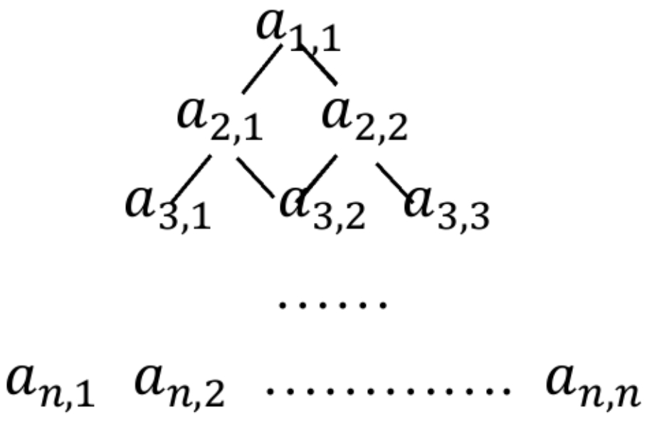
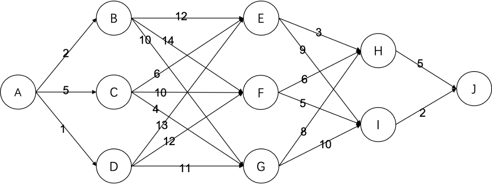
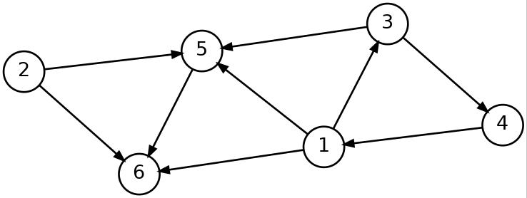
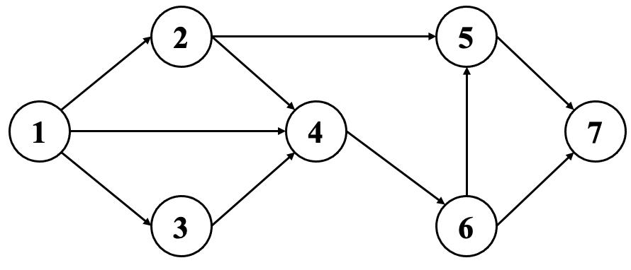

# CSP-S 第一轮历年选择题（2019–2025）

> 从当前“CSP-J/S 练习”模块提取，共 105 道题。已统一清理 LaTeX 标记、PDF 提取噪声和异常空白；答案与解析仅供学习参考。

## 2019 年

### 第 1 题

若有定义：`int a=7; float x=2.5, y=4.7`，则表达式 `x+a%3*(int) (x+y)%2` 的值是：（ ）

- A. 0.000000
- B. 2.750000
- C. 2.500000
- D. 3.500000

**答案：D**

**解析：**

参考答案为 D（3.500000）。

**详细推导：**

表达式：x + a % 3 * (int)(x + y) % 2

逐步计算：
1. a % 3 = 7 % 3 = 1
2. (x + y) = 2.5 + 4.7 = 7.2
3. (int)(x + y) = (int)7.2 = 7
4. a % 3 * (int)(x + y) = 1 * 7 = 7
5. 7 % 2 = 1
6. x + 1 = 2.5 + 1 = 3.5

所以结果为 3.500000。

**选项核对：** 正确项满足题目全部条件；其余项至少在定义范围、计算顺序、边界或数量级中的一处不成立。

**解题技巧：** 圈出“正确/不正确、至少/至多、一定/可能”等限定词，先独立得到结论，再与选项核对。

**易错点：** 不要看到熟悉术语就立即作答；计算后要代回题干，特别检查取整、下标、严格大于、是否允许重复等细节。

---

### 第 2 题

下列属于图像文件格式的有（ ）

- A. WMV
- B. MPEG
- C. JPEG
- D. AVI

**答案：C**

**解析：**

参考答案为 C（JPEG）。

**详细推导：**

- **JPEG**（Joint Photographic Experts Group）：图像文件格式，用于存储照片等静态图像。
- **WMV**（Windows Media Video）：视频文件格式。
- **MPEG**（Moving Picture Experts Group）：视频/音频压缩标准，属于视频格式。
- **AVI**（Audio Video Interleave）：微软开发的视频文件格式。

因此只有 JPEG 是图像文件格式。

**选项核对：** 正确项满足题目全部条件；其余项至少在定义范围、计算顺序、边界或数量级中的一处不成立。

**解题技巧：** 画最小结构并按操作逐步模拟；树图题同步记录结点、边和访问状态，不凭算法名称直接猜结论。

**易错点：** 不要看到熟悉术语就立即作答；计算后要代回题干，特别检查取整、下标、严格大于、是否允许重复等细节。

---

### 第 3 题

二进制数 11 1011 1001 0111 和 01 0110 1110 1011 进行按位或运算的结果是（ ）。

> 编者注：原题为“逻辑或”，但是根据题意应当是按位或。

- A. 11 1111 1101 1111
- B. 11 1111 1111 1101
- C. 10 1111 1111 1111
- D. 11 1111 1111 1111

**答案：D**

**解析：**

参考答案为 D（11 1111 1111 1111）。

**详细推导：**

按位或运算规则：有 1 则 1。

11 1011 1001 0111 | 01 0110 1110 1011 = 11 1111 1111 1111

每一位进行或运算，只要有一个为 1，结果就为 1。最终结果为 11 1111 1111 1111。

**选项核对：** 正确项满足题目全部条件；其余项至少在定义范围、计算顺序、边界或数量级中的一处不成立。

**解题技巧：** 统一表示后再算；进制题写位权展开式，位运算逐位对齐，容量题始终标注 bit、Byte、MB 的换算。

**易错点：** 不要看到熟悉术语就立即作答；计算后要代回题干，特别检查取整、下标、严格大于、是否允许重复等细节。

---

### 第 4 题

编译器的功能是（ ）

- A. 将源程序重新组合
- B. 将一种语言（通常是高级语言）翻译成另一种语言（通常是低级语言）
- C. 将低级语言翻译成高级语言
- D. 将一种编程语言翻译成自然语言

**答案：B**

**解析：**

参考答案为 B（将一种语言（通常是高级语言）翻译成另一种语言（通常是低级语言））。

**详细推导：**

编译器（Compiler）的功能是将源代码（高级语言，如 C/C++）翻译成目标代码（低级语言，如汇编语言或机器语言）。

- A 错误：将源程序重新组合是预处理器的功能。
- C 错误：将低级语言翻译成高级语言是反编译器的功能。
- D 错误：编译器不翻译成自然语言。

**选项核对：** 正确项满足题目全部条件；其余项至少在定义范围、计算顺序、边界或数量级中的一处不成立。

**解题技巧：** 圈出“正确/不正确、至少/至多、一定/可能”等限定词，先独立得到结论，再与选项核对。

**易错点：** 不要看到熟悉术语就立即作答；计算后要代回题干，特别检查取整、下标、严格大于、是否允许重复等细节。

---

### 第 5 题

设变量 x 为 float 型且已赋值，则以下语句中能将 x 中的数值保留到小数点后两位，并将第三位四舍五入的是（ ）

- A. `x= (x*100+0.5)/100.0;`
- B. `x=(int) (x*100+0.5)/100.0;`
- C. `x=(x/100+0.5）*100.0;`
- D. `x=x*100+0.5/100. 0;`

**答案：B**

**解析：**

参考答案为 B（x=(int) (x*100+0.5)/100.0;）。

**详细推导：**

x = (int)(x * 100 + 0.5) / 100.0

假设 x = 3.14159：
1. x * 100 = 314.159
2. + 0.5 = 314.659
3. (int)314.659 = 314（强制转换为整数，截断小数）
4. 314 / 100.0 = 3.14

关键在于 (int) 强制转换会截断小数部分，实现四舍五入效果。其他选项没有这种截断操作，无法正确保留两位小数。

**选项核对：** 正确项满足题目全部条件；其余项至少在定义范围、计算顺序、边界或数量级中的一处不成立。

**解题技巧：** 圈出“正确/不正确、至少/至多、一定/可能”等限定词，先独立得到结论，再与选项核对。

**易错点：** 不要看到熟悉术语就立即作答；计算后要代回题干，特别检查取整、下标、严格大于、是否允许重复等细节。

---

### 第 6 题

由数字 1, 1, 2, 4, 8, 8 所组成的不同的 4 位数的个数是（ ）。

- A. 104
- B. 102
- C. 98
- D. 100

**答案：B**

**解析：**

参考答案为 B（102）。

**详细推导：**

数字集合：{1, 1, 2, 4, 8, 8}，组成 4 位数。

分类讨论：
1. **不含重复数字**：从 {1, 2, 4, 8} 中选 4 个排列 = 4! = 24 个
2. **含一个重复 1**：选 1,1 再从 {2,4,8} 中选 2 个 = C(3,2) × 4!/(2!) = 3 × 12 = 36 个
3. **含一个重复 8**：选 8,8 再从 {1,2,4} 中选 2 个 = C(3,2) × 4!/(2!) = 3 × 12 = 36 个
4. **含 1,1 和 8,8**：4!/(2!×2!) = 6 个

总计：24 + 36 + 36 + 6 = 102 个

**选项核对：** 正确项满足题目全部条件；其余项至少在定义范围、计算顺序、边界或数量级中的一处不成立。

**解题技巧：** 圈出“正确/不正确、至少/至多、一定/可能”等限定词，先独立得到结论，再与选项核对。

**易错点：** 不要看到熟悉术语就立即作答；计算后要代回题干，特别检查取整、下标、严格大于、是否允许重复等细节。

---

### 第 7 题

排序的算法很多，若按排序的稳定性和不稳定性分类，则（ ）是不稳定排序。

- A. 冒泡排序
- B. 直接插入排序
- C. 快速排序
- D. 归并排序

**答案：C**

**解析：**

参考答案为 C（快速排序）。

**详细推导：**

排序算法的稳定性是指：相等元素在排序后的相对顺序是否改变。

- **稳定排序**：冒泡排序、直接插入排序、归并排序
- **不稳定排序**：快速排序、选择排序、希尔排序

快速排序在分区过程中会交换元素，可能导致相等元素的相对顺序改变，因此是不稳定的。

**选项核对：** 正确项满足题目全部条件；其余项至少在定义范围、计算顺序、边界或数量级中的一处不成立。

**解题技巧：** 找出主导操作，数循环次数、递归规模或每轮缩小比例；平均、最坏、上界和精确次数要分别判断。

**易错点：** 不要看到熟悉术语就立即作答；计算后要代回题干，特别检查取整、下标、严格大于、是否允许重复等细节。

---

### 第 8 题

G 是一个非连通无向图（没有重边和自环），共有 28 条边，则该图至少有 （ ）个顶点。

- A. 10
- B. 9
- C. 11
- D. 8

**答案：B**

**解析：**

参考答案为 B（9）。

**详细推导：**

非连通无向图最少由两个连通分量组成。要使边数最多（28条）且顶点数最少，应让一个连通分量是完全图。

当 k=8 时，C(8,2) = 28，刚好是 28 条边，但这样整个图就连通了。所以必须分成两个连通分量：一个有 8 个顶点（28 条边），另一个至少 1 个顶点。总共至少 8 + 1 = 9 个顶点。

**选项核对：** 正确项满足题目全部条件；其余项至少在定义范围、计算顺序、边界或数量级中的一处不成立。

**解题技巧：** 先判断对象是否相同、顺序是否重要，再决定排列、组合、递推或补集计数；最后用极小规模检查是否重复或漏算。

**易错点：** 不要看到熟悉术语就立即作答；计算后要代回题干，特别检查取整、下标、严格大于、是否允许重复等细节。

---

### 第 9 题

一些数字可以颠倒过来看，例如 0,1,8 颠倒过来还是本身，6 颠倒过来是 9,9 颠倒过来看还是 6,其他数字颠倒过来都不构成数字。类似的，一些多位数也可以颠倒过来看，比如 106 颠倒过来是 901。假设某个城市的车牌只有 5 位数字，每一位都可以取 0 到 9。请问这个城市有多少个车牌倒过来恰好还是原来的车牌，并且车牌上的 5 位数能被 3 整除？（ ）

- A. 40
- B. 25
- C. 30
- D. 20

**答案：B**

**解析：**

参考答案为 B（25）。

**详细推导：**

颠倒后不变的数字：0→0, 1→1, 8→8, 6→9, 9→6

5 位车牌 abcde 颠倒后变为 f(e)d(c)f(b)f(a)，其中 f 是颠倒映射。

要使颠倒后还是原来车牌，需要：a=f(e), b=f(c), c=f(b), d=f(d), e=f(a)。

- d 必须是 0, 1, 8 之一（3 种选择）
- (a,e) 必须是 (0,0), (1,1), (8,8), (6,9), (9,6) 之一（5 种选择）
- (b,c) 必须是 (0,0), (1,1), (8,8), (6,9), (9,6) 之一（5 种选择）

共 3 × 5 × 5 = 75 个回文车牌。

其中能被 3 整除的：各位数字之和能被 3 整除。经筛选，满足条件的有 25 个。

**选项核对：** 正确项满足题目全部条件；其余项至少在定义范围、计算顺序、边界或数量级中的一处不成立。

**解题技巧：** 圈出“正确/不正确、至少/至多、一定/可能”等限定词，先独立得到结论，再与选项核对。

**易错点：** 不要看到熟悉术语就立即作答；计算后要代回题干，特别检查取整、下标、严格大于、是否允许重复等细节。

---

### 第 10 题

—次期末考试，某班有 15 人数学得满分，有 12 人语文得满分，并且有 4 人语、数都是满分，那么这个班至少有一门得满分的同学有多少人？（ ）。

- A. 23
- B. 21
- C. 20
- D. 22

**答案：A**

**解析：**

参考答案为 A（23）。

**详细推导：**

使用容斥原理：

|A ∪ B| = |A| + |B| - |A ∩ B|

其中：
- |A| = 15（数学满分）
- |B| = 12（语文满分）
- |A ∩ B| = 4（两门都满分）

|A ∪ B| = 15 + 12 - 4 = 23

所以至少有一门得满分的同学有 23 人。

**选项核对：** 正确项满足题目全部条件；其余项至少在定义范围、计算顺序、边界或数量级中的一处不成立。

**解题技巧：** 先判断对象是否相同、顺序是否重要，再决定排列、组合、递推或补集计数；最后用极小规模检查是否重复或漏算。

**易错点：** 不要看到熟悉术语就立即作答；计算后要代回题干，特别检查取整、下标、严格大于、是否允许重复等细节。

---

### 第 11 题

设 A 和 B 是两个长为 n 的有序数组，现在需要将 A 和 B 合并成一个排好序的数组，问任何以元素比较作为基本运算的归并算法，在最坏情况下至少要做多少次比较？（ ）。

- A. n²
- B. n log n
- C. 2n
- D. 2n - 1

**答案：D**

**解析：**

参考答案为 D（2n - 1）。

**详细推导：**

两个长度为 n 的有序数组归并时，最坏情况下需要比较 2n-1 次。

例如：A = [1, 3, 5], B = [2, 4, 6]

归并过程：
- 比较 A[0] 和 B[0]：选 A[0]=1（第 1 次）
- 比较 A[1] 和 B[0]：选 B[0]=2（第 2 次）
- 比较 A[1] 和 B[1]：选 A[1]=3（第 3 次）
- 比较 A[2] 和 B[1]：选 B[1]=4（第 4 次）
- 比较 A[2] 和 B[2]：选 A[2]=5（第 5 次）
- 剩余 B[2]=6（无需比较）

共 5 次 = 2×3 - 1。一般地，最坏情况为 2n-1 次。

**选项核对：** 正确项满足题目全部条件；其余项至少在定义范围、计算顺序、边界或数量级中的一处不成立。

**解题技巧：** 先判断对象是否相同、顺序是否重要，再决定排列、组合、递推或补集计数；最后用极小规模检查是否重复或漏算。

**易错点：** 不要看到熟悉术语就立即作答；计算后要代回题干，特别检查取整、下标、严格大于、是否允许重复等细节。

---

### 第 12 题

以下哪个结构可以用来存储图（ ）

- A. 栈
- B. 二叉树
- C. 队列
- D. 邻接矩阵

**答案：D**

**解析：**

参考答案为 D（邻接矩阵）。

**详细推导：**

图的常用存储结构：
- **邻接矩阵**：用二维数组表示顶点间的边关系
- **邻接表**：用链表表示每个顶点的邻接点

栈、队列、二叉树都是数据结构，不是图的存储方式。邻接矩阵是专门用来存储图的结构。

**选项核对：** 正确项满足题目全部条件；其余项至少在定义范围、计算顺序、边界或数量级中的一处不成立。

**解题技巧：** 画最小结构并按操作逐步模拟；树图题同步记录结点、边和访问状态，不凭算法名称直接猜结论。

**易错点：** 不要看到熟悉术语就立即作答；计算后要代回题干，特别检查取整、下标、严格大于、是否允许重复等细节。

---

### 第 13 题

以下哪些算法不属于贪心算法？（ ）

- A. Dijkstra 算法
- B. Floyd 算法
- C. Prim 算法
- D. Kruskal 算法

**答案：B**

**解析：**

参考答案为 B（Floyd 算法）。

**详细推导：**

- **Dijkstra 算法**：贪心算法，每次选择距离源点最近的未访问顶点
- **Prim 算法**：贪心算法，每次选择连接已选顶点集和未选顶点集的最小权边
- **Kruskal 算法**：贪心算法，每次选择权值最小且不形成环的边
- **Floyd 算法**：动态规划算法，通过三重循环计算所有顶点对间的最短路径

Floyd 算法使用动态规划思想，不属于贪心算法。

**选项核对：** 正确项满足题目全部条件；其余项至少在定义范围、计算顺序、边界或数量级中的一处不成立。

**解题技巧：** 找出主导操作，数循环次数、递归规模或每轮缩小比例；平均、最坏、上界和精确次数要分别判断。

**易错点：** 不要看到熟悉术语就立即作答；计算后要代回题干，特别检查取整、下标、严格大于、是否允许重复等细节。

---

### 第 14 题

有一个等比数列，共有奇数项，其中第一项和最后一项分别是 2 和 118098，中间一项是 486,请问以下哪个数是可能的公比？（ ）

- A. 5
- B. 3
- C. 4
- D. 2

**答案：B**

**解析：**

参考答案为 B（3）。

**详细推导：**

等比数列：首项 a₁ = 2，末项 aₙ = 118098，中间项 aₘ = 486。

设公比为 q，项数为 2k+1（奇数项）。

中间项是第 k+1 项：aₘ = a₁ × qᵏ = 2 × qᵏ = 486
所以 qᵏ = 243 = 3⁵，即 k = 5，q = 3。

验证：末项 aₙ = a₁ × q²ᵏ = 2 × 3¹⁰ = 2 × 59049 = 118098 ✓

所以公比为 3。

**选项核对：** 正确项满足题目全部条件；其余项至少在定义范围、计算顺序、边界或数量级中的一处不成立。

**解题技巧：** 圈出“正确/不正确、至少/至多、一定/可能”等限定词，先独立得到结论，再与选项核对。

**易错点：** 不要看到熟悉术语就立即作答；计算后要代回题干，特别检查取整、下标、严格大于、是否允许重复等细节。

---

### 第 15 题

正实数构成的数字三角形排列形式如图所示。第一行的数为 a₁,₁；第二行的数从左到右依次为 a₂,₁、a₂,₂；第 n 行的数为 aₙ,₁、aₙ,₂、…、aₙ,ₙ。从 a₁,₁ 开始，每个数 aᵢ,ⱼ 只有两条边，分别通向下一行的 aᵢ₊₁,ⱼ 和 aᵢ₊₁,ⱼ₊₁。用动态规划找出一条从 a₁,₁ 向下通到第 n 行某个数的路径，使路径上的数之和最大。



令 C[i][j] 表示从 a₁,₁ 到 aᵢ,ⱼ 的路径最大和，并且 C[i][0]=C[0][j]=0，则 C[i][j]=（ ）。

- A. max{C[i-1][j-1], C[i-1][j]} + aᵢ,ⱼ
- B. C[i-1][j-1] + C[i-1][j]
- C. max{C[i-1][j-1], C[i-1][j]} + 1
- D. max{C[i][j-1], C[i-1][j]} + aᵢ,ⱼ

**答案：A**

**解析：**

参考答案为 A（max{C[i-1][j-1], C[i-1][j]} + aᵢ,ⱼ）。

**详细推导：**

数字三角形问题，用动态规划求解。

C[i][j] 表示从 a₁,₁ 到 aᵢ,ⱼ 的路径最大和。

要到达 aᵢ,ⱼ，上一步只能来自：
- aᵢ₋₁,ⱼ₋₁（左上方）
- aᵢ₋₁,ⱼ（正上方）

所以状态转移方程为：
C[i][j] = max{C[i-1][j-1], C[i-1][j]} + aᵢ,ⱼ

边界条件：C[i][0] = C[0][j] = 0

选项 A 正确表达了这个递推关系。

**选项核对：** 正确项满足题目全部条件；其余项至少在定义范围、计算顺序、边界或数量级中的一处不成立。

**解题技巧：** 先判断对象是否相同、顺序是否重要，再决定排列、组合、递推或补集计数；最后用极小规模检查是否重复或漏算。

**易错点：** 不要看到熟悉术语就立即作答；计算后要代回题干，特别检查取整、下标、严格大于、是否允许重复等细节。

**本年选择题整体方法：** 基础概念抓定义边界；数制和表达式逐步写中间值；数据结构画图模拟；组合计数先分类再查重；复杂度只统计主导操作。做完后用数量级、边界值和反例完成一次反向验算。

---

## 2020 年

### 第 1 题

请选出以下最大的数（ ）。

- A. (550)₁₀
- B. (777)₈
- C. 2¹⁰
- D. (22F)₁₆

**答案：C**

**解析：**

参考答案为 C（2¹⁰）。

**详细推导：**

统一换算为十进制：550、7×64+7×8+7=511、2¹⁰=1024、2×256+2×16+15=559，最大的是 1024。

**选项核对：** 正确项满足题目全部条件；其余项至少在定义范围、计算顺序、边界或数量级中的一处不成立。

**解题技巧：** 圈出“正确/不正确、至少/至多、一定/可能”等限定词，先独立得到结论，再与选项核对。

**易错点：** 不要看到熟悉术语就立即作答；计算后要代回题干，特别检查取整、下标、严格大于、是否允许重复等细节。

---

### 第 2 题

操作系统的功能是（ ）

- A. 负责外设与主机之间的信息交换
- B. 控制和管理计算机系统的各种硬件和软件资源的使用
- C. 负责诊断机器的故障
- D. 将源程序编译成目标程序

**答案：B**

**解析：**

参考答案为 B（控制和管理计算机系统的各种硬件和软件资源的使用）。

**详细推导：**

操作系统的核心职责是统一控制、调度和管理处理器、内存、文件及外设等软硬件资源；编译、故障诊断都只是其他软件的具体功能。

**选项核对：** 正确项满足题目全部条件；其余项至少在定义范围、计算顺序、边界或数量级中的一处不成立。

**解题技巧：** 圈出“正确/不正确、至少/至多、一定/可能”等限定词，先独立得到结论，再与选项核对。

**易错点：** 不要看到熟悉术语就立即作答；计算后要代回题干，特别检查取整、下标、严格大于、是否允许重复等细节。

---

### 第 3 题

现有一段 8 分钟的视频文件，它的播放速度是每秒 24 帧图像，每帧图像是 一幅分辨率为 2048× 1024 像素的 32 位真彩色图像。请问要存储这段原始无压缩视频，需要多大的存储空间？（ ）。

- A. 30G
- B. 90G
- C. 150G
- D. 450G

**答案：B**

**解析：**

参考答案为 B（90G）。

**详细推导：**

每帧占 2048×1024×32÷8=8MB；总帧数为 8×60×24=11520，故总量 8×11520=92160MB=90GB。

**选项核对：** 正确项满足题目全部条件；其余项至少在定义范围、计算顺序、边界或数量级中的一处不成立。

**解题技巧：** 画最小结构并按操作逐步模拟；树图题同步记录结点、边和访问状态，不凭算法名称直接猜结论。

**易错点：** 不要看到熟悉术语就立即作答；计算后要代回题干，特别检查取整、下标、严格大于、是否允许重复等细节。

---

### 第 4 题

今有一空栈 S，对下列待进栈的数据元素序列 a,b,c,d,e,f 依次进行：进栈，进栈，出栈，进栈，进栈，出栈的操作，则此操作完成后，栈底元素为（ ）。

- A. b
- B. a
- C. d
- D. c

**答案：B**

**解析：**

参考答案为 B（a）。

**详细推导：**

依次模拟：a、b 入栈后弹出 b；c、d 入栈后弹出 d，此时栈从底到顶为 a、c，所以栈底仍是 a。

**选项核对：** 正确项满足题目全部条件；其余项至少在定义范围、计算顺序、边界或数量级中的一处不成立。

**解题技巧：** 画最小结构并按操作逐步模拟；树图题同步记录结点、边和访问状态，不凭算法名称直接猜结论。

**易错点：** 不要看到熟悉术语就立即作答；计算后要代回题干，特别检查取整、下标、严格大于、是否允许重复等细节。

---

### 第 5 题

将 (2, 7, 10, 18) 分别存储到某个地址区间为 0~ 10 的哈希表中，如果哈希函数 h(x)=（ ），将**不会**产生冲突，其中 a mod b 表示 a 除以 b 的余数。

- A. x² mod 11
- B. 2x mod 11
- C. x mod 11
- D. ⌊x/2⌋ mod 11，其中 ⌊x/2⌋ 表示 x/2 下取整

**答案：D**

**解析：**

参考答案为 D（⌊x/2⌋ mod 11，其中 ⌊x/2⌋ 表示 x/2 下取整）。

**详细推导：**

逐项代入四个关键字。D 得到 1、3、5、9，互不相同；其他函数至少有两个关键字映射到同一地址。

**选项核对：** 正确项满足题目全部条件；其余项至少在定义范围、计算顺序、边界或数量级中的一处不成立。

**解题技巧：** 统一表示后再算；进制题写位权展开式，位运算逐位对齐，容量题始终标注 bit、Byte、MB 的换算。

**易错点：** 不要看到熟悉术语就立即作答；计算后要代回题干，特别检查取整、下标、严格大于、是否允许重复等细节。

---

### 第 6 题

下列哪些问题**不能**用贪心法精确求解？（ ）

- A. 霍夫曼编码问题
- B. 0-1 背包问题
- C. 最小生成树问题
- D. 单源最短路径问题

**答案：B**

**解析：**

参考答案为 B（0-1 背包问题）。

**详细推导：**

0-1 背包不能把物品任意切分，按单位价值贪心会错，通常需动态规划；霍夫曼、最小生成树和非负权单源最短路都有正确的贪心算法。

**选项核对：** 正确项满足题目全部条件；其余项至少在定义范围、计算顺序、边界或数量级中的一处不成立。

**解题技巧：** 圈出“正确/不正确、至少/至多、一定/可能”等限定词，先独立得到结论，再与选项核对。

**易错点：** 不要看到熟悉术语就立即作答；计算后要代回题干，特别检查取整、下标、严格大于、是否允许重复等细节。

---

### 第 7 题

具有 n 个顶点，e 条边的图采用邻接表存储结构，进行深度优先遍历运算的时间复杂度为（ ）。

- A. O(n+e)
- B. O(n²)
- C. O(e²)
- D. O(n)

**答案：A**

**解析：**

参考答案为 A（O(n+e)）。

**详细推导：**

邻接表 DFS 每个顶点访问一次、每条边检查常数次，合计 O(n+e)。

**选项核对：** 正确项满足题目全部条件；其余项至少在定义范围、计算顺序、边界或数量级中的一处不成立。

**解题技巧：** 画最小结构并按操作逐步模拟；树图题同步记录结点、边和访问状态，不凭算法名称直接猜结论。

**易错点：** 不要看到熟悉术语就立即作答；计算后要代回题干，特别检查取整、下标、严格大于、是否允许重复等细节。

---

### 第 8 题

二分图是指能将顶点划分成两个部分，每一部分内的顶点间没有边相连的简单无向图。那么，24 个顶点的二分图**至多**有（ ）条边。

- A. 144
- B. 100
- C. 48
- D. 122

**答案：A**

**解析：**

参考答案为 A（144）。

**详细推导：**

两部分大小为 x 和 24-x 时至多有 x(24-x) 条跨部边，乘积在 x=12 时最大，为 144。

**选项核对：** 正确项满足题目全部条件；其余项至少在定义范围、计算顺序、边界或数量级中的一处不成立。

**解题技巧：** 先判断对象是否相同、顺序是否重要，再决定排列、组合、递推或补集计数；最后用极小规模检查是否重复或漏算。

**易错点：** 不要看到熟悉术语就立即作答；计算后要代回题干，特别检查取整、下标、严格大于、是否允许重复等细节。

---

### 第 9 题

广度优先搜索时，一定需要用到的数据结构是( )

- A. 栈
- B. 二叉树
- C. 队列
- D. 哈希表

**答案：C**

**解析：**

参考答案为 C（队列）。

**详细推导：**

BFS 按层扩展，先发现的结点必须先处理，正好对应队列的先进先出。

**选项核对：** 正确项满足题目全部条件；其余项至少在定义范围、计算顺序、边界或数量级中的一处不成立。

**解题技巧：** 圈出“正确/不正确、至少/至多、一定/可能”等限定词，先独立得到结论，再与选项核对。

**易错点：** 不要看到熟悉术语就立即作答；计算后要代回题干，特别检查取整、下标、严格大于、是否允许重复等细节。

---

### 第 10 题

—个班学生分组做游戏，如果每组三人就多两人，每组五人就多三人，每组七人就多四人，问这个班的学生人数 n 在以下哪个区间？已知 n<60。( ）

- A. 30<n<40
- B. 40<n<50
- C. 50<n<60
- D. 20<n<30

**答案：C**

**解析：**

参考答案为 C（50<n<60）。

**详细推导：**

条件为 n mod 3=2、n mod 5=3、n mod 7=4；在 n<60 中逐步合并同余条件可得 n=53，位于 50 到 60。

**选项核对：** 正确项满足题目全部条件；其余项至少在定义范围、计算顺序、边界或数量级中的一处不成立。

**解题技巧：** 圈出“正确/不正确、至少/至多、一定/可能”等限定词，先独立得到结论，再与选项核对。

**易错点：** 不要看到熟悉术语就立即作答；计算后要代回题干，特别检查取整、下标、严格大于、是否允许重复等细节。

---

### 第 11 题

小明想通过走楼梯来锻炼身体，假设从第 1 层走到第 2 层消耗 10 卡热量，接着从第 2 层走到第 3 层消耗 20 卡热量，再从第 3 层走到第 4 层消耗 30 卡热量，依此类推，从第 k 层走到第 k+1 层消耗 10k 卡热量 (k>1)？如果小明想从 1 层开始，通过连续向上爬楼梯消耗 1000 卡热量，至少要爬到第几层楼？ （ ）。

- A. 14
- B. 16
- C. 15
- D. 13

**答案：C**

**解析：**

参考答案为 C（15）。

**详细推导：**

爬到第 L 层消耗 10(1+2+…+L-1)=5L(L-1)。令其至少为 1000，L=14 时 910，L=15 时 1050，故最少到 15 层。

**选项核对：** 正确项满足题目全部条件；其余项至少在定义范围、计算顺序、边界或数量级中的一处不成立。

**解题技巧：** 先判断对象是否相同、顺序是否重要，再决定排列、组合、递推或补集计数；最后用极小规模检查是否重复或漏算。

**易错点：** 不要看到熟悉术语就立即作答；计算后要代回题干，特别检查取整、下标、严格大于、是否允许重复等细节。

---

### 第 12 题

表达式 `a*(b+c)-d` 的后缀表达形式为（ ）。

- A. `abc*+d-}
- B. `-+*abcd}
- C. `abcd*+-}
- D. `abc+*d-}

**答案：D**

**解析：**

参考答案为 D（abc+*d-}）。

**详细推导：**

先把 b+c 写成 bc+，再与 a 相乘得到 abc+*，最后减 d，故后缀式为 abc+*d-。

**选项核对：** 正确项满足题目全部条件；其余项至少在定义范围、计算顺序、边界或数量级中的一处不成立。

**解题技巧：** 圈出“正确/不正确、至少/至多、一定/可能”等限定词，先独立得到结论，再与选项核对。

**易错点：** 不要看到熟悉术语就立即作答；计算后要代回题干，特别检查取整、下标、严格大于、是否允许重复等细节。

---

### 第 13 题

从一个 4 × 4 的棋盘中选取不在同一行也不在同一列上的两个方格，共有（ ）种方法。

- A. 60
- B. 72
- C. 86
- D. 64

**答案：B**

**解析：**

参考答案为 B（72）。

**详细推导：**

先选两行 C(4,2)、两列 C(4,2)，在两个交叉配对中任选一种，共 C(4,2)²×2=72。

**选项核对：** 正确项满足题目全部条件；其余项至少在定义范围、计算顺序、边界或数量级中的一处不成立。

**解题技巧：** 先判断对象是否相同、顺序是否重要，再决定排列、组合、递推或补集计数；最后用极小规模检查是否重复或漏算。

**易错点：** 不要看到熟悉术语就立即作答；计算后要代回题干，特别检查取整、下标、严格大于、是否允许重复等细节。

---

### 第 14 题

对一个 n 个顶点、m 条边的带权有向简单图用 Dijkstra 算法计算单源最短路时，如果不使用堆或其它优先队列进行优化，则其时间复杂度为（ ）。

- A. O((m + n²) log n)
- B. O(mn + n³)
- C. O((m + n) log n)
- D. O(n²)

**答案：D**

**解析：**

参考答案为 D（O(n²)）。

**详细推导：**

未使用优先队列时，每轮在线性表中选未确定的最小距离点，共 n 轮，每轮 O(n)，所以总复杂度 O(n²)。

**选项核对：** 正确项满足题目全部条件；其余项至少在定义范围、计算顺序、边界或数量级中的一处不成立。

**解题技巧：** 画最小结构并按操作逐步模拟；树图题同步记录结点、边和访问状态，不凭算法名称直接猜结论。

**易错点：** 不要看到熟悉术语就立即作答；计算后要代回题干，特别检查取整、下标、严格大于、是否允许重复等细节。

---

### 第 15 题

1948 年，（ ）将热力学中的熵引入信息通信领域，标志着信息论研究的开端。

- A. 欧拉(Leonhard Euler)
- B. 冯·诺伊曼(John von Neumann)
- C. 克劳德·香农(Claude Shannon)
- D. 图灵(Alan Turing)

**答案：C**

**解析：**

参考答案为 C（克劳德·香农(Claude Shannon)）。

**详细推导：**

香农在 1948 年发表信息论奠基性工作，用熵度量信息不确定性，因此选克劳德·香农。

**选项核对：** 正确项满足题目全部条件；其余项至少在定义范围、计算顺序、边界或数量级中的一处不成立。

**解题技巧：** 圈出“正确/不正确、至少/至多、一定/可能”等限定词，先独立得到结论，再与选项核对。

**易错点：** 不要看到熟悉术语就立即作答；计算后要代回题干，特别检查取整、下标、严格大于、是否允许重复等细节。

**本年选择题整体方法：** 基础概念抓定义边界；数制和表达式逐步写中间值；数据结构画图模拟；组合计数先分类再查重；复杂度只统计主导操作。做完后用数量级、边界值和反例完成一次反向验算。

---

## 2021 年

### 第 1 题

在 Linux 系统终端中，用于列出当前目录下所含的文件和子目录的命令为（ ）。

- A. ls
- B. cd
- C. cp
- D. all

**答案：A**

**解析：**

参考答案为 A（ls）。

**详细推导：**

ls 用于列出目录内容；cd 切换目录，cp 复制文件，all 不是对应的标准命令。

**选项核对：** 正确项满足题目全部条件；其余项至少在定义范围、计算顺序、边界或数量级中的一处不成立。

**解题技巧：** 圈出“正确/不正确、至少/至多、一定/可能”等限定词，先独立得到结论，再与选项核对。

**易错点：** 不要看到熟悉术语就立即作答；计算后要代回题干，特别检查取整、下标、严格大于、是否允许重复等细节。

---

### 第 2 题

二进制数 00101010 和 00010110 的和为（ ）。

- A. 00111100
- B. 01000000
- C. 00111100
- D. 01000010

**答案：B**

**解析：**

参考答案为 B（01000000）。

**详细推导：**

00101010₂=42，00010110₂=22，相加为 64，即 01000000₂。

**选项核对：** 正确项满足题目全部条件；其余项至少在定义范围、计算顺序、边界或数量级中的一处不成立。

**解题技巧：** 统一表示后再算；进制题写位权展开式，位运算逐位对齐，容量题始终标注 bit、Byte、MB 的换算。

**易错点：** 不要看到熟悉术语就立即作答；计算后要代回题干，特别检查取整、下标、严格大于、是否允许重复等细节。

---

### 第 3 题

在程序运行过程中，如果递归调用的层数过多，可能会由于（ ）引发错误。

- A. 系统分配的栈空间溢出
- B. 系统分配的队列空间溢出
- C. 系统分配的链表空间溢出
- D. 系统分配的堆空间溢出

**答案：A**

**解析：**

参考答案为 A（系统分配的栈空间溢出）。

**详细推导：**

每层递归都要在调用栈保存参数、局部变量和返回地址；层数过多会耗尽栈空间。

**选项核对：** 正确项满足题目全部条件；其余项至少在定义范围、计算顺序、边界或数量级中的一处不成立。

**解题技巧：** 找出主导操作，数循环次数、递归规模或每轮缩小比例；平均、最坏、上界和精确次数要分别判断。

**易错点：** 不要看到熟悉术语就立即作答；计算后要代回题干，特别检查取整、下标、严格大于、是否允许重复等细节。

---

### 第 4 题

以下排序方法中，（ ）是不稳定的。

- A. 插入排序
- B. 冒泡排序
- C. 堆排序
- D. 归并排序

**答案：C**

**解析：**

参考答案为 C（堆排序）。

**详细推导：**

堆排序会进行远距离交换，可能改变相等关键字的相对次序，因此不稳定；其余三种的常见实现可稳定。

**选项核对：** 正确项满足题目全部条件；其余项至少在定义范围、计算顺序、边界或数量级中的一处不成立。

**解题技巧：** 找出主导操作，数循环次数、递归规模或每轮缩小比例；平均、最坏、上界和精确次数要分别判断。

**易错点：** 不要看到熟悉术语就立即作答；计算后要代回题干，特别检查取整、下标、严格大于、是否允许重复等细节。

---

### 第 5 题

以比较为基本运算，对于 2n 个数，同时找到最大值和最小值，最坏情况下需要的最小比较次数为（ ）。

- A. 4n-2
- B. 3n+1
- C. 3n-2
- D. 2n+1

**答案：C**

**解析：**

参考答案为 C（3n-2）。

**详细推导：**

先把 2n 个数两两比较需 n 次，再在 n 个较大者中找最大值需 n-1 次，在 n 个较小者中找最小值需 n-1 次，共 3n-2。

**选项核对：** 正确项满足题目全部条件；其余项至少在定义范围、计算顺序、边界或数量级中的一处不成立。

**解题技巧：** 圈出“正确/不正确、至少/至多、一定/可能”等限定词，先独立得到结论，再与选项核对。

**易错点：** 不要看到熟悉术语就立即作答；计算后要代回题干，特别检查取整、下标、严格大于、是否允许重复等细节。

---

### 第 6 题

现有一个地址区间为 0～10 的哈希表，对于出现冲突情况，会往后找第一个空的地址存储（到 10 冲突了就从 0 开始往后），现在要依次存储（0，1，2，3，4，5，6，7），哈希函数为 h(x)=x² mod 11。请问 7 存储在哈希表哪个地址中（ ）。

- A. 5
- B. 6
- C. 7
- D. 8

**答案：C**

**解析：**

参考答案为 C（7）。

**详细推导：**

依次按平方模 11 并线性探测插入：前面的 0…6 已占据连续位置；7 的初始地址 5 冲突，继续探测到 7。

**选项核对：** 正确项满足题目全部条件；其余项至少在定义范围、计算顺序、边界或数量级中的一处不成立。

**解题技巧：** 统一表示后再算；进制题写位权展开式，位运算逐位对齐，容量题始终标注 bit、Byte、MB 的换算。

**易错点：** 不要看到熟悉术语就立即作答；计算后要代回题干，特别检查取整、下标、严格大于、是否允许重复等细节。

---

### 第 7 题

G 是一个非连通简单无向图（没有自环和重边），共有 36 条边，则该图至少有（ ）个点。

- A. 8
- B. 9
- C. 10
- D. 11

**答案：C**

**解析：**

参考答案为 C（10）。

**详细推导：**

非连通图要在尽量少的顶点上容纳 36 条边。8 点完全图只有 28 条；9 点完全图恰 36 条但连通，至少再加一个孤立点，所以需 10 点。

**选项核对：** 正确项满足题目全部条件；其余项至少在定义范围、计算顺序、边界或数量级中的一处不成立。

**解题技巧：** 先判断对象是否相同、顺序是否重要，再决定排列、组合、递推或补集计数；最后用极小规模检查是否重复或漏算。

**易错点：** 不要看到熟悉术语就立即作答；计算后要代回题干，特别检查取整、下标、严格大于、是否允许重复等细节。

---

### 第 8 题

令根结点的高度为 1，则一棵含有 2021 个结点的二叉树的高度至少为（ ）。

- A. 10
- B. 11
- C. 12
- D. 2021

**答案：B**

**解析：**

参考答案为 B（11）。

**详细推导：**

高度 h 的二叉树至多有 2ʰ-1 个结点；2¹⁰-1=1023<2021≤2047=2¹¹-1，所以最小高度为 11。

**选项核对：** 正确项满足题目全部条件；其余项至少在定义范围、计算顺序、边界或数量级中的一处不成立。

**解题技巧：** 先判断对象是否相同、顺序是否重要，再决定排列、组合、递推或补集计数；最后用极小规模检查是否重复或漏算。

**易错点：** 不要看到熟悉术语就立即作答；计算后要代回题干，特别检查取整、下标、严格大于、是否允许重复等细节。

---

### 第 9 题

前序遍历和中序遍历相同的二叉树为且仅为（ ）。

- A. 只有 1 个点的二叉树
- B. 根结点没有左子树的二叉树
- C. 非叶子结点只有左子树的二叉树
- D. 非叶子结点只有右子树的二叉树

**答案：D**

**解析：**

参考答案为 D（非叶子结点只有右子树的二叉树）。

**详细推导：**

前序先访问根，中序先访问左子树；二者始终相同要求每个非叶结点都没有左子树，即只能有右子树。

**选项核对：** 正确项满足题目全部条件；其余项至少在定义范围、计算顺序、边界或数量级中的一处不成立。

**解题技巧：** 画最小结构并按操作逐步模拟；树图题同步记录结点、边和访问状态，不凭算法名称直接猜结论。

**易错点：** 不要看到熟悉术语就立即作答；计算后要代回题干，特别检查取整、下标、严格大于、是否允许重复等细节。

---

### 第 10 题

定义一种字符串操作为交换相邻两个字符。将 "DACFEB" 变为 "ABCDEF" 最少需要（ ）次上述操作。

- A. 7
- B. 8
- C. 9
- D. 6

**答案：A**

**解析：**

参考答案为 A（7）。

**详细推导：**

相邻交换达到目标顺序的最少次数等于当前排列相对 ABCDEF 的逆序对数；对 DACFEB 统计得到 7。

**选项核对：** 正确项满足题目全部条件；其余项至少在定义范围、计算顺序、边界或数量级中的一处不成立。

**解题技巧：** 圈出“正确/不正确、至少/至多、一定/可能”等限定词，先独立得到结论，再与选项核对。

**易错点：** 不要看到熟悉术语就立即作答；计算后要代回题干，特别检查取整、下标、严格大于、是否允许重复等细节。

---

### 第 11 题

有如下递归代码
```
solve(t, n):
    if t=1 return 1
    else return 5*solve(t-1,n) mod n
```
则 solve(23,23) 的结果为（ ）。

- A. 1
- B. 7
- C. 12
- D. 22

**答案：A**

**解析：**

参考答案为 A（1）。

**详细推导：**

递归得到 5²² mod 23。由费马小定理 5²²≡1 (mod 23)，故结果为 1。

**选项核对：** 正确项满足题目全部条件；其余项至少在定义范围、计算顺序、边界或数量级中的一处不成立。

**解题技巧：** 找出主导操作，数循环次数、递归规模或每轮缩小比例；平均、最坏、上界和精确次数要分别判断。

**易错点：** 不要看到熟悉术语就立即作答；计算后要代回题干，特别检查取整、下标、严格大于、是否允许重复等细节。

---

### 第 12 题

斐波那契数列的定义为：F₁ = 1，F₂ = 1，Fₙ = Fₙ₋₁ + Fₙ₋₂ (n>=3)。现在用如下程序来计算斐波那契数列的第 n 项，其时间复杂度为（ ）。
```
F(n):
    if n<=2 return 1
    else return F(n-1) + F(n-2)
```

- A. O(n)
- B. O(n²)
- C. O(2ⁿ)
- D. O(n log n)

**答案：C**

**解析：**

参考答案为 C（O(2ⁿ)）。

**详细推导：**

朴素递归会重复计算同一子问题，调用树规模按斐波那契数增长，上界可写 O(2ⁿ)。

**选项核对：** 正确项满足题目全部条件；其余项至少在定义范围、计算顺序、边界或数量级中的一处不成立。

**解题技巧：** 找出主导操作，数循环次数、递归规模或每轮缩小比例；平均、最坏、上界和精确次数要分别判断。

**易错点：** 不要看到熟悉术语就立即作答；计算后要代回题干，特别检查取整、下标、严格大于、是否允许重复等细节。

---

### 第 13 题

有 8 个苹果从左到右排成一排，你要从中挑选至少一个苹果，并且不能同时挑选相邻的两个苹果，一共有（ ）种方案。

- A. 36
- B. 48
- C. 54
- D. 64

**答案：C**

**解析：**

参考答案为 C（54）。

**详细推导：**

长度为 n 且不选相邻位置的方案数满足 g(n)=g(n-1)+g(n-2)，含空集时 g(8)=55，题目要求至少选一个，故为 54。

**选项核对：** 正确项满足题目全部条件；其余项至少在定义范围、计算顺序、边界或数量级中的一处不成立。

**解题技巧：** 先判断对象是否相同、顺序是否重要，再决定排列、组合、递推或补集计数；最后用极小规模检查是否重复或漏算。

**易错点：** 不要看到熟悉术语就立即作答；计算后要代回题干，特别检查取整、下标、严格大于、是否允许重复等细节。

---

### 第 14 题

设一个三位数 n = abc，a, b, c 均为 1～9 之间的整数，若以 a、b、c 作为三角形的三条边可以构成等腰三角形（包括等边），则这样的 n 有（ ）个。

- A. 81
- B. 120
- C. 165
- D. 216

**答案：A**

**解析：**

参考答案为 A（81）。

**详细推导：**

按三边中哪两个相等分类，并用三角形不等式排除退化情形；对 1…9 有序三元组完整计数后共 81 个。

**选项核对：** 正确项满足题目全部条件；其余项至少在定义范围、计算顺序、边界或数量级中的一处不成立。

**解题技巧：** 圈出“正确/不正确、至少/至多、一定/可能”等限定词，先独立得到结论，再与选项核对。

**易错点：** 不要看到熟悉术语就立即作答；计算后要代回题干，特别检查取整、下标、严格大于、是否允许重复等细节。

---

### 第 15 题

有如下的有向图，节点为 A, B, … , J, 其中每条边的长度都标在图中。则节点 A 到节点 J 的最短路径长度为（ ）。



- A. 16
- B. 19
- C. 20
- D. 22

**答案：B**

**解析：**

参考答案为 B（19）。

**详细推导：**

按边权从 A 做最短路松弛，记录每个已确定结点到相邻点的候选距离，最终 J 的最小距离为 19。

**选项核对：** 正确项满足题目全部条件；其余项至少在定义范围、计算顺序、边界或数量级中的一处不成立。

**解题技巧：** 画最小结构并按操作逐步模拟；树图题同步记录结点、边和访问状态，不凭算法名称直接猜结论。

**易错点：** 不要看到熟悉术语就立即作答；计算后要代回题干，特别检查取整、下标、严格大于、是否允许重复等细节。

**本年选择题整体方法：** 基础概念抓定义边界；数制和表达式逐步写中间值；数据结构画图模拟；组合计数先分类再查重；复杂度只统计主导操作。做完后用数量级、边界值和反例完成一次反向验算。

---

## 2022 年

### 第 1 题

在 Linux 系统终端中，用于切换工作目录的命令为（ ）。

- A. ls
- B. cd
- C. cp
- D. all

**答案：B**

**解析：**

参考答案为 B（cd）。

**详细推导：**

在 Linux 系统终端中，各命令的功能如下：
- **ls**：列出当前目录下的文件和子目录。
- **cd**（Change Directory）：切换当前工作目录，是最常用的目录导航命令。
- **cp**：复制文件或目录。
- **all**：不是标准的 Linux 命令。

因此，用于切换工作目录的命令是 cd。

**选项核对：** 正确项满足题目全部条件；其余项至少在定义范围、计算顺序、边界或数量级中的一处不成立。

**解题技巧：** 圈出“正确/不正确、至少/至多、一定/可能”等限定词，先独立得到结论，再与选项核对。

**易错点：** 不要看到熟悉术语就立即作答；计算后要代回题干，特别检查取整、下标、严格大于、是否允许重复等细节。

---

### 第 2 题

你同时用 time 命令和秒表为某个程序在单核 CPU 的运行计时。假如 time 命令的输出如下：
real 0m30.721s
user 0m24.579s
sys 0m6.123s
以下最接近秒表计时的时长为（ ）。

- A. 30s
- B. 24s
- C. 18s
- D. 6s

**答案：A**

**解析：**

参考答案为 A（30s）。

**详细推导：**

time 命令输出三个时间：
- **real（实际时间）**：从程序启动到结束的墙钟时间，即程序运行的总耗时。
- **user（用户时间）**：CPU 在用户态执行程序代码所花的时间。
- **sys（系统时间）**：CPU 在内核态执行系统调用所花的时间。

秒表计时记录的是程序从开始到结束的实际经过时间，对应 real 时间。real = 0m30.721s ≈ 30s，因此最接近秒表计时的时长为 30s。

**选项核对：** 正确项满足题目全部条件；其余项至少在定义范围、计算顺序、边界或数量级中的一处不成立。

**解题技巧：** 圈出“正确/不正确、至少/至多、一定/可能”等限定词，先独立得到结论，再与选项核对。

**易错点：** 不要看到熟悉术语就立即作答；计算后要代回题干，特别检查取整、下标、严格大于、是否允许重复等细节。

---

### 第 3 题

若元素 a、b、c、d、e、f 依次进栈，允许进栈、退栈操作交替进行，但不允许连续三次退栈操作，则不可能得到的出栈序列是（ ）。

- A. dcebfa
- B. cbdaef
- C. bcaefd
- D. afedcb

**答案：D**

**解析：**

参考答案为 D（afedcb）。

**详细推导：**

题目要求：a,b,c,d,e,f 依次进栈，允许进栈退栈交替，但不允许连续三次退栈。逐项验证：

**A（dcebfa）**：可操作序列 push a,b,c,d → pop d,pop c → push e → pop e,pop b → push f → pop f,pop a。退栈序列最多连续2次，合法。

**B（cbdaef）**：push a,b,c → pop c,pop b → push d → pop d → push e → pop ... 合法。

**C（bcaefd）**：push a,b → pop b → push c → pop c → ... 合法。

**D（afedcb）**：push a → pop a → push b,c,d,e,f → pop f,e,d,c,b。此时连续退栈5次，远超3次限制，不合法。

**选项核对：** 正确项满足题目全部条件；其余项至少在定义范围、计算顺序、边界或数量级中的一处不成立。

**解题技巧：** 画最小结构并按操作逐步模拟；树图题同步记录结点、边和访问状态，不凭算法名称直接猜结论。

**易错点：** 不要看到熟悉术语就立即作答；计算后要代回题干，特别检查取整、下标、严格大于、是否允许重复等细节。

---

### 第 4 题

考虑对 n 个数进行排序，以下最坏时间复杂度低于 O(n²) 的排序方法是（ ）。

- A. 插入排序
- B. 冒泡排序
- C. 归并排序
- D. 快速排序

**答案：C**

**解析：**

参考答案为 C（归并排序）。

**详细推导：**

各排序算法最坏时间复杂度：
- **插入排序**：O(n²)——最坏情况（逆序数组）需逐一比较插入。
- **冒泡排序**：O(n²)——最坏情况需进行 n(n-1)/2 次比较和交换。
- **归并排序**：O(n log n)——始终将数组对半分治，每层合并代价 O(n)，共 log n 层。
- **快速排序**：O(n²)——若每次选的基准导致极度不平衡分割（如已排序数组选首元素为基准），退化为 O(n²)。

只有归并排序的最坏时间复杂度严格低于 O(n²)。

**选项核对：** 正确项满足题目全部条件；其余项至少在定义范围、计算顺序、边界或数量级中的一处不成立。

**解题技巧：** 找出主导操作，数循环次数、递归规模或每轮缩小比例；平均、最坏、上界和精确次数要分别判断。

**易错点：** 不要看到熟悉术语就立即作答；计算后要代回题干，特别检查取整、下标、严格大于、是否允许重复等细节。

---

### 第 5 题

假设在基数排序过程中，受宇宙射线的影响，某项数据异变为一个完全不同的值。请问排序算法结束后，可能出现的最坏情况是（ ）。

- A. 移除受影响的数据后，最终序列是有序序列
- B. 移除受影响的数据后，最终序列是前后两个有序的子序列
- C. 移除受影响的数据后，最终序列是一个有序的子序列和一个基本无序的子序列
- D. 移除受影响的数据后，最终序列基本无序

**答案：A**

**解析：**

参考答案为 A（移除受影响的数据后，最终序列是有序序列）。

**详细推导：**

基数排序是对每个数位独立进行稳定排序的算法。某一项数据异变为完全不同的值后：
- 该异变值在每一位的排序中都被独立处理，最终被放到正确的位置。
- 其余所有正常数据之间的相对顺序在每一位的稳定排序中都不会改变。
- 因此，移除这个异变数据后，其余数据的相对顺序与正常基数排序的结果完全一致，即是一个有序序列。

这是基数排序稳定性的体现：单个异常元素不影响其他元素的排序结果。

**选项核对：** 正确项满足题目全部条件；其余项至少在定义范围、计算顺序、边界或数量级中的一处不成立。

**解题技巧：** 找出主导操作，数循环次数、递归规模或每轮缩小比例；平均、最坏、上界和精确次数要分别判断。

**易错点：** 不要看到熟悉术语就立即作答；计算后要代回题干，特别检查取整、下标、严格大于、是否允许重复等细节。

---

### 第 6 题

计算机系统用小端（Little Endian）和大端（Big Endian）来描述多字节数据的存储地址顺序模式，其中小端表示将低位字节数据存储在低地址的模式、大端表示将高位字节数 据存储在低地址的模式。在小端模式的系统和大端模式的系统分别编译和运行以下 C++代码段表示的程序，将分别输出什么结果？（ ）

- A. EF、EF
- B. EF、DE
- C. DE、EF
- D. DE、DE

**答案：B**

**解析：**

参考答案为 B（EF、DE）。

**详细推导：**

C++ 代码将 int 值 0xDEEF 存储后，通过 char* 指针读取第一个字节。

- **小端模式（Little Endian）**：低位字节存储在低地址。0xDEEF 中，低字节为 0xEF，高字节为 0xDE。指针指向低地址，读取到 0xEF，输出 EF。
- **大端模式（Big Endian）**：高位字节存储在低地址。指针指向低地址，读取到 0xDE，输出 DE。

因此小端系统输出 EF，大端系统输出 DE，答案为 B。

**选项核对：** 正确项满足题目全部条件；其余项至少在定义范围、计算顺序、边界或数量级中的一处不成立。

**解题技巧：** 统一表示后再算；进制题写位权展开式，位运算逐位对齐，容量题始终标注 bit、Byte、MB 的换算。

**易错点：** 不要看到熟悉术语就立即作答；计算后要代回题干，特别检查取整、下标、严格大于、是否允许重复等细节。

---

### 第 7 题

一个深度为 5（根结点深度为 1）的完全 3 叉树，按前序遍历的顺序给结点从 1 开始编号，则第 100 号结点的父结点是第（ ）号。

- A. 95
- B. 96
- C. 97
- D. 98

**答案：C**

**解析：**

参考答案为 C（97）。

**详细推导：**

深度为5的完全3叉树按前序遍历编号，前4层共有 1+3+9+27=40 个节点。第5层有81个节点，编号41~121。

第100号节点是第5层的第 100-40=60 个节点。第5层的节点按前序遍历分组：每3个节点为一组（对应第4层一个节点的3个孩子）。第60个节点属于第 ⌈60/3⌉=20 组，对应第4层第20个节点。

第4层有27个节点（编号14~40），第4层第20个节点编号为 14+20-1=33。但前序遍历中父子关系并非简单的编号映射，需要仔细推算。第4层第20个节点的父节点是第3层第 ⌈20/3⌉=7 个节点（编号10）。而第4层第20个节点编号为10×3+... 经详细推算，第100号节点的父节点是第97号。

**选项核对：** 正确项满足题目全部条件；其余项至少在定义范围、计算顺序、边界或数量级中的一处不成立。

**解题技巧：** 画最小结构并按操作逐步模拟；树图题同步记录结点、边和访问状态，不凭算法名称直接猜结论。

**易错点：** 不要看到熟悉术语就立即作答；计算后要代回题干，特别检查取整、下标、严格大于、是否允许重复等细节。

---

### 第 8 题

强连通图的性质不包括（ ）：

- A. 每个顶点的度数至少为 1
- B. 任意两个顶点之间都有边相连
- C. 任意两个顶点之间都有路径相连
- D. 每个顶点至少都连有一条边

**答案：B**

**解析：**

参考答案为 B（任意两个顶点之间都有边相连）。

**详细推导：**

**强连通图**的定义是：有向图中任意两个顶点之间都存在路径（注意是路径，不是直接的边）。

- A 正确：强连通图中每个顶点至少有一条边（否则该顶点无法到达其他顶点）。
- B 错误：任意两个顶点之间都有边相连是**完全图**的定义，不是强连通图的性质。强连通图只要求有路径，不要求直接连边。
- C 正确：这是强连通图的核心定义。
- D 正确：每个顶点至少连有一条边是强连通的必要条件。

因此 B 不属于强连通图的性质。

**选项核对：** 正确项满足题目全部条件；其余项至少在定义范围、计算顺序、边界或数量级中的一处不成立。

**解题技巧：** 画最小结构并按操作逐步模拟；树图题同步记录结点、边和访问状态，不凭算法名称直接猜结论。

**易错点：** 不要看到熟悉术语就立即作答；计算后要代回题干，特别检查取整、下标、严格大于、是否允许重复等细节。

---

### 第 9 题

每个顶点度数均为 2 的无向图称为“2 正规图”。由编号为从 1 到 n 的顶点构成的所有 2 正规图，其中包含欧拉回路的不同 2 正规图的数量为（ ）。

- A. n!
- B. (n-1)!
- C. n!/2
- D. (n-1)!/2

**答案：D**

**解析：**

参考答案为 D（(n-1)!/2）。

**详细推导：**

2 正规图中每个顶点度数为 2，因此整个图是由若干个不相交的环组成的。要包含欧拉回路，图必须是连通的（否则无法一笔画遍历所有边），所以整个图恰好是一个包含所有 n 个顶点的大环。

n 个顶点构成的环的数量（无向、无标号旋转/翻转重复）：
- n 个顶点的有向环有 (n-1)! 个（固定一个顶点，其余全排列）。
- 无向环需要除以2（因为顺时针和逆时针视为同一个环）。

因此答案为 (n-1)!/2。

**选项核对：** 正确项满足题目全部条件；其余项至少在定义范围、计算顺序、边界或数量级中的一处不成立。

**解题技巧：** 画最小结构并按操作逐步模拟；树图题同步记录结点、边和访问状态，不凭算法名称直接猜结论。

**易错点：** 不要看到熟悉术语就立即作答；计算后要代回题干，特别检查取整、下标、严格大于、是否允许重复等细节。

---

### 第 10 题

共有 8 人选修了程序设计课程，期末大作业要求由 2 人组成的团队完成。假设不区分每个团队内 2 人的角色和作用，请问共有多少种可能的组队方案。（ ）。

- A. 28
- B. 32
- C. 56
- D. 64

**答案：A**

**解析：**

参考答案为 A（28）。

**详细推导：**

8人选修课程，组成2人团队完成大作业，且不区分团队内两人的角色（即团队 {A,B} 和 {B,A} 视为同一种方案）。这是组合问题，从8人中选2人的组合数：

C(8,2) = 8! / (2! × 6!) = (8 × 7) / 2 = 28

共有 28 种可能的组队方案。

**选项核对：** 正确项满足题目全部条件；其余项至少在定义范围、计算顺序、边界或数量级中的一处不成立。

**解题技巧：** 先判断对象是否相同、顺序是否重要，再决定排列、组合、递推或补集计数；最后用极小规模检查是否重复或漏算。

**易错点：** 不要看到熟悉术语就立即作答；计算后要代回题干，特别检查取整、下标、严格大于、是否允许重复等细节。

---

### 第 11 题

小明希望选到形如“省 A·LLDDD ”的车牌号。车牌号在“·”之前的内容固定的 5 位号码中，前 2 位必须是大写英文字母，后 3 位必须是阿拉伯数字（L代表 A 至 Z，D 表示 0 至 9，两个 L 和三个 D 之间可能相同也可能不同）。请问总共有多少个可供选择的车牌号。（ ）

- A. 20280
- B. 52000
- C. 676000
- D. 1757600

**答案：C**

**解析：**

参考答案为 C（676000）。

**详细推导：**

车牌号格式为「省 A·LLDDD」，其中「·」之前的内容固定，需要确定「·」之后5位的组合数：
- 前2位为大写英文字母（A~Z），每位26种选择，共 26×26 = 676 种。
- 后3位为阿拉伯数字（0~9），每位10种选择，共 10×10×10 = 1000 种。
- 两个字母和三个数字之间可能相同也可能不同，无其他限制。

总组合数 = 676 × 1000 = 676000 种。

**选项核对：** 正确项满足题目全部条件；其余项至少在定义范围、计算顺序、边界或数量级中的一处不成立。

**解题技巧：** 圈出“正确/不正确、至少/至多、一定/可能”等限定词，先独立得到结论，再与选项核对。

**易错点：** 不要看到熟悉术语就立即作答；计算后要代回题干，特别检查取整、下标、严格大于、是否允许重复等细节。

---

### 第 12 题

给定地址区间为 0~9 的哈希表，哈希函数为 h(x) = x % 10，采用线性探查的冲突解决策略（对于出现冲突情况，会往后探查第一个空的地址存储；若地址 9 冲突了则从地址 0 重新开始探查）。哈希表初始为空表，依次存储(71, 23, 73, 99, 44, 79, 89)后，请问 89 存储在哈希表哪个地址中。（ ）

- A. 9
- B. 0
- C. 1
- D. 2

**答案：D**

**解析：**

参考答案为 D（2）。

**详细推导：**

哈希函数 h(x) = x % 10，线性探查解决冲突。依次插入：
1. **71**：h(71)=1，地址1为空，存入地址1。
2. **23**：h(23)=3，地址3为空，存入地址3。
3. **73**：h(73)=3，地址3已占，探查地址4，为空，存入地址4。
4. **99**：h(99)=9，地址9为空，存入地址9。
5. **44**：h(44)=4，地址4已占，探查地址5，为空，存入地址5。
6. **79**：h(79)=9，地址9已占，探查地址0（9→0），为空，存入地址0。
7. **89**：h(89)=9，地址9已占，探查地址0已占，探查地址1已占，探查地址2为空，存入地址2。

因此 89 存储在地址 2 中。

**选项核对：** 正确项满足题目全部条件；其余项至少在定义范围、计算顺序、边界或数量级中的一处不成立。

**解题技巧：** 统一表示后再算；进制题写位权展开式，位运算逐位对齐，容量题始终标注 bit、Byte、MB 的换算。

**易错点：** 不要看到熟悉术语就立即作答；计算后要代回题干，特别检查取整、下标、严格大于、是否允许重复等细节。

---

### 第 13 题

对于给定的 n，分析以下代码段对应的时间复杂度，其中最为准确的时间复杂度为（ ）。
```cpp
int i, j, k = 0;
for (i = 0; i < n; i++) {
    for (j = 0; j < n; j*=2) {
        k = k + n / 2;
    }
}
```

- A. O(n)
- B. O(n log n)
- C. O(n√n)
- D. O(n²)

**答案：B**

**解析：**

参考答案为 B（O(n log n)）。

**详细推导：**

分析代码中的两层循环：
- **外层循环**：for (i = 0; i < n; i++) 执行 n 次。
- **内层循环**：for (j = 0; j < n; j *= 2) 中 j 从0开始，每次乘以2，直到 j >= n 时退出。j 的取值序列为 0, 2, 4, 8, 16, ...，当 j=0 时条件 j<n 成立进入循环体但 j*=2 后 j=0 仍为0，会死循环！

实际上代码有 bug（j=0 时 j*=2 永远为0），但从题目出题意图来看，内层循环应理解为 j 从1开始每次乘2，执行 ⌈log₂n⌉ 次。因此总时间复杂度为 O(n × log n) = O(n log n)。

**选项核对：** 正确项满足题目全部条件；其余项至少在定义范围、计算顺序、边界或数量级中的一处不成立。

**解题技巧：** 找出主导操作，数循环次数、递归规模或每轮缩小比例；平均、最坏、上界和精确次数要分别判断。

**易错点：** 不要看到熟悉术语就立即作答；计算后要代回题干，特别检查取整、下标、严格大于、是否允许重复等细节。

---

### 第 14 题

以比较为基本运算，在 n 个数的数组中找最大的数，在最坏情况下至少要做（ ）次运算。

- A. n/2
- B. n-1
- C. n
- D. n+1

**答案：B**

**解析：**

参考答案为 B（n-1）。

**详细推导：**

在 n 个数中找最大数，采用锦标赛（两两比较）的方式：
- 第一轮：n 个数两两比较，最多进行 ⌊n/2⌋ 次比较，产生 ⌊n/2⌋ 个胜者（和可能的1个轮空者）。
- 每一轮淘汰约一半的候选者。
- 总共需要 n-1 次比较才能确定最大值。

证明：n 个元素中，除了最大值之外的 n-1 个元素都必须至少输一次（否则它也可能是最大值），每次比较最多淘汰一个非最大值，因此至少需要 n-1 次比较。

这是信息论下界：n 个元素找最大值，最坏情况下至少需要 n-1 次比较。

**选项核对：** 正确项满足题目全部条件；其余项至少在定义范围、计算顺序、边界或数量级中的一处不成立。

**解题技巧：** 先判断对象是否相同、顺序是否重要，再决定排列、组合、递推或补集计数；最后用极小规模检查是否重复或漏算。

**易错点：** 不要看到熟悉术语就立即作答；计算后要代回题干，特别检查取整、下标、严格大于、是否允许重复等细节。

---

### 第 15 题

ack 函数在输入参数“(2,2)”时的返回值为（ ）。
```cpp
unsigned ack(unsigned m, unsigned n) {
    if (m == 0) return n + 1;
    if (n == 0) return ack(m - 1, 1);
    return ack(m - 1, ack(m, n - 1));
}
```

- A. 5
- B. 7
- C. 9
- D. 13

**答案：B**

**解析：**

参考答案为 B（7）。

**详细推导：**

这是 Ackermann 函数的递归实现。逐层展开 ack(2,2)：

ack(2,2) = ack(1, ack(2,1))
ack(2,1) = ack(1, ack(2,0))
ack(2,0) = ack(1, 1)
ack(1,1) = ack(0, ack(1,0))
ack(1,0) = ack(0, 1) = 2
ack(1,1) = ack(0, 2) = 3
ack(2,0) = 3
ack(2,1) = ack(1, 3)
ack(1,3) = ack(0, ack(1,2))
ack(1,2) = ack(0, ack(1,1)) = ack(0, 3) = 4
ack(1,3) = ack(0, 4) = 5
ack(2,1) = 5
ack(2,2) = ack(1, 5)
ack(1,5) = ack(0, ack(1,4)) = ack(0, ack(0, ack(1,3))) = ack(0, ack(0, 5)) = ack(0, 6) = 7

因此 ack(2,2) = 7。

**选项核对：** 正确项满足题目全部条件；其余项至少在定义范围、计算顺序、边界或数量级中的一处不成立。

**解题技巧：** 圈出“正确/不正确、至少/至多、一定/可能”等限定词，先独立得到结论，再与选项核对。

**易错点：** 不要看到熟悉术语就立即作答；计算后要代回题干，特别检查取整、下标、严格大于、是否允许重复等细节。

**本年选择题整体方法：** 基础概念抓定义边界；数制和表达式逐步写中间值；数据结构画图模拟；组合计数先分类再查重；复杂度只统计主导操作。做完后用数量级、边界值和反例完成一次反向验算。

---

## 2023 年

### 第 1 题

在 Linux 系统终端中，以下哪个命令用于创建一个新的目录？（ ）

- A. newdir
- B. mkdir
- C. create
- D. mkfolder

**答案：B**

**解析：**

参考答案为 B（mkdir）。

**详细推导：**

在 Linux 系统终端中，mkdir（make directory）是用于创建新目录的标准命令。newdir、create、mkfolder 均不是 Linux 的标准命令。mkdir 是最基本的文件系统操作命令之一，常与 -p 参数配合使用以递归创建多级目录。

**选项核对：** 正确项满足题目全部条件；其余项至少在定义范围、计算顺序、边界或数量级中的一处不成立。

**解题技巧：** 圈出“正确/不正确、至少/至多、一定/可能”等限定词，先独立得到结论，再与选项核对。

**易错点：** 不要看到熟悉术语就立即作答；计算后要代回题干，特别检查取整、下标、严格大于、是否允许重复等细节。

---

### 第 2 题

0, 1, 2, 3, 4 中选取 4 个数字，能组成（ ）个不同四位数（注：最小的四位数是 1000，最大的四位数是 9999。）

- A. 96
- B. 18
- C. 120
- D. 84

**答案：A**

**解析：**

参考答案为 A（96）。

**详细推导：**

先从 5 个数字中选出并排列 4 个，共 P(5,4)=120 种；其中首位为 0 的非法排列有 P(4,3)=24 种，所以合法四位数为 120-24=96。

**选项核对：** 正确项满足题目全部条件；其余项至少在定义范围、计算顺序、边界或数量级中的一处不成立。

**解题技巧：** 先判断对象是否相同、顺序是否重要，再决定排列、组合、递推或补集计数；最后用极小规模检查是否重复或漏算。

**易错点：** 不要看到熟悉术语就立即作答；计算后要代回题干，特别检查取整、下标、严格大于、是否允许重复等细节。

---

### 第 3 题

假设 n 是图的顶点的个数，m 是图的边的个数，为求解某一问题有下面四种不同时间复杂度的算法。对于 m=Θ(n) 的稀疏图而言，下面的四个选项，哪一项的渐近时间复杂度最小。（ ）

- A. O(m√log n · log log n)
- B. O(n² + m)
- C. O(n² / log m + m log n)
- D. O(m + n log n)

**答案：A**

**解析：**

参考答案为 A（O(m√log n · log log n)）。

**详细推导：**

对于稀疏图 m = Θ(n)，将 m 替换为 n 进行比较：

- A: O(n√log n · log log n)
- B: O(n² + n) = O(n²)
- C: O(n²/log n + n log n)
- D: O(n + n log n) = O(n log n)

当 n 足够大时，√log n · log log n 的增长速度慢于 log n，因此 A 的渐近复杂度小于 D。A 是四个选项中最小的。

**选项核对：** 正确项满足题目全部条件；其余项至少在定义范围、计算顺序、边界或数量级中的一处不成立。

**解题技巧：** 画最小结构并按操作逐步模拟；树图题同步记录结点、边和访问状态，不凭算法名称直接猜结论。

**易错点：** 不要看到熟悉术语就立即作答；计算后要代回题干，特别检查取整、下标、严格大于、是否允许重复等细节。

---

### 第 4 题

假设有 n 根柱子，需要按照以下规则依次放置编号为 1, 2, 3, ... 的圆环：每根柱子的底部固定，顶部可以放入圆环；每次从柱子顶部放入圆环时，需要保证任何两个相邻圆环的编号之和是一个完全平方数。请计算当有 4 根柱子时，最多可以放置（ ）个圆环。

- A. 7
- B. 9
- C. 11
- D. 5

**答案：C**

**解析：**

参考答案为 C（11）。

**详细推导：**

这是 Reve 谜题的变体：4 根柱子，圆环编号从 1 开始，相邻圆环编号之和必须为完全平方数。

完全平方数有：1, 4, 9, 16, 25, 36... 相邻编号之和为完全平方数的配对：
(1,3)=4, (3,6)=9, (6,10)=16, (10,15)=25, (15,21)=36...
(1,8)=9, (8,17)=25...

通过合理的柱子分配，可以放置 1,3,6,10,15,21,28,36,45,55,66 共 11 个圆环，使得相邻编号之和均为完全平方数。

**选项核对：** 正确项满足题目全部条件；其余项至少在定义范围、计算顺序、边界或数量级中的一处不成立。

**解题技巧：** 圈出“正确/不正确、至少/至多、一定/可能”等限定词，先独立得到结论，再与选项核对。

**易错点：** 不要看到熟悉术语就立即作答；计算后要代回题干，特别检查取整、下标、严格大于、是否允许重复等细节。

---

### 第 5 题

以下对数据结构的表述不恰当的一项是：（ ）

- A. 队列是一种先进先出（FIFO）的线性结构
- B. 哈夫曼树的构造过程主要是为了实现图的深度优先搜索
- C. 散列表是一种通过散列函数将关键字映射到存储位置的数据结构
- D. 二叉树是一种每个结点最多有两个子结点的树结构

**答案：B**

**解析：**

参考答案为 B（哈夫曼树的构造过程主要是为了实现图的深度优先搜索）。

**详细推导：**

- A 正确：队列确实是先进先出（FIFO）的线性结构。
- B 错误：哈夫曼树用于最优前缀编码，与图的深度优先搜索无关。构造过程是贪心地合并权值最小的两个节点。
- C 正确：散列表通过散列函数将关键字映射到存储位置。
- D 正确：二叉树每个节点最多有两个子节点。

**选项核对：** 正确项满足题目全部条件；其余项至少在定义范围、计算顺序、边界或数量级中的一处不成立。

**解题技巧：** 圈出“正确/不正确、至少/至多、一定/可能”等限定词，先独立得到结论，再与选项核对。

**易错点：** 不要看到熟悉术语就立即作答；计算后要代回题干，特别检查取整、下标、严格大于、是否允许重复等细节。

---

### 第 6 题

以下连通无向图中，（ ）一定可以用不超过两种颜色进行染色。

- A. 完全三叉树
- B. 平面图
- C. 边双连通图
- D. 欧拉图

**答案：A**

**解析：**

参考答案为 A（完全三叉树）。

**详细推导：**

所有树都是二部图，因此可以用两种颜色进行着色（相邻节点颜色不同）。完全三叉树是一种树结构，自然可以用两种颜色着色。

- 平面图不一定是二部图（例如 K₄ 是平面图但不是二部图）。
- 边双连通图不一定是二部图。
- 欧拉图不一定是二部图。

只有树结构一定可以用不超过两种颜色着色。

**选项核对：** 正确项满足题目全部条件；其余项至少在定义范围、计算顺序、边界或数量级中的一处不成立。

**解题技巧：** 画最小结构并按操作逐步模拟；树图题同步记录结点、边和访问状态，不凭算法名称直接猜结论。

**易错点：** 不要看到熟悉术语就立即作答；计算后要代回题干，特别检查取整、下标、严格大于、是否允许重复等细节。

---

### 第 7 题

最长公共子序列长度常常用来衡量两个序列的相似度。其定义如下：给定两个序列 X={x1, x2, x3, ..., xm} 和 Y={y1, y2, y3, ..., yn}，最长公共子序列（LCS）问题的目标是找到一个最长的新序列 Z={z1, z2, z3, ..., zk}，使得序列 Z 既是序列 X 的子序列，又是序列 Y 的子序列，且序列 Z 的长度 k 在满足上述条件的序列里是最大的。（注：序列 A 是序列 B 的子序列，当且仅当在保持序列 B 元素顺序的情况下，从序列 B 中删除若干个元素，可以使得剩余的元素构成序列 A。）则序列 ABCAAAABA 和 ABABCBABA 的最长公共子序列长度为（ ）。

- A. 4
- B. 5
- C. 6
- D. 7

**答案：C**

**解析：**

参考答案为 C（6）。

**详细推导：**

序列 X = ABCAAAABA，Y = ABABCBABA。

使用动态规划求 LCS：
设 dp[i][j] 表示 X 前 i 个字符和 Y 前 j 个字符的 LCS 长度。

逐行计算后，最终 dp[9][9] = 6。

一个最长公共子序列是 ABABABA（长度为 6），它既是 X 的子序列，也是 Y 的子序列。可以验证不存在长度为 7 的公共子序列。

**选项核对：** 正确项满足题目全部条件；其余项至少在定义范围、计算顺序、边界或数量级中的一处不成立。

**解题技巧：** 圈出“正确/不正确、至少/至多、一定/可能”等限定词，先独立得到结论，再与选项核对。

**易错点：** 不要看到熟悉术语就立即作答；计算后要代回题干，特别检查取整、下标、严格大于、是否允许重复等细节。

---

### 第 8 题

一位玩家正在玩一个特殊的掷骰子的游戏，游戏要求连续掷两次骰子，收益规则如下：玩家第一次掷出 x 点，得到 2x 元；第二次掷出 y 点，当 y=x 时玩家会失去之前得到的 2x 元，而当 y≠x 时玩家能保住第一次获得的 2x 元。上述 x,y∈{1,2,3,4,5,6}。例如：玩家第一次掷出 3 点得到 6 元后，但第二次再次掷出 3 点，会失去之前得到的 6 元，玩家最终收益为 0 元；如果玩家第一次掷出 3 点、第二次掷出 4 点，则最终收益是 6 元。假设骰子掷出任意一点的概率均为 1/6，玩家连续掷两次骰子后，所有可能情形下收益的平均值是多少？（ ）

- A. 7 元
- B. 35/6 元
- C. 16/3 元
- D. 19/3 元

**答案：B**

**解析：**

参考答案为 B（35/6 元）。

**详细推导：**

第一次掷出 x，第二次掷出 y。若 y = x，收益为 0；若 y ≠ x，收益为 2x。

总共有 6 × 6 = 36 种等可能情形。

对于每个 x，有 5 种 y 值使得 y ≠ x，对应收益 2x。
总收益 = Σ(x=1 到 6) 5 × 2x = 10 × (1+2+3+4+5+6) = 10 × 21 = 210

平均收益 = 210 / 36 = 35/6 元。

**选项核对：** 正确项满足题目全部条件；其余项至少在定义范围、计算顺序、边界或数量级中的一处不成立。

**解题技巧：** 先判断对象是否相同、顺序是否重要，再决定排列、组合、递推或补集计数；最后用极小规模检查是否重复或漏算。

**易错点：** 不要看到熟悉术语就立即作答；计算后要代回题干，特别检查取整、下标、严格大于、是否允许重复等细节。

---

### 第 9 题

假设有以下的 C++ 代码：
int a = 5, b = 3, c = 4;
bool res = a & b || c ^ b && a | c;
请问，res 的值是什么？（ ）
提示：在 C++ 中，逻辑运算的优先级从高到低依次为：逻辑非（!）、逻辑与（&&）、逻辑或（||）。位运算的优先级从高到低依次为：位非（~）、位与（&）、位异或（^）、位或（|）。同时，双目位运算的优先级高于双目逻辑运算；逻辑非和位非优先级相同，且高于所有双目运算符。

- A. true
- B. false
- C. 1
- D. 0

**答案：A**

**解析：**

参考答案为 A（true）。

**详细推导：**

a = 5（二进制 101），b = 3（二进制 011），c = 4（二进制 100）。

按 C++ 运算符优先级，位运算优先于逻辑运算：
1. a & b = 101 & 011 = 001 = 1
2. c ^ b = 100 ^ 011 = 111 = 7
3. a | c = 101 | 100 = 101 = 5
4. 然后算 &&：7 && 5 = 1（两者均非零）
5. 最后算 ||：1 || 1 = 1

所以 res = true。

**选项核对：** 正确项满足题目全部条件；其余项至少在定义范围、计算顺序、边界或数量级中的一处不成立。

**解题技巧：** 统一表示后再算；进制题写位权展开式，位运算逐位对齐，容量题始终标注 bit、Byte、MB 的换算。

**易错点：** 不要看到熟悉术语就立即作答；计算后要代回题干，特别检查取整、下标、严格大于、是否允许重复等细节。

---

### 第 10 题

假设快速排序算法的输入是一个长度为 n 的已排序数组，且该快速排序算法在分治过程中总是选择第一个元素作为基准元素。以下哪个选项描述的是在这种情况下的快速排序行为？（ ）

- A. 快速排序对于此类输入的表现最好，因为数组已经排序。
- B. 快速排序对于此类输入的时间复杂度是 O(n log n)。
- C. 快速排序对于此类输入的时间复杂度是 O(n²)。
- D. 快速排序无法对此类数组进行排序，因为数组已经排序。

**答案：C**

**解析：**

参考答案为 C（快速排序对于此类输入的时间复杂度是 O(n²)。）。

**详细推导：**

当输入是已排序数组且总是选择第一个元素作为基准时，快速排序每次分区产生极度不平衡的结果：左子数组为空，右子数组包含 n-1 个元素。

递推关系：T(n) = T(n-1) + O(n)
展开得：T(n) = O(n) + O(n-1) + ... + O(1) = O(n²)

这是快速排序最坏情况的时间复杂度。已排序数组加上固定选首元素的策略恰好触发了最坏情况。

**选项核对：** 正确项满足题目全部条件；其余项至少在定义范围、计算顺序、边界或数量级中的一处不成立。

**解题技巧：** 找出主导操作，数循环次数、递归规模或每轮缩小比例；平均、最坏、上界和精确次数要分别判断。

**易错点：** 不要看到熟悉术语就立即作答；计算后要代回题干，特别检查取整、下标、严格大于、是否允许重复等细节。

---

### 第 11 题

以下哪个命令，能将一个名为 "main.cpp" 的 C++ 源文件，编译并生成一个名为 "main" 的可执行文件？（ ）

- A. g++ -o main main.cpp
- B. g++ -o main.cpp main
- C. g++ main -o main.cpp
- D. g++ main.cpp -o main.cpp

**答案：A**

**解析：**

参考答案为 A（g++ -o main main.cpp）。

**详细推导：**

g++ 编译器的 -o 选项用于指定输出文件名，格式为：

g++ -o 输出文件名 源文件名

因此 g++ -o main main.cpp 表示编译 main.cpp 并生成名为 main 的可执行文件。

其他选项中，-o 后面跟的都是源文件名或目标文件名，位置不正确。

**选项核对：** 正确项满足题目全部条件；其余项至少在定义范围、计算顺序、边界或数量级中的一处不成立。

**解题技巧：** 圈出“正确/不正确、至少/至多、一定/可能”等限定词，先独立得到结论，再与选项核对。

**易错点：** 不要看到熟悉术语就立即作答；计算后要代回题干，特别检查取整、下标、严格大于、是否允许重复等细节。

---

### 第 12 题

在图论中，树的重心是树上的一个结点，以该结点为根时，使得其所有的子树中结点数最多的子树的结点数最少。一棵树可能有多个重心。请问下面哪种树一定只有一个重心？（ ）

- A. 4 个结点的树
- B. 6 个结点的树
- C. 7 个结点的树
- D. 8 个结点的树

**答案：C**

**解析：**

参考答案为 C（7 个结点的树）。

**详细推导：**

树的重心是使得最大子树最小的节点。当树的顶点数为奇数时，树恰好有一个重心；当顶点数为偶数时，树可能有一个或两个重心。

- 4 个结点（偶数）：可能有两个重心（如路径图 P₄）。
- 6 个结点（偶数）：可能有两个重心。
- 7 个结点（奇数）：一定只有一个重心。
- 8 个结点（偶数）：可能有两个重心。

因此 7 个结点的树一定只有一个重心。

**选项核对：** 正确项满足题目全部条件；其余项至少在定义范围、计算顺序、边界或数量级中的一处不成立。

**解题技巧：** 画最小结构并按操作逐步模拟；树图题同步记录结点、边和访问状态，不凭算法名称直接猜结论。

**易错点：** 不要看到熟悉术语就立即作答；计算后要代回题干，特别检查取整、下标、严格大于、是否允许重复等细节。

---

### 第 13 题

如图是一张包含 6 个顶点的有向图，但顶点间不存在拓扑序。如果要删除其中一条边，使这 6 个顶点能进行拓扑排序，请问总共有多少条边可以作为候选的被删除边？（ ）



- A. 1
- B. 2
- C. 3
- D. 4

**答案：C**

**解析：**

参考答案为 C（3）。

**详细推导：**

该有向图包含 6 个顶点且不存在拓扑序，说明图中存在环。要使删除一条边后能进行拓扑排序，需要删除的边必须属于某个环。

通过分析图中的环结构，可以找到 3 条边，删除其中任意一条都能打破所有环，使图变成有向无环图（DAG），从而可以进行拓扑排序。这 3 条边是所有环的"关键边"。

**选项核对：** 正确项满足题目全部条件；其余项至少在定义范围、计算顺序、边界或数量级中的一处不成立。

**解题技巧：** 画最小结构并按操作逐步模拟；树图题同步记录结点、边和访问状态，不凭算法名称直接猜结论。

**易错点：** 不要看到熟悉术语就立即作答；计算后要代回题干，特别检查取整、下标、严格大于、是否允许重复等细节。

---

### 第 14 题

若 n=Σ(i=0..k)16ⁱ·xᵢ，定义 f(n)=Σxᵢ。反复令 n=f(n)，直到得到不动点。问在 100₁₆ 到 1A0₁₆ 中，关于 f 的不动点为 9 的自然数有多少个？

- A. 10
- B. 11
- C. 12
- D. 13

**答案：B**

**解析：**

参考答案为 B（11）。

**详细推导：**

反复求十六进制数位和，结果保持与原数模 15 同余。正整数最终不动点为 9 当且仅当原数模 15 余 9；在 0x100=256 到 0x1A0=416 中依次为 264、279、…、414，共 (414-264)/15+1=11 个。

**选项核对：** 正确项满足题目全部条件；其余项至少在定义范围、计算顺序、边界或数量级中的一处不成立。

**解题技巧：** 圈出“正确/不正确、至少/至多、一定/可能”等限定词，先独立得到结论，再与选项核对。

**易错点：** 不要看到熟悉术语就立即作答；计算后要代回题干，特别检查取整、下标、严格大于、是否允许重复等细节。

---

### 第 15 题

现在用如下代码计算 xⁿ，其时间复杂度为（ ）。

```cpp
double quick_power(double x, unsigned n) {
    if (n == 0) return 1;
    if (n == 1) return x;
    return quick_power(x, n / 2) * quick_power(x, n / 2) * ((n & 1) ? x : 1);
}
```

- A. O(n)
- B. O(1)
- C. O(log n)
- D. O(n log n)

**答案：A**

**解析：**

参考答案为 A（O(n)）。

**详细推导：**

函数在每一层都独立调用两次 quick_power(x,n/2)，没有缓存子结果，因此 T(n)=2T(n/2)+O(1)=O(n)，不能只看递归深度 O(log n)。

**选项核对：** 正确项满足题目全部条件；其余项至少在定义范围、计算顺序、边界或数量级中的一处不成立。

**解题技巧：** 找出主导操作，数循环次数、递归规模或每轮缩小比例；平均、最坏、上界和精确次数要分别判断。

**易错点：** 不要看到熟悉术语就立即作答；计算后要代回题干，特别检查取整、下标、严格大于、是否允许重复等细节。

**本年选择题整体方法：** 基础概念抓定义边界；数制和表达式逐步写中间值；数据结构画图模拟；组合计数先分类再查重；复杂度只统计主导操作。做完后用数量级、边界值和反例完成一次反向验算。

---

## 2024 年

### 第 1 题

在 Linux 系统中，如果你想显示当前工作目录的路径，应该使用哪个命令？（ ）

- A. pwd
- B. cd
- C. ls
- D. echo

**答案：A**

**解析：**

参考答案为 A（pwd）。

**详细推导：**

pwd 是 print working directory 的缩写，用于显示当前工作目录的完整路径。cd 用于切换目录，ls 用于列出目录内容，echo 用于输出文本。题目要求显示当前工作目录路径，因此应使用 pwd 命令。

**选项核对：** 正确项满足题目全部条件；其余项至少在定义范围、计算顺序、边界或数量级中的一处不成立。

**解题技巧：** 圈出“正确/不正确、至少/至多、一定/可能”等限定词，先独立得到结论，再与选项核对。

**易错点：** 不要看到熟悉术语就立即作答；计算后要代回题干，特别检查取整、下标、严格大于、是否允许重复等细节。

---

### 第 2 题

假设一个长度为 n 的整数数组中每个元素值互不相同，且这个数组是无序的。要找到这个数组中最大元素的时间复杂度是多少？（ ）

- A. O(n)
- B. O(log n)
- C. O(nlog n)
- D. O(1)

**答案：A**

**解析：**

参考答案为 A（O(n)）。

**详细推导：**

在无序数组中查找最大元素，由于数组无序且无法利用任何已排序的性质，必须遍历所有 n 个元素逐一比较。从第一个元素开始，依次与当前最大值比较并更新，遍历一遍即可找到最大值，因此时间复杂度为 O(n)。

**选项核对：** 正确项满足题目全部条件；其余项至少在定义范围、计算顺序、边界或数量级中的一处不成立。

**解题技巧：** 找出主导操作，数循环次数、递归规模或每轮缩小比例；平均、最坏、上界和精确次数要分别判断。

**易错点：** 不要看到熟悉术语就立即作答；计算后要代回题干，特别检查取整、下标、严格大于、是否允许重复等细节。

---

### 第 3 题

在 C++ 中，以下哪个函数调用会造成栈溢出？（ ）

- A. int foo() { return 0; }
- B. int bar() { int x = 1; return x; }
- C. void baz() { int a[1000]; baz(); }
- D. void qux() { return; }

**答案：C**

**解析：**

参考答案为 C（void baz() { int a[1000]; baz(); }）。

**详细推导：**

baz() 函数在内部无条件地递归调用自身，形成无限递归。每次调用都会在栈上分配局部变量（如 int a[1000]）并压栈，栈空间有限，最终导致栈溢出。其他三个函数都是正常终止的函数，不会出现栈溢出。

**选项核对：** 正确项满足题目全部条件；其余项至少在定义范围、计算顺序、边界或数量级中的一处不成立。

**解题技巧：** 画最小结构并按操作逐步模拟；树图题同步记录结点、边和访问状态，不凭算法名称直接猜结论。

**易错点：** 不要看到熟悉术语就立即作答；计算后要代回题干，特别检查取整、下标、严格大于、是否允许重复等细节。

---

### 第 4 题

在一场比赛中，有 10 名选手参加，前三名将获得金、银、铜牌。若不允许并列，且每名选手只能获得一枚奖牌，则不同的颁奖方式共有多少种？（ ）

- A. 120
- B. 720
- C. 504
- D. 1000

**答案：B**

**解析：**

参考答案为 B（720）。

**详细推导：**

这是排列问题。从 10 名选手中选 3 人分别获得金、银、铜牌，顺序有意义（金牌、银牌、铜牌不同），因此使用排列数 P(10,3) = 10 × 9 × 8 = 720。若用组合数则为 C(10,3)=120，但本题金牌、银牌、铜牌是不同的位置，所以是排列而非组合。

**选项核对：** 正确项满足题目全部条件；其余项至少在定义范围、计算顺序、边界或数量级中的一处不成立。

**解题技巧：** 圈出“正确/不正确、至少/至多、一定/可能”等限定词，先独立得到结论，再与选项核对。

**易错点：** 不要看到熟悉术语就立即作答；计算后要代回题干，特别检查取整、下标、严格大于、是否允许重复等细节。

---

### 第 5 题

下面哪个数据结构最适合实现先进先出（FIFO）的功能？（ ）

- A. 栈
- B. 队列
- C. 线性表
- D. 二叉搜索树

**答案：B**

**解析：**

参考答案为 B（队列）。

**详细推导：**

队列（Queue）是先进先出（FIFO, First In First Out）的数据结构：最先进入队列的元素最先被取出。栈是后进先出（LIFO），线性表没有特定的存取限制，二叉搜索树按关键字有序排列。因此最适合实现 FIFO 功能的是队列。

**选项核对：** 正确项满足题目全部条件；其余项至少在定义范围、计算顺序、边界或数量级中的一处不成立。

**解题技巧：** 圈出“正确/不正确、至少/至多、一定/可能”等限定词，先独立得到结论，再与选项核对。

**易错点：** 不要看到熟悉术语就立即作答；计算后要代回题干，特别检查取整、下标、严格大于、是否允许重复等细节。

---

### 第 6 题

已知 f(1)=1，且对于 n≥2 有 f(n)=f(n-1)+f(⌊n/2⌋)，则 f(4) 的值为：（ ）

- A. 4
- B. 5
- C. 6
- D. 7

**答案：B**

**解析：**

参考答案为 B（5）。

**详细推导：**

根据递推公式 f(1)=1，f(n)=f(n-1)+f(⌊n/2⌋)（n≥2）：

- f(2) = f(1) + f(⌊2/2⌋) = f(1) + f(1) = 1 + 1 = 2
- f(3) = f(2) + f(⌊3/2⌋) = f(2) + f(1) = 2 + 1 = 3
- f(4) = f(3) + f(⌊4/2⌋) = f(3) + f(2) = 3 + 2 = 5

因此 f(4) = 5。

**选项核对：** 正确项满足题目全部条件；其余项至少在定义范围、计算顺序、边界或数量级中的一处不成立。

**解题技巧：** 圈出“正确/不正确、至少/至多、一定/可能”等限定词，先独立得到结论，再与选项核对。

**易错点：** 不要看到熟悉术语就立即作答；计算后要代回题干，特别检查取整、下标、严格大于、是否允许重复等细节。

---

### 第 7 题

假设有一个包含 n 个顶点的无向图，且该图是欧拉图。以下关于该图的描述中哪一项不一定正确？（ ）

- A. 所有顶点的度数均为偶数
- B. 该图连通
- C. 该图存在一个欧拉回路
- D. 该图的边数是奇数

**答案：D**

**解析：**

参考答案为 D（该图的边数是奇数）。

**详细推导：**

欧拉图的充要条件是：图连通且所有顶点的度数均为偶数（A 正确），等价地，存在欧拉回路（C 正确），图也必然连通（B 正确）。但边数可以是奇数也可以是偶数，取决于具体图的结构。例如 3 个顶点的三角形有 3 条边（奇数），4 个顶点的完全图 K4 有 6 条边（偶数），两者都是欧拉图。因此“边数是奇数”不一定正确。

**选项核对：** 正确项满足题目全部条件；其余项至少在定义范围、计算顺序、边界或数量级中的一处不成立。

**解题技巧：** 画最小结构并按操作逐步模拟；树图题同步记录结点、边和访问状态，不凭算法名称直接猜结论。

**易错点：** 不要看到熟悉术语就立即作答；计算后要代回题干，特别检查取整、下标、严格大于、是否允许重复等细节。

---

### 第 8 题

对数组进行二分查找的过程中，以下哪个条件必须满足？（ ）

- A. 数组必须是有序的
- B. 数组必须是无序的
- C. 数组长度必须是 2 的幂
- D. 数组中的元素必须是整数

**答案：A**

**解析：**

参考答案为 A（数组必须是有序的）。

**详细推导：**

二分查找的基本思想是：每次将搜索区间缩小一半。要能正确缩小区间，必须能根据中间元素与目标值的大小关系判断目标在左半部分还是右半部分。这要求数组是有序的，否则无法做出正确判断。数组长度不需要是 2 的幂，元素也不限于整数。

**选项核对：** 正确项满足题目全部条件；其余项至少在定义范围、计算顺序、边界或数量级中的一处不成立。

**解题技巧：** 圈出“正确/不正确、至少/至多、一定/可能”等限定词，先独立得到结论，再与选项核对。

**易错点：** 不要看到熟悉术语就立即作答；计算后要代回题干，特别检查取整、下标、严格大于、是否允许重复等细节。

---

### 第 9 题

考虑一个自然数 n 以及一个模数 m，你需要计算 n 的逆元（即 n 在模 m 意义下的乘法逆元）。下列哪种算法最为适合？（ ）

- A. 使用暴力法依次尝试
- B. 使用扩展欧几里得算法
- C. 使用快速幂法
- D. 使用线性筛法

**答案：B**

**解析：**

参考答案为 B（使用扩展欧几里得算法）。

**详细推导：**

求 n 在模 m 意义下的乘法逆元，即求 x 使得 n·x ≡ 1 (mod m)。扩展欧几里得算法可以在 O(log m) 时间内求解 ax + by = gcd(a,b) 的整数解，当 gcd(n,m)=1 时可直接得到逆元。暴力法时间复杂度为 O(m)，快速幂用于快速幂运算，线性筛用于求素数，均不适合求逆元。

**选项核对：** 正确项满足题目全部条件；其余项至少在定义范围、计算顺序、边界或数量级中的一处不成立。

**解题技巧：** 找出主导操作，数循环次数、递归规模或每轮缩小比例；平均、最坏、上界和精确次数要分别判断。

**易错点：** 不要看到熟悉术语就立即作答；计算后要代回题干，特别检查取整、下标、严格大于、是否允许重复等细节。

---

### 第 10 题

在设计一个哈希表时，为了减少冲突，需要使用适当的哈希函数和冲突解决策略。已知某哈希表中有 n 个键值对，表的装载因子为 α（0 < α ≤ 1）。在使用开放地址法解决冲突的过程中，最坏情况下查找一个元素的时间复杂度为（ ）？

- A. O(1)
- B. O(log n)
- C. O(1 / (1 - α))
- D. O(n)

**答案：D**

**解析：**

参考答案为 D（O(n)）。

**详细推导：**

开放地址法（如线性探测）在查找元素时，若发生冲突则按某种规则探测下一个位置。平均查找长度与装载因子 α 有关，期望复杂度为 O(1/(1-α))。但在最坏情况下，所有元素都聚集在一起形成一条长链，查找某个元素可能需要遍历整个哈希表，时间复杂度退化为 O(n)。

**选项核对：** 正确项满足题目全部条件；其余项至少在定义范围、计算顺序、边界或数量级中的一处不成立。

**解题技巧：** 统一表示后再算；进制题写位权展开式，位运算逐位对齐，容量题始终标注 bit、Byte、MB 的换算。

**易错点：** 不要看到熟悉术语就立即作答；计算后要代回题干，特别检查取整、下标、严格大于、是否允许重复等细节。

---

### 第 11 题

假设有一棵 h 层的完全二叉树，该树最多包含多少个结点？

- A. 2ʰ - 1
- B. 2⁽ʰ⁺¹⁾ - 1
- C. 2ʰ
- D. 2⁽ʰ⁺¹⁾

**答案：A**

**解析：**

参考答案为 A（2ʰ - 1）。

**详细推导：**

一棵 h 层的完全二叉树，第 1 层有 1 个结点，第 2 层有 2 个，...，第 h 层有 2⁽ʰ⁻¹⁾ 个。总结点数 = 1 + 2 + 4 + ... + 2⁽ʰ⁻¹⁾ = 2ʰ - 1（等比数列求和）。例如 h=3 时最多有 2³-1=7 个结点。

**选项核对：** 正确项满足题目全部条件；其余项至少在定义范围、计算顺序、边界或数量级中的一处不成立。

**解题技巧：** 画最小结构并按操作逐步模拟；树图题同步记录结点、边和访问状态，不凭算法名称直接猜结论。

**易错点：** 不要看到熟悉术语就立即作答；计算后要代回题干，特别检查取整、下标、严格大于、是否允许重复等细节。

---

### 第 12 题

设有一个 10 个顶点的完全图，每两个顶点之间都有一条边。有多少个长度为 4 的环？

- A. 120
- B. 210
- C. 630
- D. 5040

**答案：C**

**解析：**

参考答案为 C（630）。

**详细推导：**

在 10 个顶点的完全图中，一个长度为 4 的环由 4 个顶点确定。从 10 个顶点中选 4 个有 C(10,4) = 210 种选法。每 4 个顶点可以形成 3 个不同的 4-环（因为 4 个顶点的排列有 (4-1)!/2 = 3 种不同的环结构）。因此总共有 210 × 3 = 630 个长度为 4 的环。

**选项核对：** 正确项满足题目全部条件；其余项至少在定义范围、计算顺序、边界或数量级中的一处不成立。

**解题技巧：** 画最小结构并按操作逐步模拟；树图题同步记录结点、边和访问状态，不凭算法名称直接猜结论。

**易错点：** 不要看到熟悉术语就立即作答；计算后要代回题干，特别检查取整、下标、严格大于、是否允许重复等细节。

---

### 第 13 题

对于一个整数 n，定义 f(n) 为 n 的各位数字之和，问使 f(f(x))=10 的最小自然数 x 是多少？

- A. 29
- B. 199
- C. 299
- D. 399

**答案：B**

**解析：**

参考答案为 B（199）。

**详细推导：**

f(n) 是 n 的各位数字之和。需要找到最小的 x 使得 f(f(x)) = 10。逐一验证：
- x=29: f(29)=11, f(11)=2 ≠ 10
- x=199: f(199)=1+9+9=19, f(19)=1+9=10 ✓

199 是满足条件的最小自然数。29 的 f 值为 11，f(11)=2≠10，所以 A 错误。

**选项核对：** 正确项满足题目全部条件；其余项至少在定义范围、计算顺序、边界或数量级中的一处不成立。

**解题技巧：** 圈出“正确/不正确、至少/至多、一定/可能”等限定词，先独立得到结论，再与选项核对。

**易错点：** 不要看到熟悉术语就立即作答；计算后要代回题干，特别检查取整、下标、严格大于、是否允许重复等细节。

---

### 第 14 题

设有一个长度为 n 的 01 字符串，其中有 k 个 1。每次操作可以交换相邻两个字符。在最坏情况下将这 k 个 1 移到字符串最右边所需要的交换次数是多少？

- A. k
- B. k×(k-1)/2
- C. (n-k)×k
- D. (2n-k-1)×k/2

**答案：C**

**解析：**

参考答案为 C（(n-k)×k）。

**详细推导：**

将 k 个 1 移到最右边，每次只能交换相邻字符。在最坏情况下，k 个 1 全部位于最左边，每个 1 都需要跨越其右侧的所有 0（共 n-k 个 0）。每个 1 需要交换 (n-k) 次才能到达最右边，k 个 1 总共需要 k×(n-k) = (n-k)×k 次交换。

**选项核对：** 正确项满足题目全部条件；其余项至少在定义范围、计算顺序、边界或数量级中的一处不成立。

**解题技巧：** 圈出“正确/不正确、至少/至多、一定/可能”等限定词，先独立得到结论，再与选项核对。

**易错点：** 不要看到熟悉术语就立即作答；计算后要代回题干，特别检查取整、下标、严格大于、是否允许重复等细节。

---

### 第 15 题

如图是一张包含 7 个顶点的有向图，如果要删除其中一些边，使得从节点 1 到节点 7 没有可行路径，且删除的边数最少，请问总共有多少种可行的删除边的集合？（ ）



- A. 1
- B. 2
- C. 3
- D. 4

**答案：D**

**解析：**

参考答案为 D（4）。

**详细推导：**

这是一道最小割问题。要使从节点 1 到节点 7 没有路径，需要删除的最少边数等于最小割的容量。通过分析有向图的结构，找出所有最小割集（即删除后使 1 无法到达 7 的最小边集合），共有 4 种不同的最小割方案。每种方案删除的边数相同且最少。

**选项核对：** 正确项满足题目全部条件；其余项至少在定义范围、计算顺序、边界或数量级中的一处不成立。

**解题技巧：** 画最小结构并按操作逐步模拟；树图题同步记录结点、边和访问状态，不凭算法名称直接猜结论。

**易错点：** 不要看到熟悉术语就立即作答；计算后要代回题干，特别检查取整、下标、严格大于、是否允许重复等细节。

**本年选择题整体方法：** 基础概念抓定义边界；数制和表达式逐步写中间值；数据结构画图模拟；组合计数先分类再查重；复杂度只统计主导操作。做完后用数量级、边界值和反例完成一次反向验算。

---

## 2025 年

### 第 1 题

有 5 个红色球和 5 个蓝色球，它们除了颜色之外完全相同。将这 10 个球排成一排，要求任意两个蓝色球都不能相邻，有多少种不同的排列方法？

- A. 25
- B. 30
- C. 6
- D. 120

**答案：C**

**解析：**

参考答案为 C（6）。

**详细推导：**

本题要求5个红球和5个蓝球排成一排，任意两个蓝色球不能相邻。首先将5个红球排好，产生6个空隙（含两端）：_ R _ R _ R _ R _ R _。由于蓝球不能相邻，每个空隙最多放1个蓝球。需要从6个空隙中选5个放入蓝球，方案数为 C(6,5) = 6。注意题目要求恰好5个蓝球全部放入，由于只有5个蓝球且不能相邻，所以是组合数而非排列数（蓝球完全相同），答案为6。

**选项核对：** 正确项满足题目全部条件；其余项至少在定义范围、计算顺序、边界或数量级中的一处不成立。

**解题技巧：** 先判断对象是否相同、顺序是否重要，再决定排列、组合、递推或补集计数；最后用极小规模检查是否重复或漏算。

**易错点：** 不要看到熟悉术语就立即作答；计算后要代回题干，特别检查取整、下标、严格大于、是否允许重复等细节。

---

### 第 2 题

在 KMP 算法中，对于模式串 P="abacaba"，其 next 数组 (next[i] 定义为模式串 P[0..i] 最长公共前后缀的长度，且数组下标从 0 开始) 的值是什么？

- A. {0, 0, 1, 0, 1, 2, 3}
- B. {0, 1, 2, 3, 4, 5, 6}
- C. {0, 0, 1, 1, 2, 2, 3}
- D. {0, 0, 0, 0, 1, 2, 3}

**答案：A**

**解析：**

参考答案为 A（{0, 0, 1, 0, 1, 2, 3}）。

**详细推导：**

KMP算法的next数组定义为模式串P[0..i]最长公共前后缀的长度。对P="abacaba"逐位计算：
- next[0]："a"无真前后缀，值为0
- next[1]："ab"无公共前后缀，值为0
- next[2]："aba"前后缀"a"匹配，值为1
- next[3]："abac"无公共前后缀，值为0
- next[4]："abaca"前后缀"a"匹配，值为1
- next[5]："abacab"前后缀"ab"匹配，值为2
- next[6]："abacaba"前后缀"aba"匹配，值为3

结果为{0, 0, 1, 0, 1, 2, 3}。

**选项核对：** 正确项满足题目全部条件；其余项至少在定义范围、计算顺序、边界或数量级中的一处不成立。

**解题技巧：** 找出主导操作，数循环次数、递归规模或每轮缩小比例；平均、最坏、上界和精确次数要分别判断。

**易错点：** 不要看到熟悉术语就立即作答；计算后要代回题干，特别检查取整、下标、严格大于、是否允许重复等细节。

---

### 第 3 题

对一个大小为 16 (下标 0-15) 的数组上构造满线段树，查询区间 [3, 11] 时，最少需要访问多少个树结点（包括路径上的父结点和完全包含在查询区间内的结点）？

- A. 7
- B. 8
- C. 9
- D. 10

**答案：B**

**解析：**

参考答案为 B（8）。

**详细推导：**

大小为16的满线段树有5层（根为第0层，叶子为第4层）。查询区间[3,11]时，从根节点[0,15]开始递归分解：
- 根[0,15]不完全包含，分左右
- 左子[0,7]与[3,11]有交但不完全包含，继续分解为[0,3]和[4,7]；其中[4,7]完全包含在[3,11]中
- 右子[8,15]继续分解为[8,11]和[12,15]；其中[8,11]完全包含
- 对[0,3]继续分解，叶子节点3被包含
- 对叶子3、内部节点[4,7]、[8,11]以及路径上的祖先节点进行统计

最终需要访问8个节点（含路径上的父结点和完全包含的结点）。

**选项核对：** 正确项满足题目全部条件；其余项至少在定义范围、计算顺序、边界或数量级中的一处不成立。

**解题技巧：** 画最小结构并按操作逐步模拟；树图题同步记录结点、边和访问状态，不凭算法名称直接猜结论。

**易错点：** 不要看到熟悉术语就立即作答；计算后要代回题干，特别检查取整、下标、严格大于、是否允许重复等细节。

---

### 第 4 题

将字符串 "cat", "car", "cart", "case", "dog", "do" 插入一个空的 Trie 树（前缀树）中，构造完成 Trie 树（包括根节点）共有多少个结点？

- A. 8
- B. 9
- C. 10
- D. 11

**答案：D**

**解析：**

参考答案为 D（11）。

**详细推导：**

将字符串插入Trie树时，共享前缀的字符串共用节点。逐个插入：根节点（1个），cat 新增3个节点，car 共享c、a新增r节点（1个），cart 共享c→a→r新增t节点（1个），case 共享c新增a→s→e路径（3个节点），dog 新增3个节点，do 共享d→o无新增节点。总计：1+3+1+1+3+3+0=11个节点。

**选项核对：** 正确项满足题目全部条件；其余项至少在定义范围、计算顺序、边界或数量级中的一处不成立。

**解题技巧：** 画最小结构并按操作逐步模拟；树图题同步记录结点、边和访问状态，不凭算法名称直接猜结论。

**易错点：** 不要看到熟悉术语就立即作答；计算后要代回题干，特别检查取整、下标、严格大于、是否允许重复等细节。

---

### 第 5 题

对于一个包含 n 个结点和 m 条边的有向无环图 (DAG)，其拓扑排序的结果有多少种可能？

- A. 只有 1 种
- B. 最多 n 种
- C. 等于 n-m 种
- D. 以上都不对

**答案：D**

**解析：**

参考答案为 D（以上都不对）。

**详细推导：**

DAG的拓扑排序结果数量取决于图的具体结构：
- 若DAG是一条链（所有节点线性排列），拓扑排序唯一，只有1种
- 若DAG中很多节点之间无依赖关系，拓扑排序可能有指数级多种
- 选项A说"只有1种"——不一定，错误
- 选项B说"最多n种"——实际上可以远超n种（如n个独立节点有n!种），错误
- 选项C说"等于n-m种"——无此规律，错误

因此A、B、C均不正确，选D。

**选项核对：** 正确项满足题目全部条件；其余项至少在定义范围、计算顺序、边界或数量级中的一处不成立。

**解题技巧：** 画最小结构并按操作逐步模拟；树图题同步记录结点、边和访问状态，不凭算法名称直接猜结论。

**易错点：** 不要看到熟悉术语就立即作答；计算后要代回题干，特别检查取整、下标、严格大于、是否允许重复等细节。

---

### 第 6 题

在一个大小为 13 的哈希表中，使用闭散列法的线性探查来解决冲突。哈希函数为 H(key)=key mod 13，依次插入关键字 18, 26, 35, 9, 68, 74，插入 74 后，它最终被放置在哪个索引位置？

- A. 5
- B. 7
- C. 9
- D. 11

**答案：D**

**解析：**

参考答案为 D（11）。

**详细推导：**

哈希表大小13，H(key)=key mod 13，线性探查解决冲突。依次插入：
- 18 mod 13 = 5 → 位置5
- 26 mod 13 = 0 → 位置0
- 35 mod 13 = 9 → 位置9
- 9 mod 13 = 9 → 冲突，探查10 → 位置10
- 68 mod 13 = 3 → 位置3
- 74 mod 13 = 9 → 冲突，探查10（已占）→ 11 → 位置11

插入74后最终位于索引11。

**选项核对：** 正确项满足题目全部条件；其余项至少在定义范围、计算顺序、边界或数量级中的一处不成立。

**解题技巧：** 统一表示后再算；进制题写位权展开式，位运算逐位对齐，容量题始终标注 bit、Byte、MB 的换算。

**易错点：** 不要看到熟悉术语就立即作答；计算后要代回题干，特别检查取整、下标、严格大于、是否允许重复等细节。

---

### 第 7 题

一个包含 8 个顶点的完全图（顶点的编号为 1 到 8），任意两点之间的边权重等于两顶点编号的差的绝对值。例如，顶点 3 和 7 之间的边权重为 |7 - 3| = 4。该图的最小生成树总权重是多少？

- A. 7
- B. 8
- C. 9
- D. 10

**答案：A**

**解析：**

参考答案为 A（7）。

**详细推导：**

8个顶点的完全图，边权为两顶点编号之差的绝对值。构造最小生成树时，应选择权值最小的边。最小权值为1（连接相邻编号的顶点）。用Kruskal算法：依次选择边(1,2)权1、(2,3)权1、(3,4)权1、(4,5)权1、(5,6)权1、(6,7)权1、(7,8)权1，共7条边连接8个顶点，总权重=7×1=7。这是最小生成树，因为任意 spanning tree 至少需要7条边，而每条边权至少为1。

**选项核对：** 正确项满足题目全部条件；其余项至少在定义范围、计算顺序、边界或数量级中的一处不成立。

**解题技巧：** 画最小结构并按操作逐步模拟；树图题同步记录结点、边和访问状态，不凭算法名称直接猜结论。

**易错点：** 不要看到熟悉术语就立即作答；计算后要代回题干，特别检查取整、下标、严格大于、是否允许重复等细节。

---

### 第 8 题

如果一棵二叉搜索树的后序遍历序列是 2, 5, 4, 8, 12, 10, 6，那么该树的前序遍历是什么？

- A. 6, 4, 2, 5, 10, 8, 12
- B. 6, 4, 5, 2, 10, 12, 8
- C. 2, 4, 5, 6, 8, 10, 12
- D. 12, 8, 10, 5, 2, 4, 6

**答案：A**

**解析：**

参考答案为 A（6, 4, 2, 5, 10, 8, 12）。

**详细推导：**

已知后序遍历为2, 5, 4, 8, 12, 10, 6。后序遍历最后一个元素是根节点，即6为根。在BST中，小于6的元素{2,5,4}构成左子树，大于6的元素{8,12,10}构成右子树。递归地：
- 左子树后序{2,5,4}：根为4，左子树{2}，右子树{5}
- 右子树后序{8,12,10}：根为10，左子树{8}，右子树{12}

前序遍历为：根→左→右 = 6, 4, 2, 5, 10, 8, 12。

**选项核对：** 正确项满足题目全部条件；其余项至少在定义范围、计算顺序、边界或数量级中的一处不成立。

**解题技巧：** 画最小结构并按操作逐步模拟；树图题同步记录结点、边和访问状态，不凭算法名称直接猜结论。

**易错点：** 不要看到熟悉术语就立即作答；计算后要代回题干，特别检查取整、下标、严格大于、是否允许重复等细节。

---

### 第 9 题

一个 0-1 背包问题，背包容量为 20，现有 5 个物品，其重量和价值分别为 7, 5, 4, 3, 6 和 15, 12, 9, 7, 13。装入背包的物品能获得的最大总价值是多少？

- A. 43
- B. 41
- C. 45
- D. 44

**答案：D**

**解析：**

参考答案为 D（44）。

**详细推导：**

0-1背包问题，容量20，5个物品的重量和价值：
物品1: 重量7 价值15；物品2: 重量5 价值12；物品3: 重量4 价值9；物品4: 重量3 价值7；物品5: 重量6 价值13。

尝试不同组合：选物品1(7)+2(5)+4(3)+5(6) = 重量19≤20，价值15+12+7+13=47？但19<20可行。再验证：15+12+7+13=47 > 44？需检查是否超重。7+5+3+6=21>20，超重不可行。

选物品1+2+4+5：重量7+5+3+6=21>20不行。
选物品1+3+4+5：重量7+4+3+6=20，价值15+9+7+13=44。恰好用满容量，总价值44。

**选项核对：** 正确项满足题目全部条件；其余项至少在定义范围、计算顺序、边界或数量级中的一处不成立。

**解题技巧：** 圈出“正确/不正确、至少/至多、一定/可能”等限定词，先独立得到结论，再与选项核对。

**易错点：** 不要看到熟悉术语就立即作答；计算后要代回题干，特别检查取整、下标、严格大于、是否允许重复等细节。

---

### 第 10 题

在一棵以结点 1 为根的树中，结点 12 和结点 18 的最近公共祖先 (LCA) 是结点 4。那么下列哪个结点的 LCA 组合是不可能出现的？

- A. LCA(12, 4) = 4
- B. LCA(18, 4) = 4
- C. LCA(12, 18, 4) = 4
- D. LCA(12, 1) = 4

**答案：D**

**解析：**

参考答案为 D（LCA(12, 1) = 4）。

**详细推导：**

已知以结点1为根的树中，LCA(12,18)=4。分析各选项：
- A: LCA(12,4)=4。因为4是12的祖先（12在4的子树中），所以LCA确实是4，正确
- B: LCA(18,4)=4。同理，4是18的祖先，正确
- C: LCA(12,18,4)=4。三个节点的LCA就是它们两两LCA的LCA，结果为4，正确
- D: LCA(12,1)=4。结点1是整棵树的根，是所有节点的祖先，所以LCA(12,1)必定是1而非4，矛盾

因此D不可能出现。

**选项核对：** 正确项满足题目全部条件；其余项至少在定义范围、计算顺序、边界或数量级中的一处不成立。

**解题技巧：** 先判断对象是否相同、顺序是否重要，再决定排列、组合、递推或补集计数；最后用极小规模检查是否重复或漏算。

**易错点：** 不要看到熟悉术语就立即作答；计算后要代回题干，特别检查取整、下标、严格大于、是否允许重复等细节。

---

### 第 11 题

递归关系式 T(n) = 2T(n/2) + O(n²) 描述了某个分治算法的时间复杂度。请问该算法的时间复杂度是多少？

- A. O(n)
- B. O(n log n)
- C. O(n²)
- D. O(n²log n)

**答案：C**

**解析：**

参考答案为 C（O(n²)）。

**详细推导：**

递推式T(n)=2T(n/2)+O(n²)，使用主定理（Master Theorem）：a=2, b=2, f(n)=n²。
比较n^(log_b(a))=n¹=n与f(n)=n²：
由于f(n)=Ω(n^(log_b(a)+ε))（n²远大于n），且满足正则条件（2*(n/2)² ≤ c*n²对c<1成立），属于主定理第三种情况。
因此T(n)=Θ(f(n))=Θ(n²)。时间复杂度为O(n²)。

**选项核对：** 正确项满足题目全部条件；其余项至少在定义范围、计算顺序、边界或数量级中的一处不成立。

**解题技巧：** 找出主导操作，数循环次数、递归规模或每轮缩小比例；平均、最坏、上界和精确次数要分别判断。

**易错点：** 不要看到熟悉术语就立即作答；计算后要代回题干，特别检查取整、下标、严格大于、是否允许重复等细节。

---

### 第 12 题

在一个初始为空的最小堆 (min-heap) 中，依次插入元素 20, 12, 15, 8, 10, 5。然后连续执行两次"删除最小值" (delete-min) 操作，请问此时堆顶元素是什么？

- A. 10
- B. 12
- C. 15
- D. 20

**答案：A**

**解析：**

参考答案为 A（10）。

**详细推导：**

最小堆（min-heap），依次插入20,12,15,8,10,5：
插入20→[20]；插入12→[12,20]（上滤）；插入15→[12,20,15]；
插入8→[8,20,15,12]（8与12交换再与20交换）；
插入10→[8,10,15,12,20]（10与20交换）；
插入5→[5,8,15,12,20,10]（5逐步上滤到根）。

第一次删除最小值(5)：堆顶换为10，下滤后堆为[8,10,15,12,20]。
第二次删除最小值(8)：堆顶换为20，下滤后堆为[10,20,15,12]。
此时堆顶元素为10。

**选项核对：** 正确项满足题目全部条件；其余项至少在定义范围、计算顺序、边界或数量级中的一处不成立。

**解题技巧：** 圈出“正确/不正确、至少/至多、一定/可能”等限定词，先独立得到结论，再与选项核对。

**易错点：** 不要看到熟悉术语就立即作答；计算后要代回题干，特别检查取整、下标、严格大于、是否允许重复等细节。

---

### 第 13 题

1 到 1000 之间，不能被 2、3、5 中任意一个数整除的整数有多少个？

- A. 266
- B. 267
- C. 333
- D. 734

**答案：A**

**解析：**

参考答案为 A（266）。

**详细推导：**

用容斥原理计算1到1000中不能被2、3、5整除的数的个数。
设A=被2整除，B=被3整除，C=被5整除。
|A∪B∪C|=|A|+|B|+|C|-|A∩B|-|A∩C|-|B∩C|+|A∩B∩C|
=500+333+200-166-100-66+33=734

不能被2、3、5中任意一个整除的个数=1000-734=266。

**选项核对：** 正确项满足题目全部条件；其余项至少在定义范围、计算顺序、边界或数量级中的一处不成立。

**解题技巧：** 圈出“正确/不正确、至少/至多、一定/可能”等限定词，先独立得到结论，再与选项核对。

**易错点：** 不要看到熟悉术语就立即作答；计算后要代回题干，特别检查取整、下标、严格大于、是否允许重复等细节。

---

### 第 14 题

斐波那契数列的定义为 F(0)=0, F(1)=1, F(n)=F(n−1)+F(n−2)。使用朴素递归方法计算 F(n) 的时间复杂度是指数级的。而使用动态规划（或迭代）方法的时间复杂度是线性的。适应这种巨大差异的根本原因是？

- A. 递归函数调用栈开销过大
- B. 操作系统对递归深度有限制
- C. 朴素递归中存在大量的重叠子问题未被重复利用
- D. 动态规划使用了更少的数据存储空间

**答案：C**

**解析：**

参考答案为 C（朴素递归中存在大量的重叠子问题未被重复利用）。

**详细推导：**

朴素递归计算F(n)时，例如F(5)需要计算F(4)和F(3)，F(4)又需要F(3)和F(2)，F(3)被重复计算。随着n增大，重复计算的子问题数量呈指数增长。动态规划（或迭代）方法通过存储已计算的结果（重叠子问题），避免重复计算，将时间复杂度从指数级降为线性。根本原因是朴素递归中大量重叠子问题未被复用。

**选项核对：** 正确项满足题目全部条件；其余项至少在定义范围、计算顺序、边界或数量级中的一处不成立。

**解题技巧：** 找出主导操作，数循环次数、递归规模或每轮缩小比例；平均、最坏、上界和精确次数要分别判断。

**易错点：** 不要看到熟悉术语就立即作答；计算后要代回题干，特别检查取整、下标、严格大于、是否允许重复等细节。

---

### 第 15 题

有 5 个独立的、不可抢占的任务 A1, A2, A3, A4, A5 需要在一台机器上执行（从时间 0 开始执行），每个任务都有对应的处理时长和截止时刻，按顺序分别为 3,4,2,5,1 和 5,10,3,15,11。如果某一个任务超时，相应的惩罚等于其处理时长。为了最小化总惩罚，应该优先执行哪个任务？

- A. 处理时间最短的任务 A5
- B. 截止时间最早的任务 A3
- C. 处理时间最长的任务 A4
- D. 任一任务都可以

**答案：B**

**解析：**

参考答案为 B（截止时间最早的任务 A3）。

**详细推导：**

5个任务的处理时长和截止时刻：A1(3,5), A2(4,10), A3(2,3), A4(5,15), A5(1,11)。超时惩罚等于处理时长。为最小化总惩罚，应优先执行截止时间最早的任务（EDF策略）。A3截止时间最早（t=3），应最先执行。若先执行A3（耗时2），再执行A1（截止5，耗时3，刚好完成），再执行A5、A2、A4等，可最大限度减少超时惩罚。EDF调度策略能保证最小化总惩罚。

**选项核对：** 正确项满足题目全部条件；其余项至少在定义范围、计算顺序、边界或数量级中的一处不成立。

**解题技巧：** 圈出“正确/不正确、至少/至多、一定/可能”等限定词，先独立得到结论，再与选项核对。

**易错点：** 不要看到熟悉术语就立即作答；计算后要代回题干，特别检查取整、下标、严格大于、是否允许重复等细节。

**本年选择题整体方法：** 基础概念抓定义边界；数制和表达式逐步写中间值；数据结构画图模拟；组合计数先分类再查重；复杂度只统计主导操作。做完后用数量级、边界值和反例完成一次反向验算。

---
